# História do Git


Para começar a historia do Git é até bem curta e direta. A comunidade do Linux usava um VCS distribuído chamado **BitKeeper** só que ele é proprietário.

Sim, um sistema open source usando um proprietário. Claramente isso era algo que causava um estranhamento na comunidade.

> 

Que por sua vez chegou ao ápice quando o BitKeeper se tornou pago, logo a comunidade do Linux ficou alerta já que eles teriam que fazer o versionamento do núcleo do Linux em outro sistema.

Assim então a comunidade começou a criar seu próprio VCS que fosse:
- Simples
- Veloz
- Não linear, ou seja, que aceite vários ramos (***branches***) de modificação
- Capaz de lidar com grandes projetos, afinal, Linux é gigante

E assim nasceu o Git, exatamente em 2005 e até hoje está em evolução sendo um dos VCS mais utilizados em todo o mundo de desenvolvimento de gambiarras (softwares).

> Ou seja, tudo nasceu de uma revolta popular
> 
> 

## Linha do Tempo Detalhada

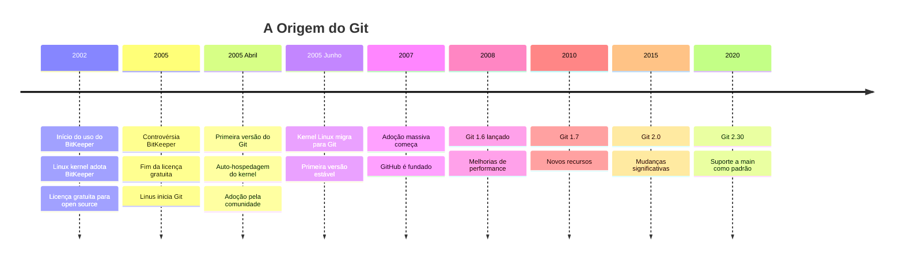

## Por que o Git Deu Certo?

### Pontos Fortes Iniciais
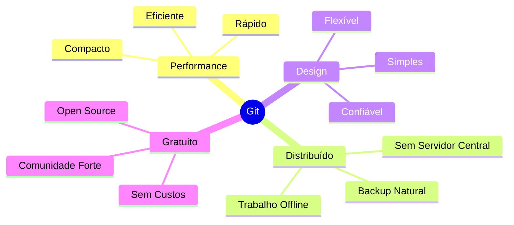

## Motivações Técnicas

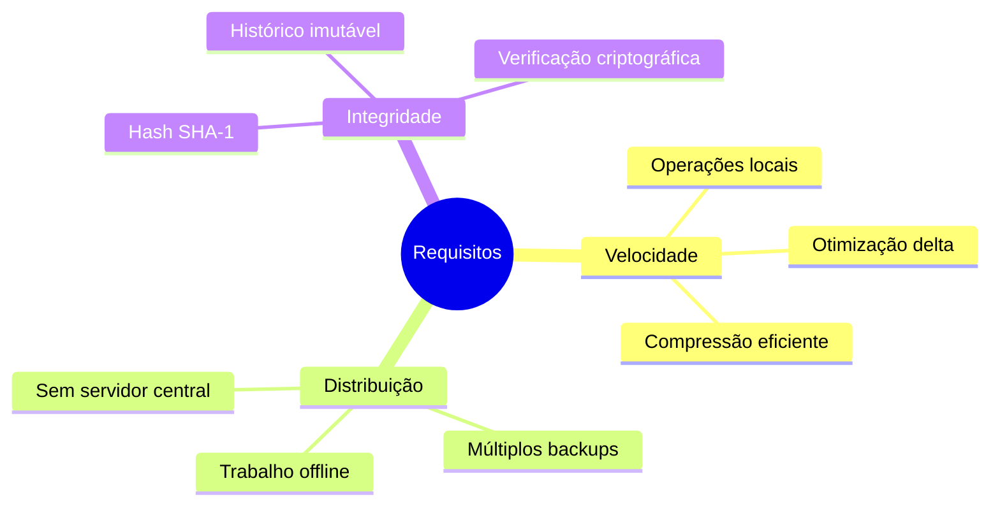

## Como o Git Funciona

### Sistema de Objetos
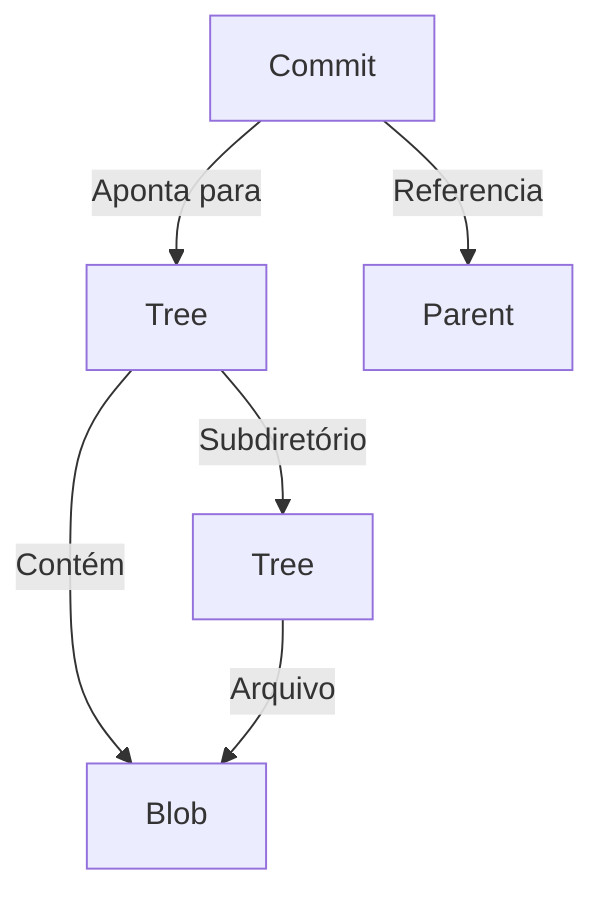

### Estrutura Interna
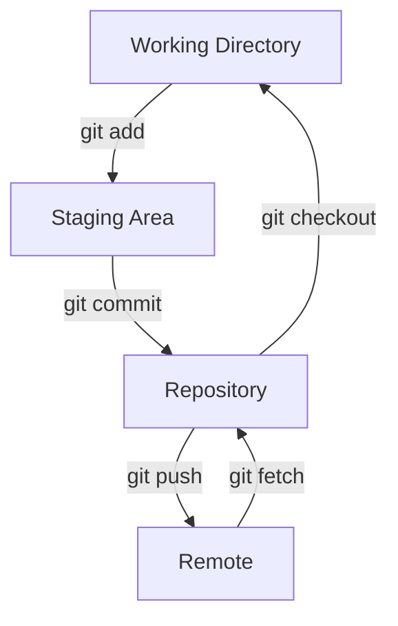

### Sistema de Branches
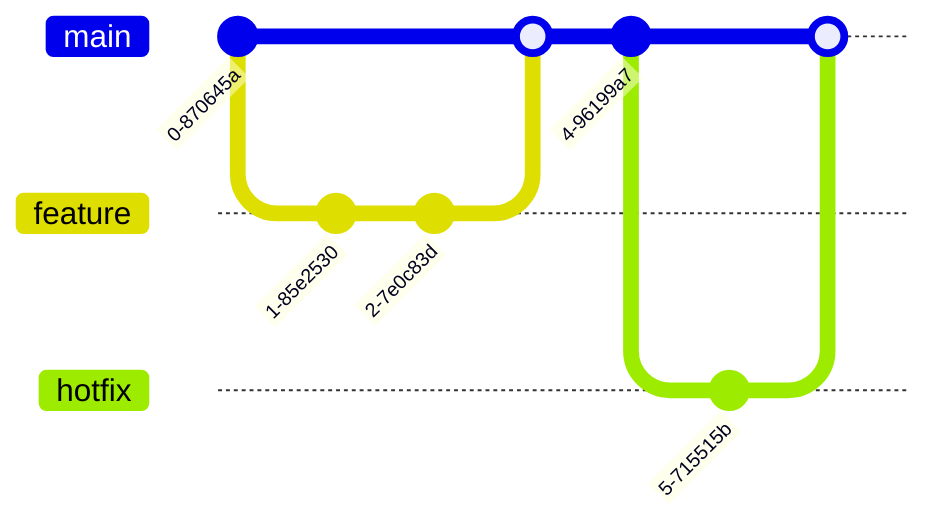

## Evolução e Impacto

### Adoção Global
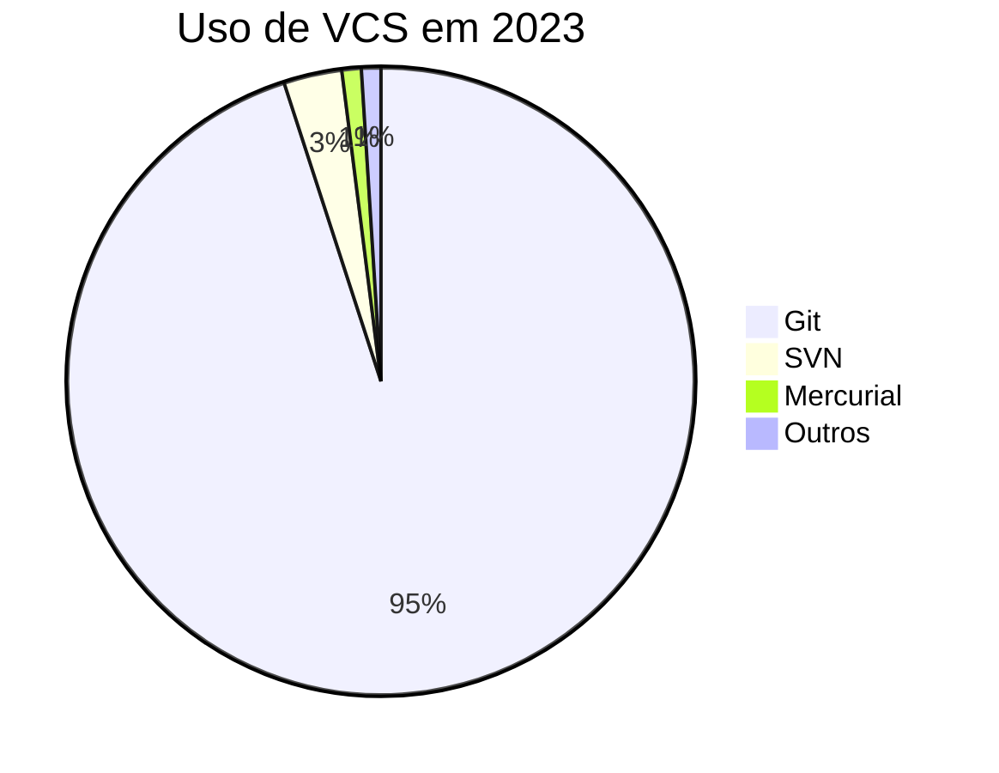

### Crescimento do GitHub
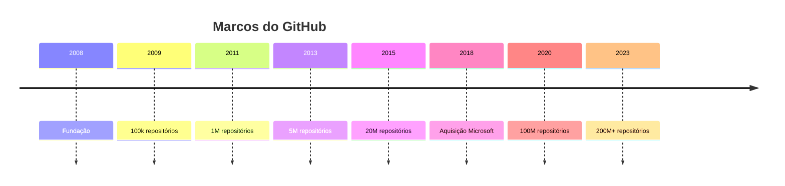

## Ecossistema Atual

### Plataformas Principais
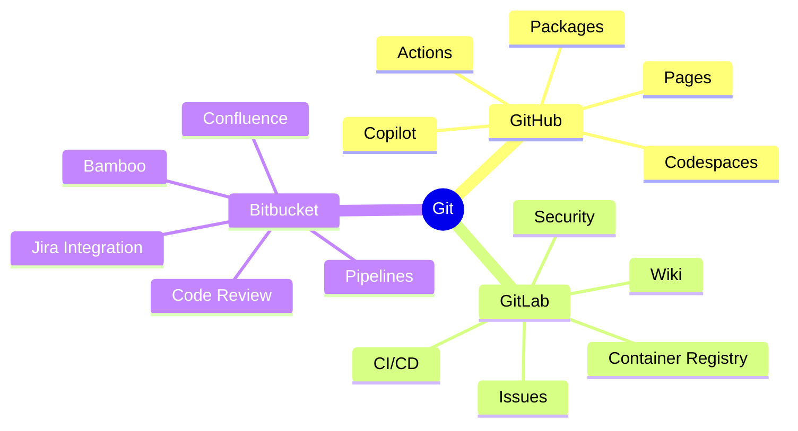

### Ferramentas Populares
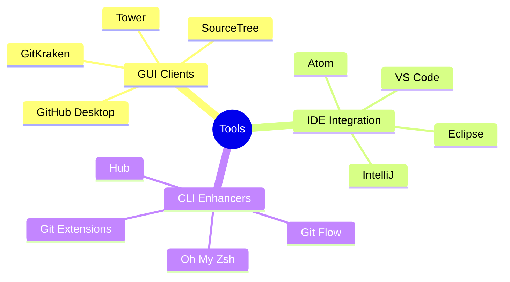

## Inovações Recentes

### GitHub Copilot
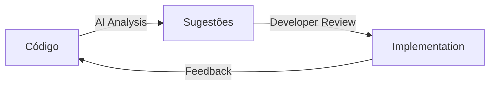

### Codespaces
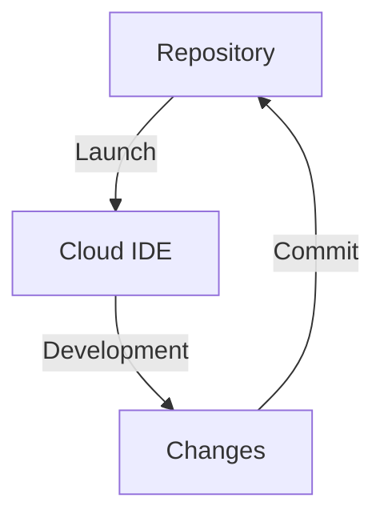

## Futuro do Git

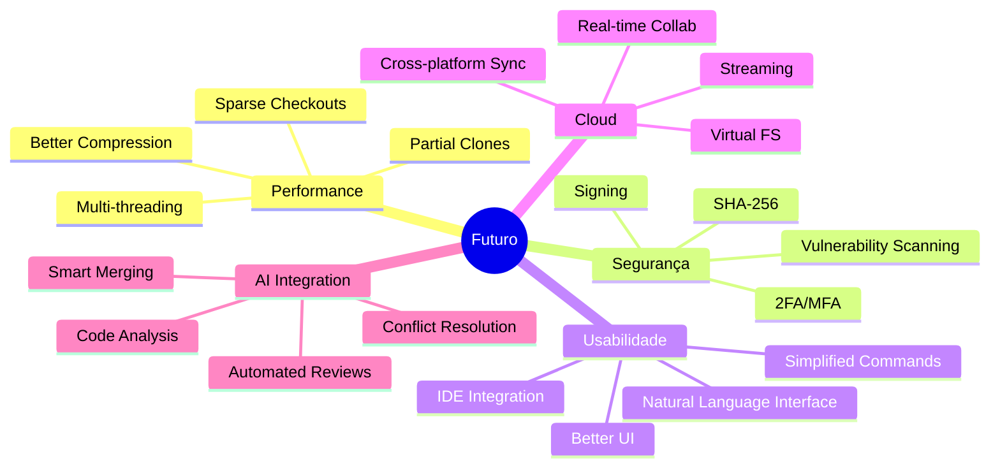

## Impacto na Indústria

### Transformação do Desenvolvimento
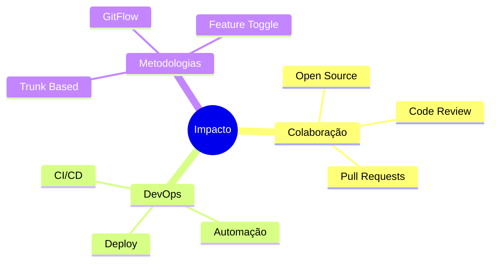

## Recursos Adicionais

### Documentação Oficial
- [Git SCM](https://git-scm.com/doc)
- [Git Book](https://git-scm.com/book/en/v2)
- [Git Reference](https://git-scm.com/docs)

### Comunidade
- [Git Mailing List](https://git.wiki.kernel.org/index.php/GitCommunity)
- [Stack Overflow Git](https://stackoverflow.com/questions/tagged/git)
- [GitHub Discussions](https://github.com/git/git/discussions)

### Tutoriais e Cursos
- [Git Immersion](http://gitimmersion.com/)
- [Learn Git Branching](https://learngitbranching.js.org/)
- [Atlassian Git Tutorial](https://www.atlassian.com/git/tutorials)

## Curiosidades

### Origem do Nome
> Linus Torvalds: "Eu sou um bastardo egoísta, e nomeio todos os meus projetos com meu nome. Primeiro Linux, agora Git" 
> 
> (Git em gíria britânica significa "pessoa desagradável")

### Recordes
- Maior repositório Git: Android Open Source Project (>100GB)
- Commit mais antigo ainda ativo: Kernel Linux (2005)
- Maior plataforma: GitHub (200M+ repositórios)

### Easter Eggs
```bash
git help --all   # Lista todos os comandos, incluindo alguns divertidos
git help everyday # Guia de uso diário
git help tutorial # Tutorial básico
```