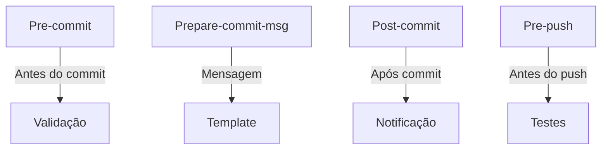
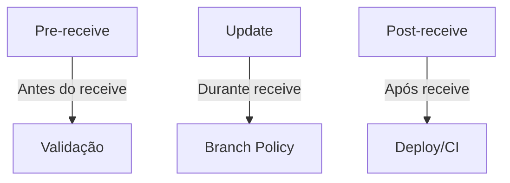
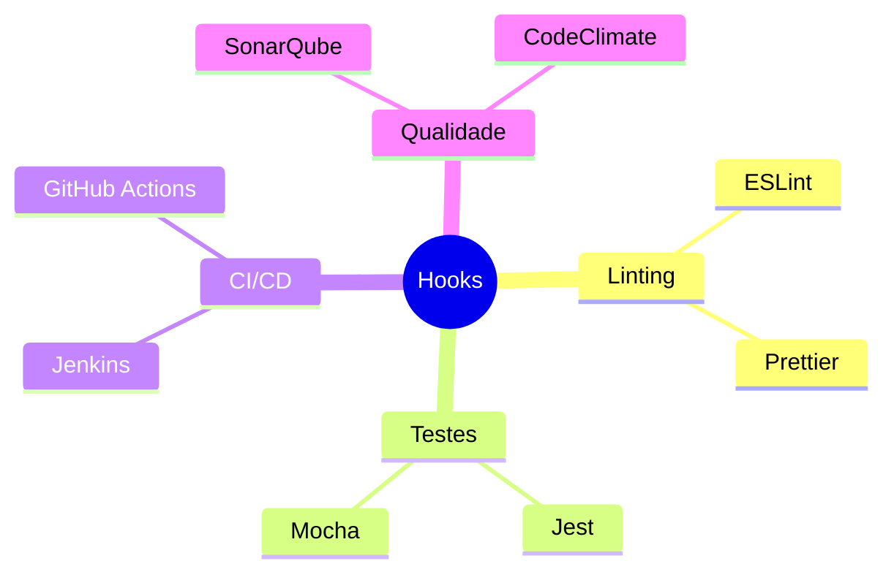
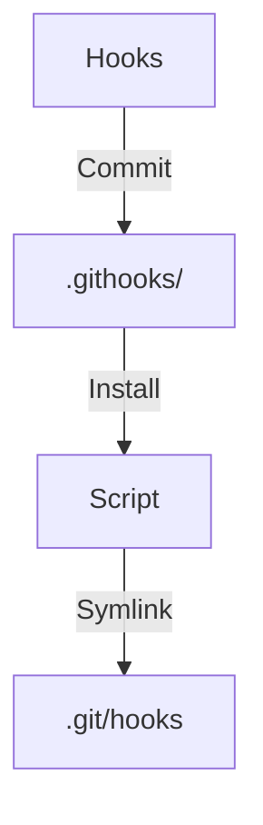

# Git Hooks: Automatizando seu Workflow

```ascii
+------------------------+
|       Git Hooks        |
|                        |
| Client + Server Hooks  |
| Automation + Quality   |
| Custom Scripts         |
|                        |
| .git/hooks            |
+------------------------+
```

## Tipos de Hooks

### Client-side Hooks


### Server-side Hooks


## Hooks Comuns

### Pre-commit
```bash
#!/bin/sh
# Verificar estilo de código
./lint.sh

# Rodar testes unitários
./test.sh

# Verificar secrets
./check-secrets.sh

exit 0
```

### Prepare-commit-msg
```bash
#!/bin/sh
# Adicionar número do ticket
TICKET=$(git branch | grep '*' | sed 's/* //' | grep -o 'PROJ-[0-9]\+')
echo "$TICKET: $(cat $1)" > $1
```

### Pre-push
```bash
#!/bin/sh
# Executar testes
npm test

# Verificar build
npm run build

# Validar cobertura
npm run coverage
```

## Implementação

### Estrutura de Diretórios
```ascii
.git/
└── hooks/
    ├── pre-commit
    ├── prepare-commit-msg
    ├── post-commit
    ├── pre-push
    └── post-receive
```

### Ativação de Hooks
```bash
# Tornar hook executável
chmod +x .git/hooks/pre-commit

# Criar link simbólico
ln -s ../../scripts/pre-commit.sh .git/hooks/pre-commit
```

## Hooks Avançados

### Integração com Ferramentas


### Scripts Complexos
```bash
#!/bin/sh
# Hook multi-etapa
set -e

echo "🔍 Verificando código..."
npm run lint

echo "🧪 Executando testes..."
npm test

echo "📦 Verificando build..."
npm run build

echo "✨ Tudo pronto!"
```

## Boas Práticas

### Recomendações
```ascii
+------------------------+
|    BOAS PRÁTICAS      |
|                       |
| • Scripts modulares   |
| • Logs claros        |
| • Timeouts           |
| • Fallbacks          |
| • Configurável       |
+------------------------+
```

### Configuração
```bash
# Config global de hooks
git config core.hooksPath .githooks

# Skip hooks quando necessário
git commit --no-verify
```

## Compartilhamento

### Versionamento


### Script de Instalação
```bash
#!/bin/sh
# install-hooks.sh
HOOK_DIR=.git/hooks
CUSTOM_HOOK_DIR=.githooks

for hook in $CUSTOM_HOOK_DIR/*; do
    ln -sf "../../$hook" "$HOOK_DIR/$(basename $hook)"
done
```

## Troubleshooting

### Problemas Comuns
```ascii
+------------------------+
|      PROBLEMAS        |
|                       |
| • Permissões         |
| • Path errado        |
| • Dependências       |
| • Performance        |
+------------------------+
```

### Debug
```bash
# Debug de hooks
GIT_TRACE=1 git commit -m "test"

# Verificar permissões
ls -l .git/hooks/

# Testar hook manualmente
.git/hooks/pre-commit
```

## Exemplos Práticos

### Validação de Código
```bash
#!/bin/sh
# pre-commit
FILES=$(git diff --cached --name-only --diff-filter=ACM | grep '\.js$')
[ -z "$FILES" ] && exit 0

# Lint
echo "🔍 Verificando arquivos JS..."
./node_modules/.bin/eslint $FILES
```

### Conventional Commits
```bash
#!/bin/sh
# prepare-commit-msg
commit_msg=$(cat $1)
if ! echo "$commit_msg" | grep -qE "^(feat|fix|docs|style|refactor|test|chore):"; then
    echo "❌ Erro: Mensagem deve seguir Conventional Commits"
    echo "✨ Exemplo: feat: adiciona novo recurso"
    exit 1
fi
```

## Próximos Passos

### Tópicos Relacionados
- [Git Workflow](git-workflow.md)
- [Git Advanced](git-advanced.md)
- [Workflow Automation](workflow-automation.md)

> **Dica Pro**: Mantenha seus hooks em um repositório separado e use um sistema de gerenciamento como Husky para facilitar a manutenção e distribuição.