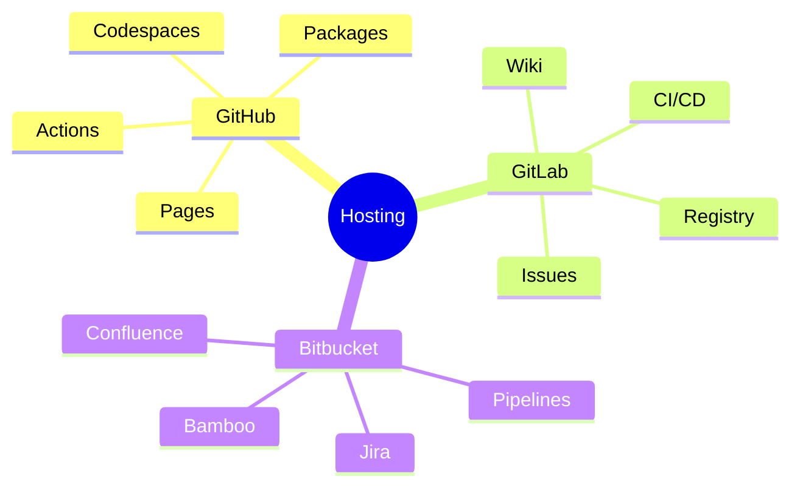
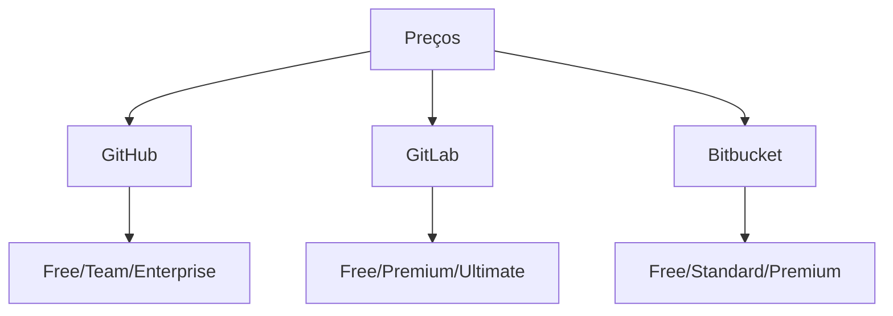
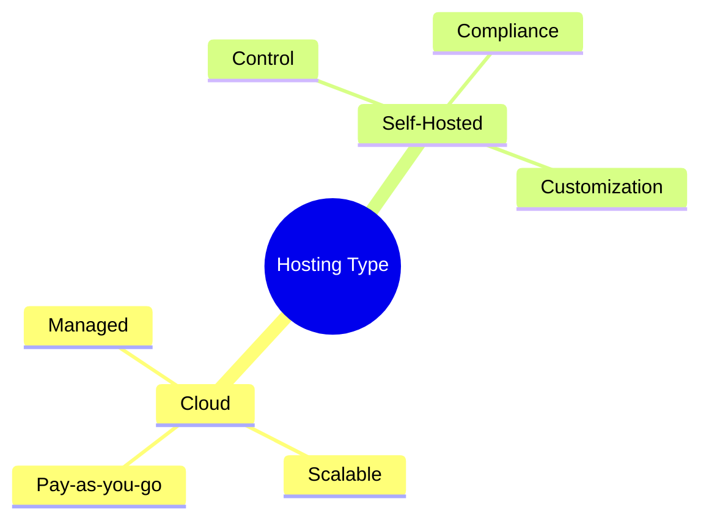

# Hospedagem Git: Plataformas e Soluções

```ascii
+------------------------+
|    Git Hosting        |
|                       |
| Cloud Services       |
| Self-Hosted         |
| Features            |
|                       |
| Platform Choice     |
+------------------------+
```

## Plataformas Principais

### Comparativo


## Critérios de Escolha

### Fatores Decisivos
```ascii
+------------------------+
|    CONSIDERAR         |
|                       |
| • Custo              |
| • Integração         |
| • Escalabilidade     |
| • Segurança          |
| • Compliance         |
| • Suporte            |
+------------------------+
```

### Comparativo de Preços


## Self-Hosted vs Cloud

### Análise


## Próximos Passos

### Tópicos Relacionados
- [GitHub Specific](github-specific.md)
- [GitLab Specific](gitlab-specific.md)
- [Bitbucket Specific](bitbucket-specific.md)
- [Self-Hosted Git](self-hosted-git.md)

> **Dica Pro**: Avalie cuidadosamente as necessidades específicas do seu projeto e equipe antes de escolher uma plataforma.