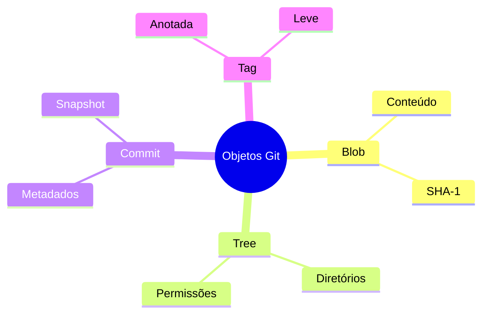
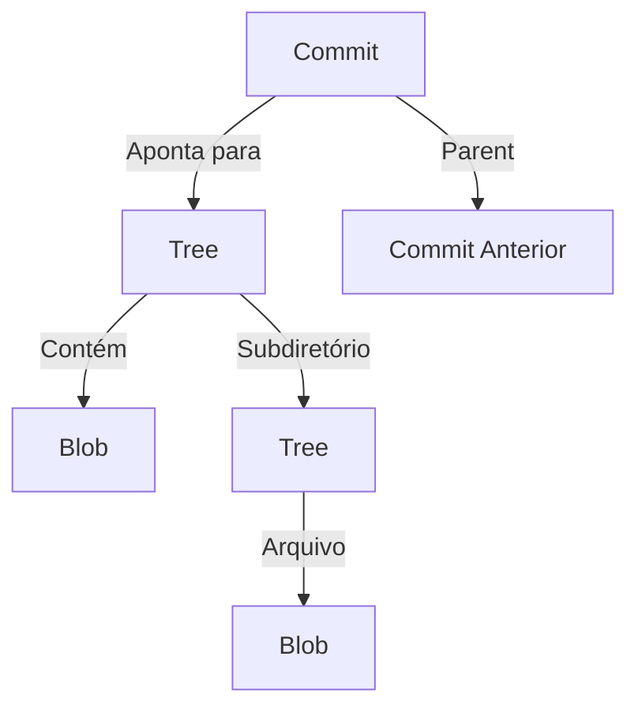
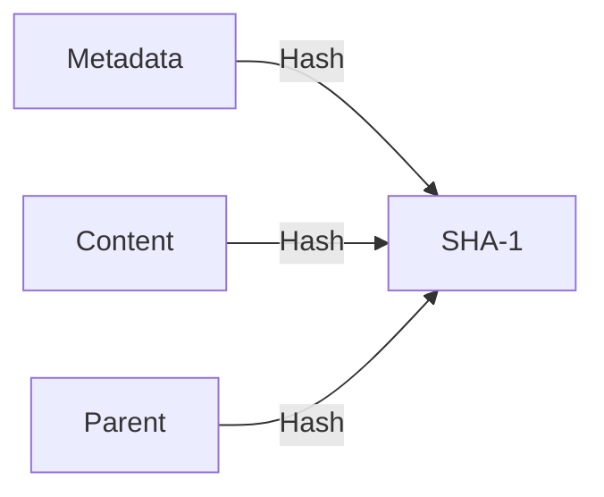
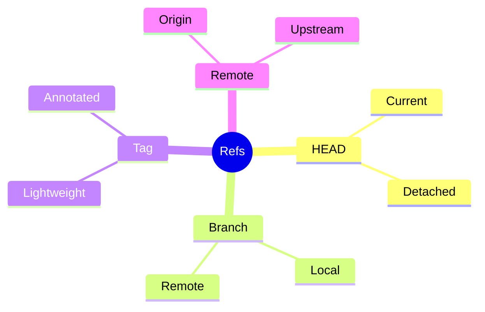
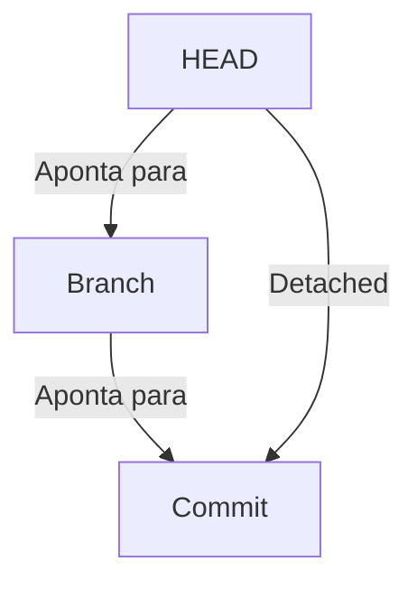
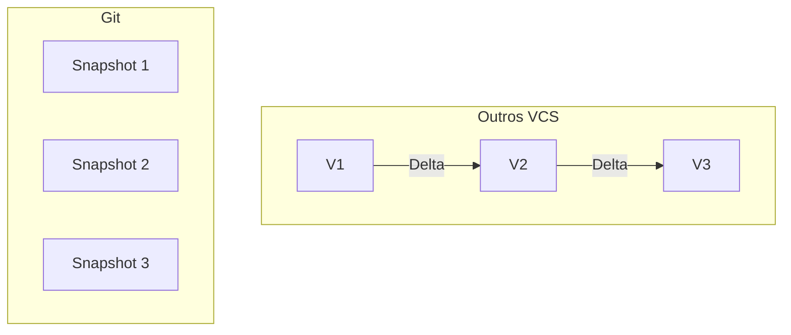
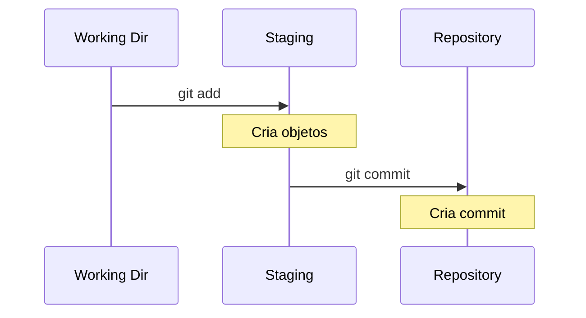
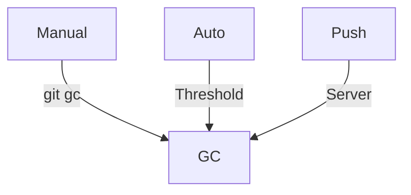
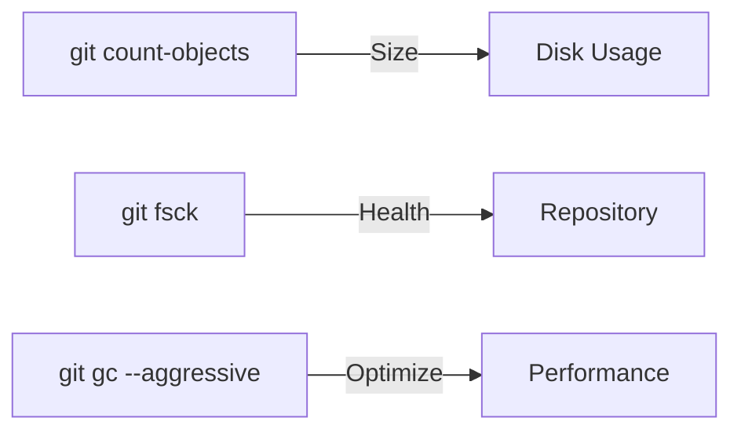
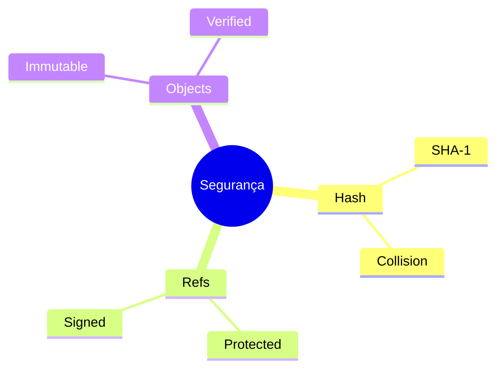

# Git Internals: Como o Git Funciona por Dentro

```ascii
+------------------------+
|       Git Object       |
|        Storage        |
|                       |
|   +---------------+   |
|   |    Commit    |   |
|   |   +-Tree-+   |   |
|   |   |Blob  |   |   |
|   |   |Blob  |   |   |
|   |   +------+   |   |
|   +---------------+   |
|                       |
|   .git/              |
|   ├── objects/       |
|   ├── refs/         |
|   └── HEAD          |
+------------------------+
```

## Sistema de Objetos do Git

### Tipos de Objetos


### Como os Objetos se Relacionam


## Anatomia de um Commit

### Estrutura Básica
```text
commit 1fc408bfdb92... 
tree a906cb2a4a904...
parent 83bc0145a898...
author Stifler <stifler@milfsgo.com> 1625097600 -0300
committer Stifler <stifler@milfsgo.com> 1625097600 -0300

feat: adiciona sistema de busca de milfs
```

### Composição do SHA-1


## Sistema de Referências

### Referencias Principais


### Como o HEAD Funciona


## Armazenamento de Objetos

### Estrutura do .git
```ascii
.git/
├── objects/
│   ├── pack/
│   ├── info/
│   ├── aa/
│   └── bb/
├── refs/
│   ├── heads/
│   ├── tags/
│   └── remotes/
├── HEAD
└── config
```

### Processo de Compressão


## Como o Git Armazena Mudanças

### Snapshot vs Delta


### Processo de Staging


## Garbage Collection

### O que é Coletado
- Objetos não referenciados
- Objetos soltos antigos
- Referências dangling
- Packfiles redundantes

### Quando Acontece


## Dicas de Performance

### Otimizações
1. Clones rasos
2. Sparse checkout
3. Partial clone
4. Prune regular

### Monitoramento


## Comandos para Exploração

### Comandos Úteis
```bash
# Ver objeto
git cat-file -p SHA1

# Listar referências
git show-ref

# Ver árvore
git ls-tree HEAD

# Contar objetos
git count-objects -v

# Verificar integridade
git fsck
```

## Considerações de Segurança

### Proteção de Dados


## Próximos Passos

### Tópicos Avançados
- [Objetos Git](git-objects.md)
- [Referências Git](git-refs.md)
- [Packfiles](git-packfiles.md)
- [Garbage Collection](git-garbage-collection.md)

> **Dica**: Entender os internals do Git ajuda muito na resolução de problemas e na otimização do uso da ferramenta.