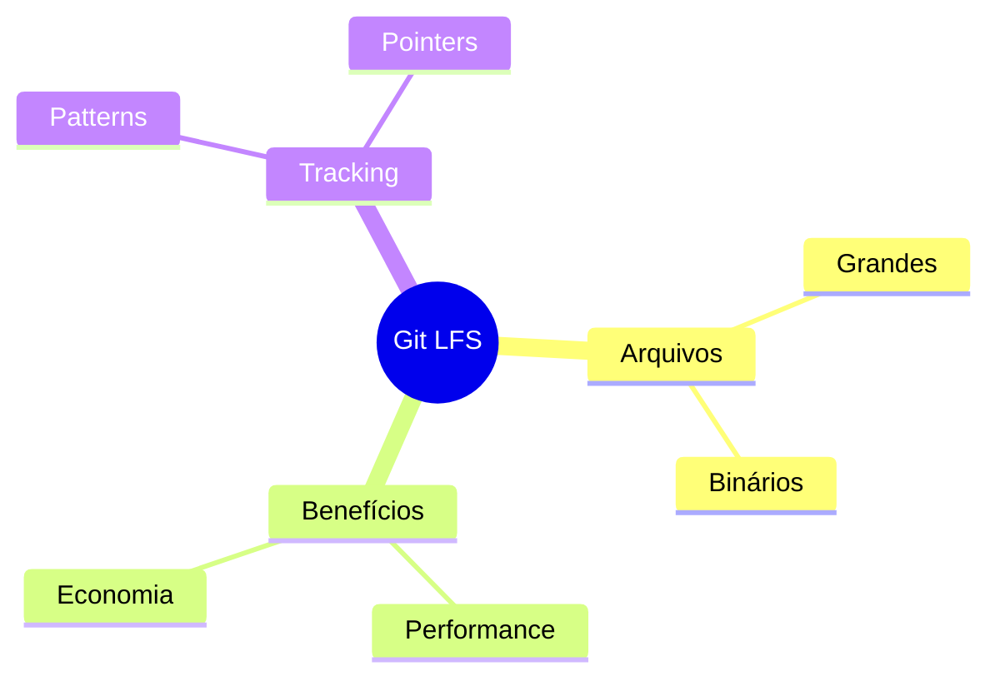
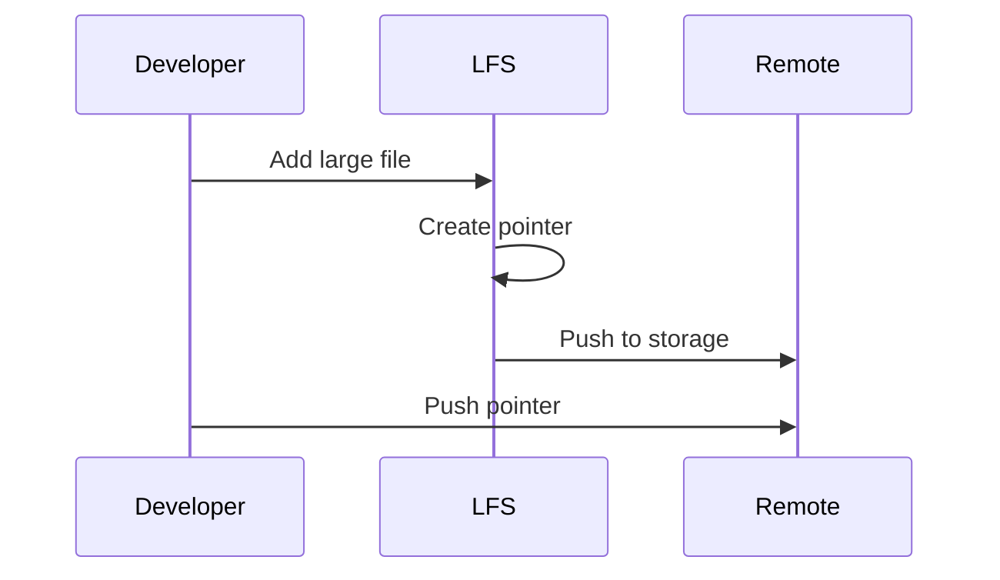

# Git LFS

```ascii
+------------------------+
|      Git LFS          |
|                       |
| Large File Handling   |
| Binary Management    |
| Storage Optimization |
|                       |
| Performance Boost    |
+------------------------+
```

## Conceitos Básicos

### O que é Git LFS?


## Configuração

### Instalação
```bash
# Instalar Git LFS
git lfs install

# Verificar instalação
git lfs version
```

### Tracking
```bash
# Iniciar tracking
git lfs track "*.psd"
git lfs track "*.zip"
git lfs track "*.iso"

# Listar patterns
git lfs track

# Verificar arquivos
git lfs ls-files
```

## Uso Diário

### Comandos Básicos
```bash
# Status
git lfs status

# Pull com LFS
git lfs pull

# Fetch específico
git lfs fetch origin master

# Prune
git lfs prune
```

### Workflow


## Boas Práticas

### Otimização
```ascii
+------------------------+
|    BOAS PRÁTICAS      |
|                       |
| • Track seletivo     |
| • Prune regular      |
| • Backup separado    |
| • Monitorar uso      |
+------------------------+
```

## Próximos Passos

### Tópicos Relacionados
- [Git Tools](git-tools.md)
- [Git Performance](git-performance.md)
- [Large Repositories](large-repositories.md)

> **Dica Pro**: Use Git LFS desde o início do projeto para arquivos grandes - migrar posteriormente pode ser desafiador.