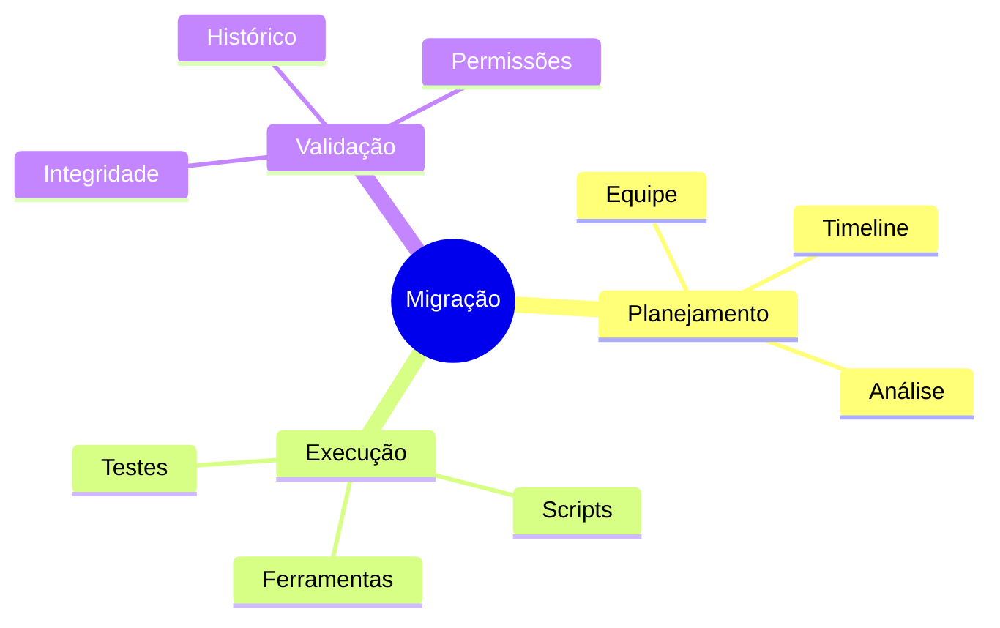
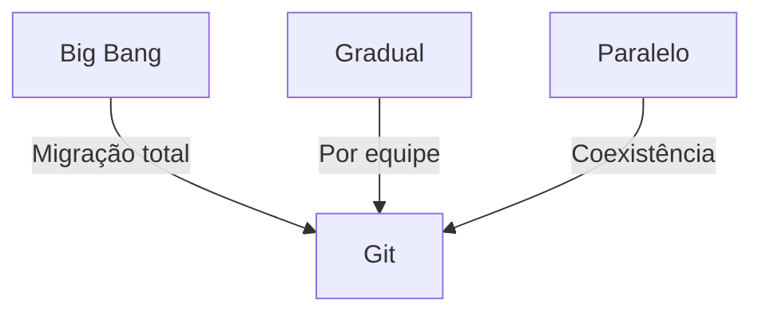
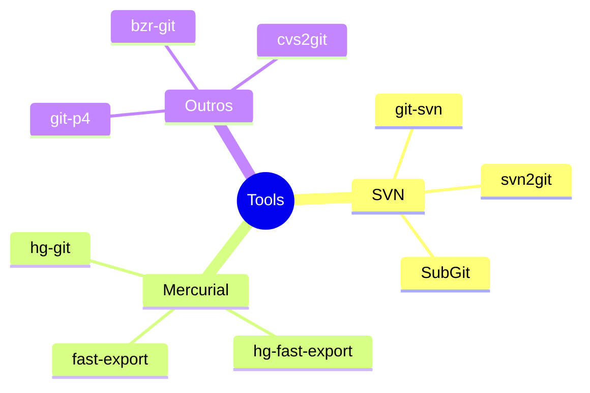

# Migrando para Git

## Visão Geral

## Estratégias de Migração

### Abordagens Comuns

## Checklist de Migração

### Pré-Migração
- Inventário de repositórios
- Backup dos dados
- Documentação do processo
- Treinamento da equipe

### Durante Migração
- Congelamento de commits
- Execução dos scripts
- Validação dos dados
- Testes de integridade

### Pós-Migração
- Verificação de acessos
- Atualização de CI/CD
- Documentação atualizada
- Suporte à equipe

## Ferramentas Recomendadas

### Por Sistema de Origem

## Próximos Passos

### Tópicos Relacionados
- [SVN para Git](svn-to-git.md)
- [Mercurial para Git](mercurial-to-git.md)
- [Divisão de Repositórios](repository-splitting.md)
- [Mesclagem de Repositórios](repository-merging.md)