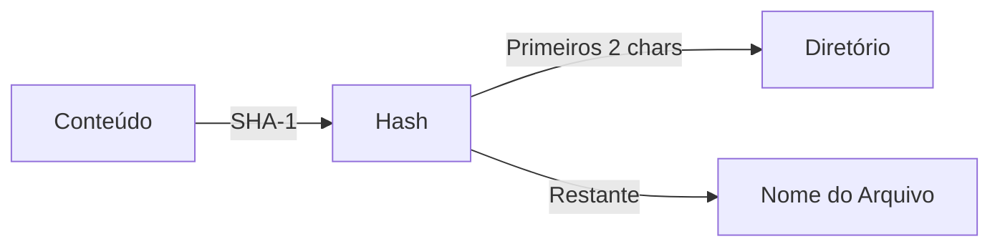
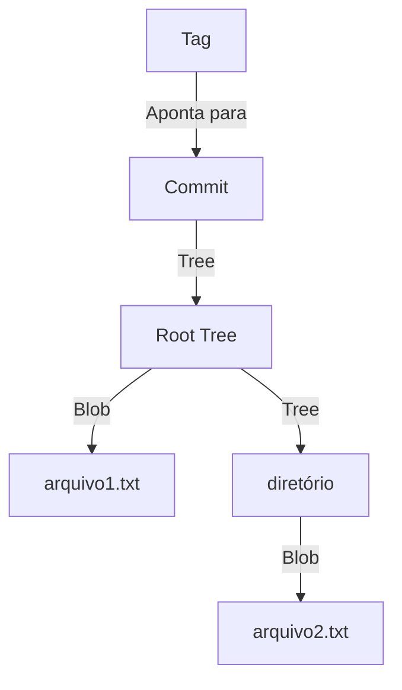
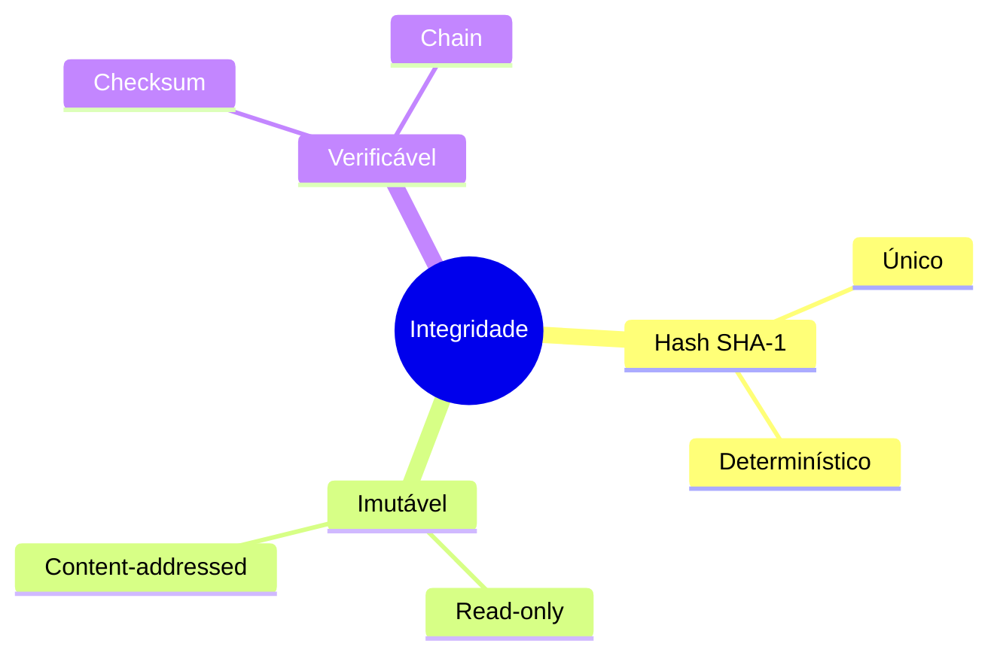
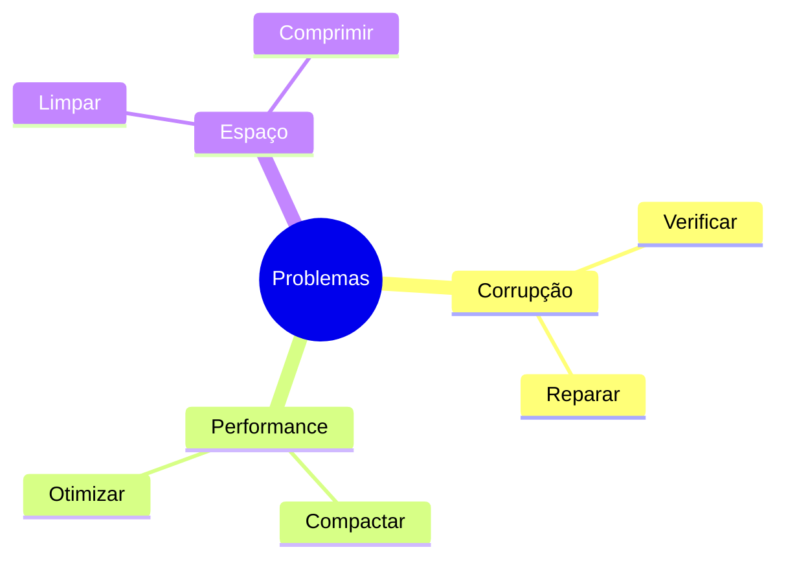

# Objetos Git: Os Blocos Fundamentais

```ascii
+------------------+
|    Git Object    |
|    Database      |
|                  |
|  SHA-1 -> Data   |
|                  |
|  Type + Size     |
|  + Content       |
+------------------+
```

## Tipos de Objetos

### 1. Blob (Binary Large Object)
```ascii
+-------------+
|    BLOB     |
+-------------+
| • Conteúdo  |
| • SHA-1     |
| • Tamanho   |
+-------------+
```

Exemplo de estrutura interna:
```text
blob 42\0Hello, World!
```

### 2. Tree (Árvore)
```ascii
+----------------+
|     TREE      |
+----------------+
| 100644 blob K1|
| 100755 blob K2|
| 040000 tree K3|
+----------------+
```

Exemplo de estrutura:
```text
$ git cat-file -p master^{tree}
100644 blob a906cb2a4a904... README.md
100644 blob 8ab686eafeb5... index.js
040000 tree ab8763f6e1dd... src
```

### 3. Commit
```ascii
+------------------+
|     COMMIT       |
+------------------+
| • Tree          |
| • Parent(s)     |
| • Author        |
| • Committer     |
| • Message       |
+------------------+
```

Exemplo de estrutura:
```text
tree a906cb2a4a904...
parent 83bc0145a898...
author Dev <dev@example.com> 1625097600 -0300
committer Dev <dev@example.com> 1625097600 -0300

Initial commit
```

### 4. Tag
```ascii
+------------------+
|       TAG        |
+------------------+
| • Object        |
| • Type          |
| • Tag Name      |
| • Tagger        |
| • Message       |
+------------------+
```

## Como os Objetos São Armazenados

### Estrutura do Diretório
```ascii
.git/objects/
├── pack/
│   ├── pack-*.pack
│   └── pack-*.idx
├── info/
└── xx/
    └── yyyyyyyyyy...
```

### Processo de Hash


## Manipulando Objetos

### Comandos Essenciais
```bash
# Criar blob
echo 'test content' | git hash-object -w --stdin

# Ver conteúdo
git cat-file -p <hash>

# Ver tipo
git cat-file -t <hash>

# Ver tamanho
git cat-file -s <hash>
```

## Relacionamentos Entre Objetos



## Integridade dos Objetos

### Garantias do Sistema


## Compressão e Performance

### Estratégias de Otimização
1. Zlib compression
2. Delta encoding
3. Packfiles
4. Garbage collection

### Exemplo de Delta
```ascii
Base object: "Hello World"
Delta: @@ -1,5 +1,6 @@
       Hello
      +New
       World
```

## Dicas Práticas

### Debug e Inspeção
```bash
# Listar todos objetos
git rev-list --objects --all

# Encontrar objetos grandes
git verify-pack -v .git/objects/pack/*.idx

# Inspecionar packfile
git unpack-objects -n < .git/objects/pack/*.pack
```

### Boas Práticas
1. Evite arquivos grandes
2. Use Git LFS quando necessário
3. Execute gc regularmente
4. Monitore o tamanho do repositório

## Troubleshooting

### Problemas Comuns


## Próximos Passos

### Tópicos Relacionados
- [Git Refs](git-refs.md)
- [Git Packfiles](git-packfiles.md)
- [Git Garbage Collection](git-garbage-collection.md)

> **Dica Pro**: Use `git count-objects -v` regularmente para monitorar o crescimento do seu repositório.