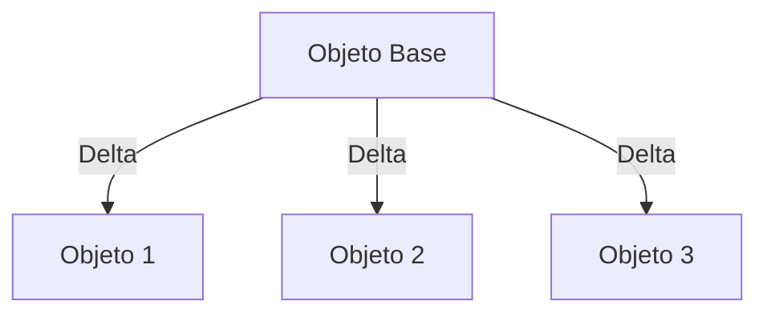
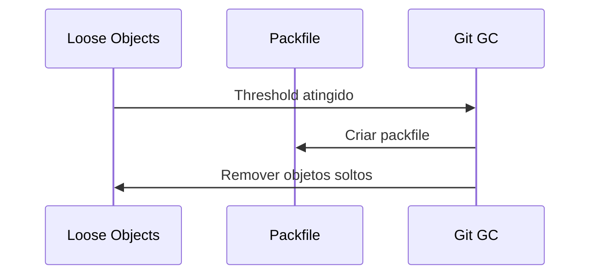
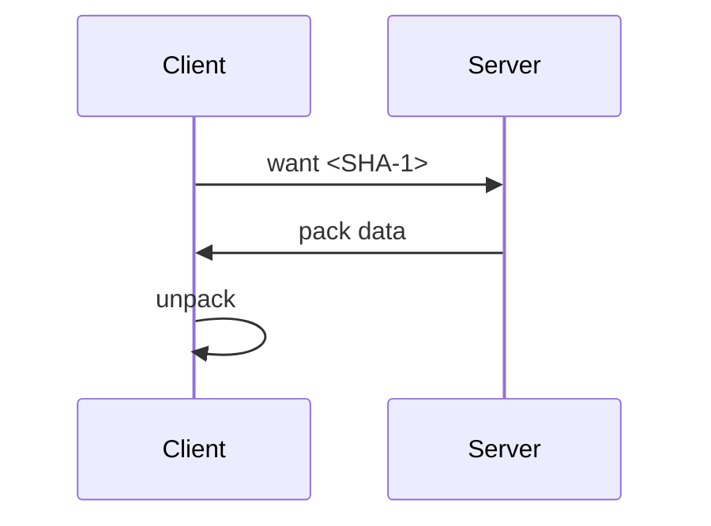
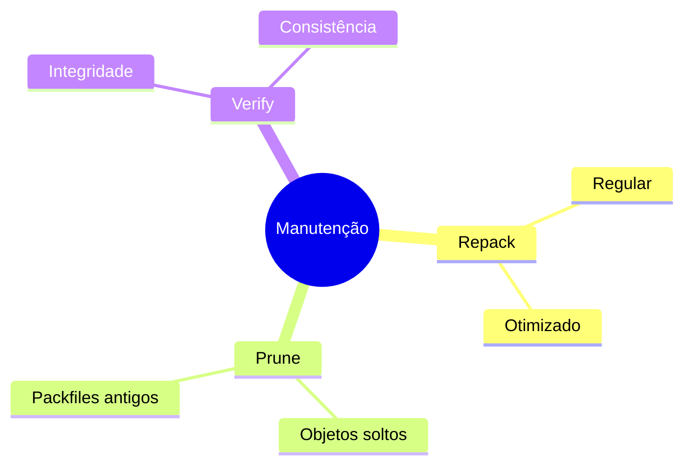

# Git Packfiles: Otimizando o Armazenamento

```ascii
+------------------------+
|       Packfile         |
|                        |
| Objects + Index        |
| Delta Compression      |
| Network Transfer       |
|                        |
| .git/objects/pack/    |
+------------------------+
```

## Estrutura dos Packfiles

### Componentes Principais
```ascii
+------------------+
|    PACKFILE     |
+------------------+
| • Header        |
| • Objects       |
| • Deltas        |
| • Index         |
+------------------+
```

### Formato do Arquivo
```text
pack-<SHA-1>.pack
pack-<SHA-1>.idx
```

## Compressão Delta

### Como Funciona


### Tipos de Delta
```ascii
+-----------------+
|  DELTA TYPES    |
+-----------------+
| • REF_DELTA    |
| • OFS_DELTA    |
+-----------------+
```

## Criação de Packfiles

### Processo Automático


### Comandos Manuais
```bash
# Criar packfile
git gc

# Repack otimizado
git repack -ad

# Verificar packfiles
git verify-pack -v .git/objects/pack/*.idx
```

## Otimização de Performance

### Estratégias
1. Delta compression
2. Object reuse
3. Network transfer
4. Index optimization

### Configurações
```bash
# Ajustar compressão
git config pack.compression 9

# Limite de window
git config pack.windowMemory "100m"

# Delta cache size
git config core.deltaBaseCacheLimit "1g"
```

## Rede e Transferência

### Protocolo de Transferência


### Otimizações de Rede
```ascii
+------------------+
| TRANSFER OPT     |
+------------------+
| • Thin pack     |
| • Multi-pack    |
| • Smart proto   |
+------------------+
```

## Manutenção

### Rotinas de Manutenção


### Comandos de Manutenção
```bash
# Repack total
git repack -a -d -f --window=250 --depth=250

# Verificar packfiles
git fsck --full

# Limpar objetos
git prune-packed
```

## Troubleshooting

### Problemas Comuns
```ascii
+----------------------+
|      PROBLEMAS       |
|                      |
| • Packfile corrupto  |
| • Delta muito grande |
| • Memória insuf.     |
| • Fragmentação       |
+----------------------+
```

### Diagnóstico
```bash
# Listar objetos grandes
git verify-pack -v .git/objects/pack/*.idx | sort -k 3 -n

# Verificar integridade
git fsck --full

# Estatísticas
git count-objects -v
```

## Boas Práticas

### Recomendações
1. Repack periódico
2. Monitorar tamanho
3. Backup antes de repack
4. Verificar integridade

### Configurações Recomendadas
```bash
# Para repositórios grandes
git config pack.deltaCacheSize 1g
git config pack.windowMemory 1g
git config pack.threads 4
```

## Ferramentas e Scripts

### Utilitários Úteis
```bash
# Análise de packfile
git show-index < .git/objects/pack/*.idx

# Extrair objeto
git unpack-objects < .git/objects/pack/*.pack

# Estatísticas detalhadas
git count-objects --verbose
```

## Próximos Passos

### Tópicos Relacionados
- [Git Objects](git-objects.md)
- [Git Internals](git-internals.md)
- [Git Garbage Collection](git-garbage-collection.md)

> **Dica Pro**: Use `git gc --aggressive` com cautela - é mais intensivo em CPU e nem sempre necessário para repositórios menores.