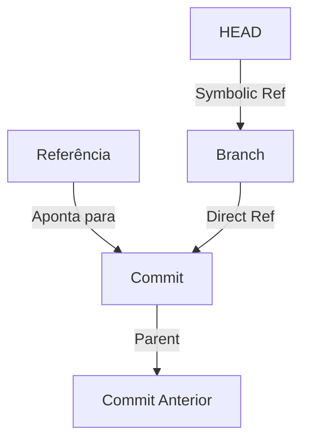
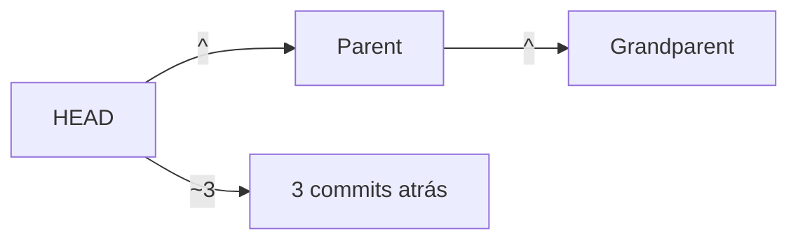
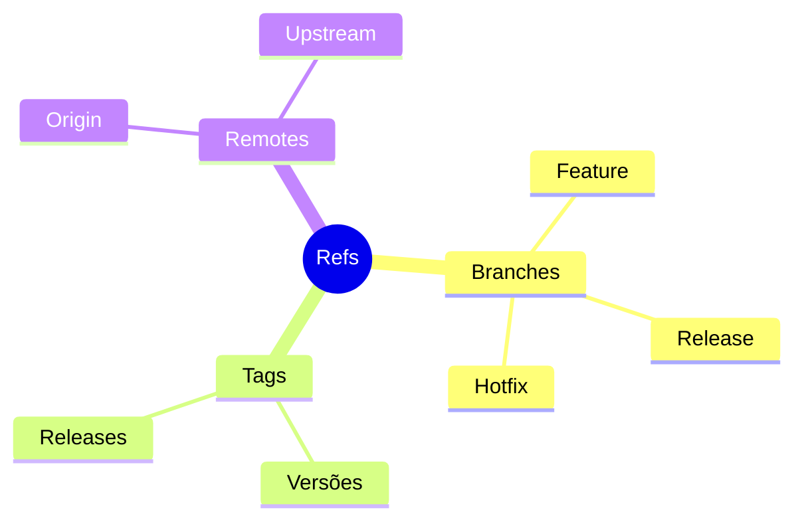

# Referências Git: Navegando pelo Histórico

```ascii
+------------------------+
|     Git References     |
|                        |
|    HEAD -> main        |
|    main -> a1b2c3      |
|    feature -> d4e5f6   |
|    v1.0 -> 789abc      |
|                        |
|    .git/refs/          |
+------------------------+
```

## Tipos de Referências

### 1. HEAD
```ascii
+-------------+
|    HEAD     |
+-------------+
| • Symbolic  |
| • Detached  |
| • Current   |
+-------------+
```

Exemplo de `.git/HEAD`:
```text
ref: refs/heads/main
```

### 2. Branches (refs/heads/)
```ascii
+------------------+
|     BRANCH      |
+------------------+
| • Local         |
| • Remote-track  |
| • Lightweight   |
+------------------+
```

Estrutura típica:
```text
.git/refs/heads/
├── main
├── develop
└── feature/
    └── new-feature
```

### 3. Tags (refs/tags/)
```ascii
+------------------+
|      TAG        |
+------------------+
| • Lightweight   |
| • Annotated     |
| • Signed        |
+------------------+
```

## Sistema de Referências

### Anatomia de uma Referência


### Namespace Hierárquico
```ascii
.git/
├── refs/
│   ├── heads/
│   ├── tags/
│   ├── remotes/
│   └── stash
└── HEAD
```

## Manipulando Referências

### Comandos Essenciais
```bash
# Listar referências
git show-ref

# Ver para onde HEAD aponta
git symbolic-ref HEAD

# Criar branch
git update-ref refs/heads/nova-branch HEAD

# Criar tag
git update-ref refs/tags/v1.0 HEAD
```

## Referências Especiais

### 1. FETCH_HEAD
```ascii
+------------------+
|   FETCH_HEAD    |
+------------------+
| Último fetch    |
| de cada branch  |
+------------------+
```

### 2. ORIG_HEAD
```ascii
+------------------+
|   ORIG_HEAD     |
+------------------+
| Backup antes de |
| operações       |
| perigosas       |
+------------------+
```

### 3. MERGE_HEAD
```ascii
+------------------+
|   MERGE_HEAD    |
+------------------+
| Branch sendo    |
| mergada         |
+------------------+
```

## Referências Relativas

### Navegação no Histórico


### Exemplos Práticos
```bash
HEAD^      # Parent do HEAD
HEAD~2     # Dois commits atrás
main^2     # Segundo parent (em merges)
HEAD@{1}   # Posição anterior no reflog
```

## Reflog: Histórico de Referências

### Estrutura do Reflog
```ascii
+------------------+
|     REFLOG      |
+------------------+
| HEAD@{0}        |
| HEAD@{1}        |
| HEAD@{2}        |
+------------------+
```

### Comandos de Reflog
```bash
# Ver histórico
git reflog

# Ver reflog específico
git reflog show main

# Expirar entradas antigas
git reflog expire --expire=30.days.ago
```

## Boas Práticas

### Organização


### Manutenção
1. Limpe branches obsoletas
2. Use tags para releases
3. Mantenha reflog limpo
4. Documente convenções

## Troubleshooting

### Problemas Comuns
```ascii
+----------------------+
|     Problemas        |
|                      |
| • HEAD desanexado    |
| • Ref corrompida     |
| • Conflito de nomes  |
| • Refs perdidas      |
+----------------------+
```

### Soluções
```bash
# Reparar referências
git fsck --full

# Recriar referência
git update-ref -d refs/heads/broken
git branch broken HEAD

# Recuperar commit perdido
git fsck --lost-found
```

## Próximos Passos

### Tópicos Relacionados
- [Git Objects](git-objects.md)
- [Git Internals](git-internals.md)
- [Git Packfiles](git-packfiles.md)

> **Dica Pro**: Use `git show-ref --heads --tags` para uma visão rápida de todas as suas referências importantes.