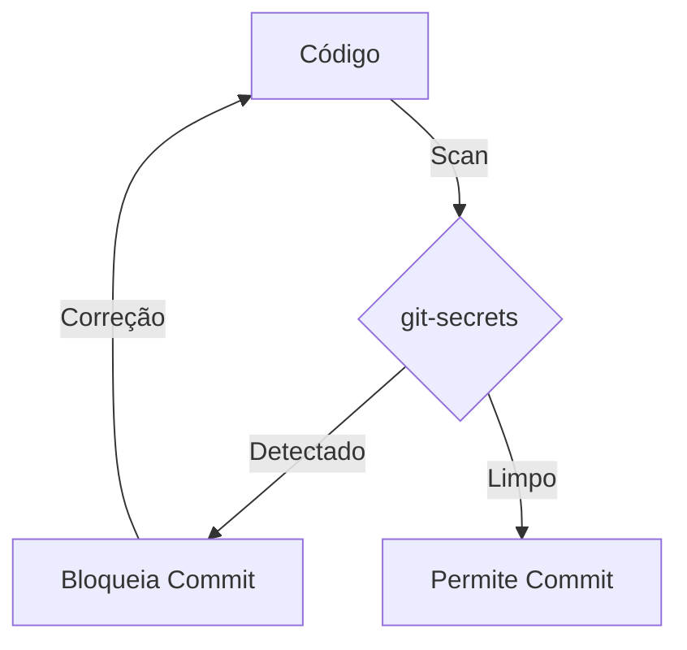
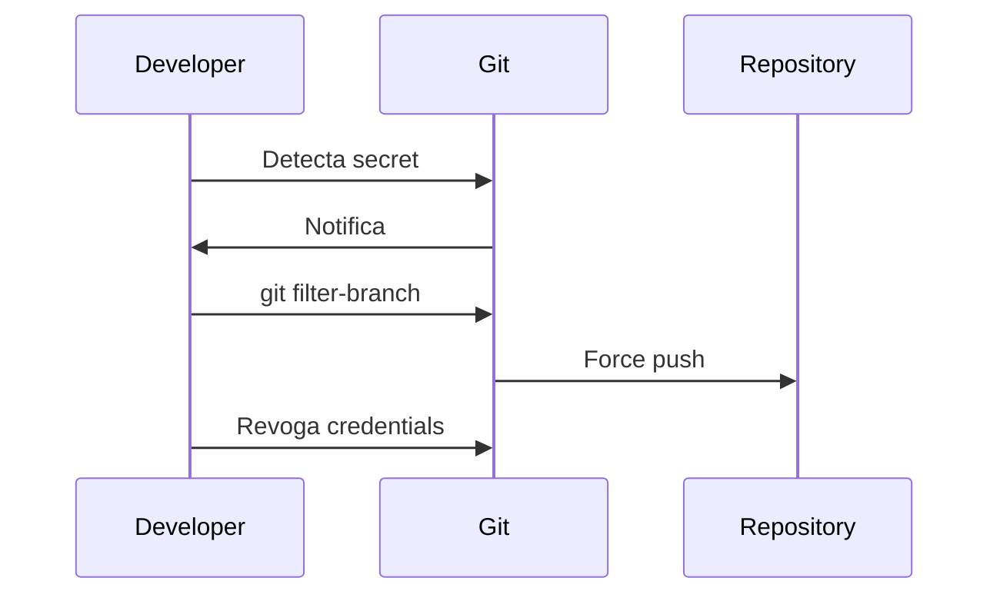
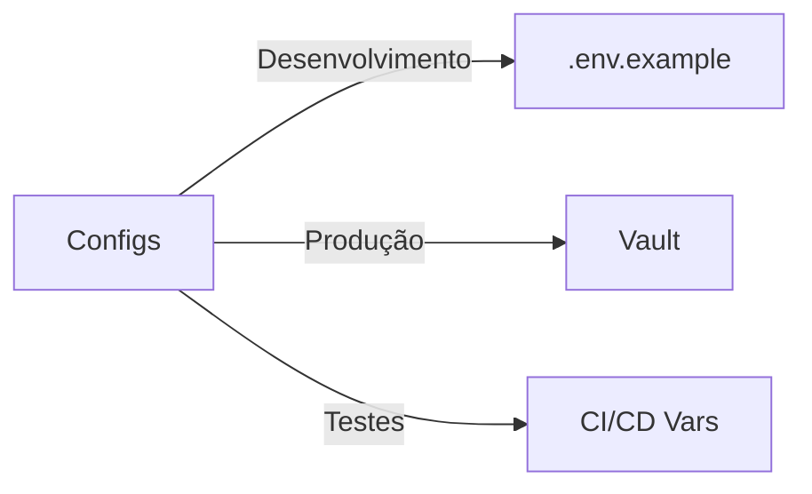
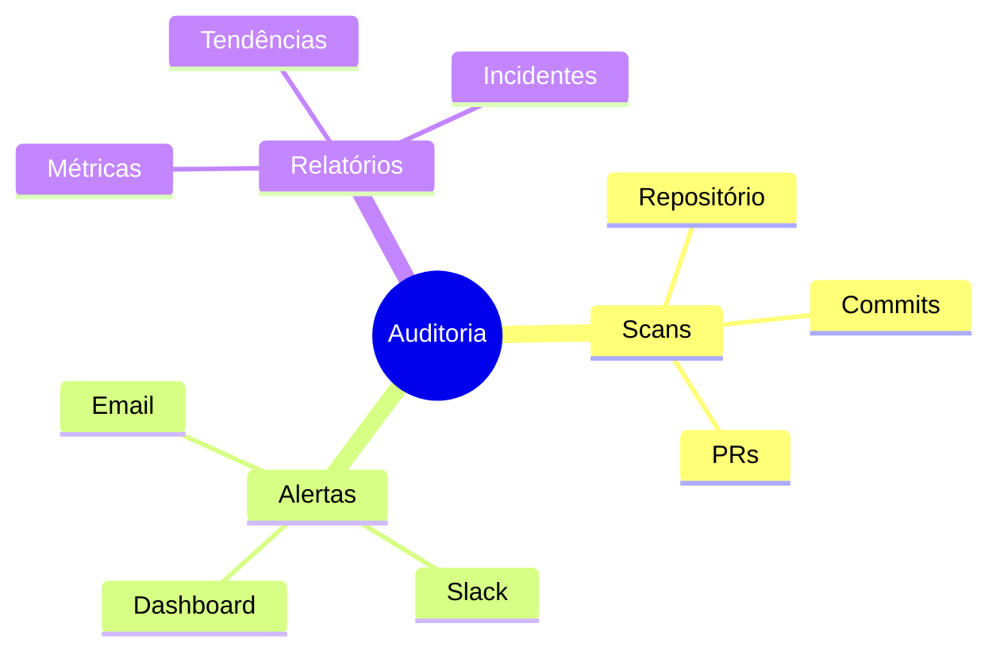
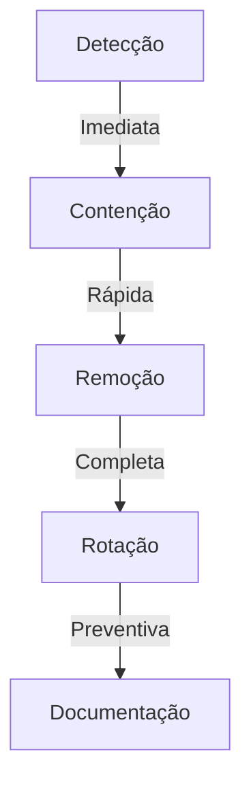

# Gerenciamento de Secrets no Git

## Prevenção

### Ferramentas de Detecção


### Configuração git-secrets
```bash
# Instalação
git secrets --install
git secrets --register-aws

# Regras personalizadas
git secrets --add 'private_key'
git secrets --add 'api_key'
git secrets --add 'password'
```

## Detecção

### Padrões Comuns
```ascii
+------------------------+
|    SECRETS COMUNS     |
|                       |
| • API Keys            |
| • Tokens              |
| • Senhas             |
| • Certificados       |
| • Chaves privadas    |
+------------------------+
```

### Implementação de Hooks
```bash
#!/bin/sh
# pre-commit hook
if git secrets --scan; then
    exit 0
else
    echo "Secrets detectados!"
    exit 1
fi
```

## Mitigação

### Processo de Limpeza


### Comandos de Limpeza
```bash
# Remover arquivo com secret
git filter-branch --force --index-filter \
  "git rm --cached --ignore-unmatch config.json" \
  --prune-empty --tag-name-filter cat -- --all

# Forçar push
git push origin --force --all
```

## Prevenção Automatizada

### CI/CD Integration
```yaml
name: Secret Scanner
on: [push, pull_request]

jobs:
  scan:
    runs-on: ubuntu-latest
    steps:
      - uses: actions/checkout@v3
      - name: TruffleHog
        uses: trufflesecurity/trufflehog-actions-scan@main
```

## Boas Práticas

### Gestão de Configuração


### Armazenamento Seguro
1. Variáveis de ambiente
2. Gestores de segredo
3. Cofres de senha
4. Serviços de configuração

## Monitoramento

### Auditoria Contínua


## Recuperação

### Plano de Ação


### Checklist de Incidente
1. Identificar exposição
2. Revogar credenciais
3. Limpar histórico
4. Atualizar secrets
5. Documentar incidente

## Próximos Passos

### Tópicos Relacionados
- Criptografia
- Gestão de credenciais
- Políticas de segurança
- Automação de segurança

> **Dica Pro**: Implemente múltiplas camadas de proteção e mantenha uma lista atualizada de padrões de secrets para detecção.