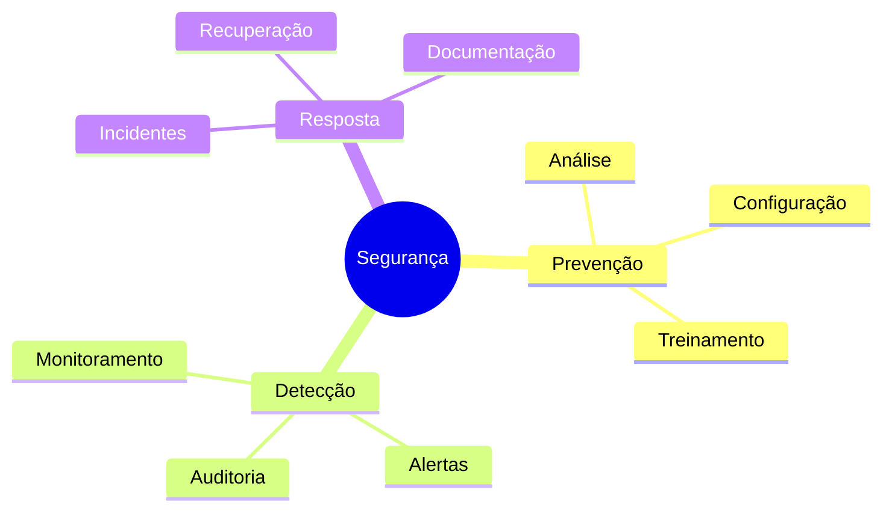
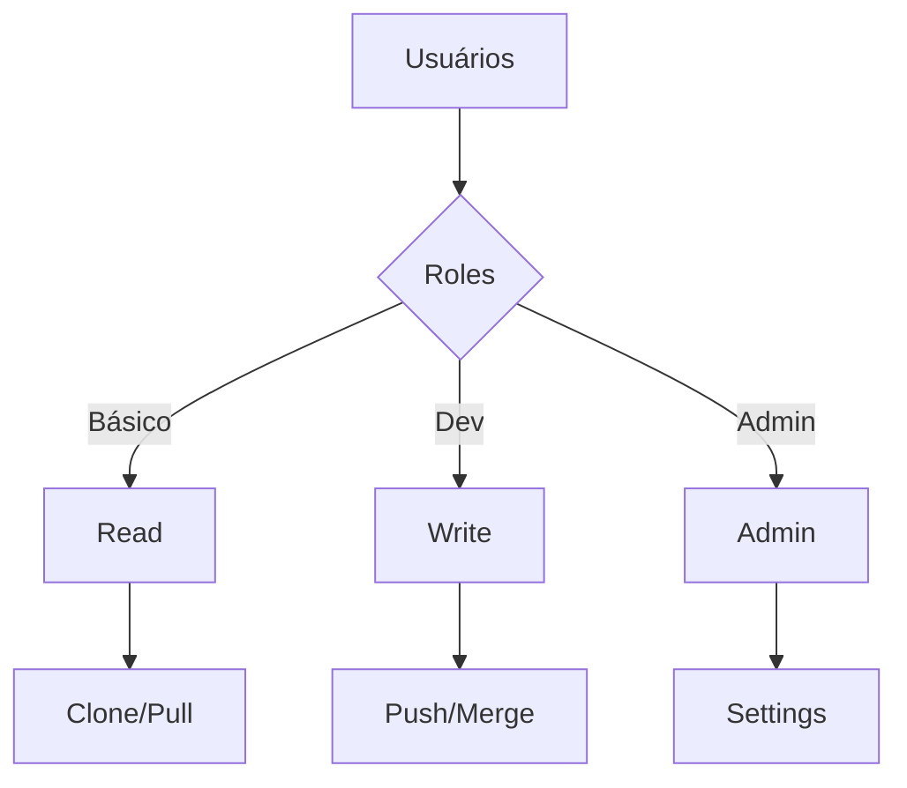
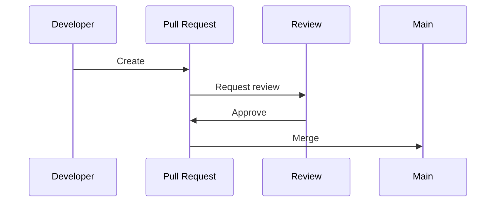
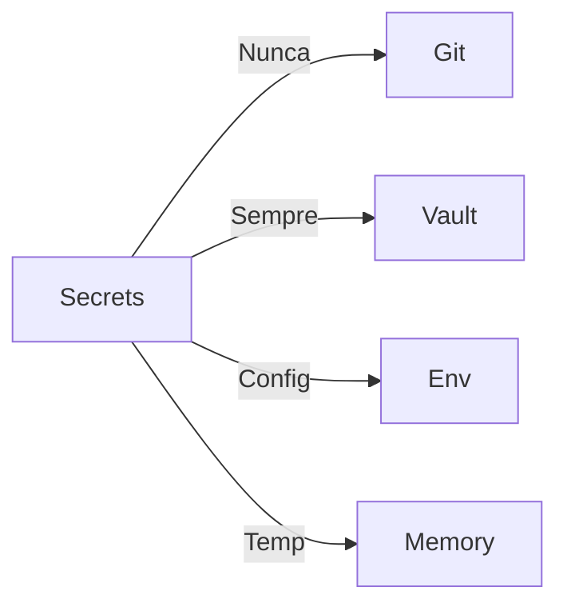
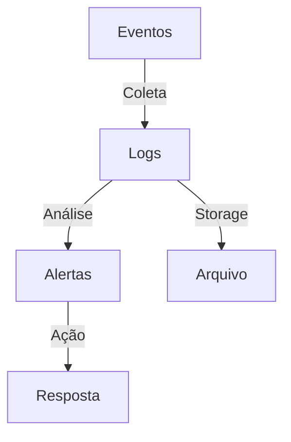

# Melhores Práticas de Segurança no Git

## Princípios Fundamentais

### Pilares de Segurança


## Configurações Seguras

### Repositório
```bash
# Proteger branch principal
git config branch.main.protect true

# Verificar objetos na transferência
git config transfer.fsckObjects true

# Assinar commits automaticamente
git config commit.gpgsign true
```

### Hooks de Segurança
```bash
#!/bin/sh
# pre-commit
if ! security-check; then
    echo "Falha na verificação de segurança"
    exit 1
fi
```

## Controle de Acesso

### Modelo de Permissões


### Políticas
```ascii
+------------------------+
|      POLÍTICAS        |
|                       |
| • Menor privilégio   |
| • Revisão regular    |
| • Logs de acesso     |
| • Tempo limitado     |
| • Aprovações         |
+------------------------+
```

## Proteção de Branches

### Configurações
```yaml
branches:
  main:
    protection:
      required_reviews: 2
      required_checks: true
      enforce_admins: true
      linear_history: true
```

### Workflow


## Gestão de Secrets

### Estratégias


### Ferramentas
1. HashiCorp Vault
2. AWS Secrets Manager
3. Azure Key Vault
4. GitGuardian
5. git-secrets

## Monitoramento

### Sistema de Logs


### Métricas Importantes
```ascii
+------------------------+
|      MÉTRICAS         |
|                       |
| • Tentativas acesso   |
| • Commits rejeitados  |
| • Secrets detectados  |
| • Vulnerabil