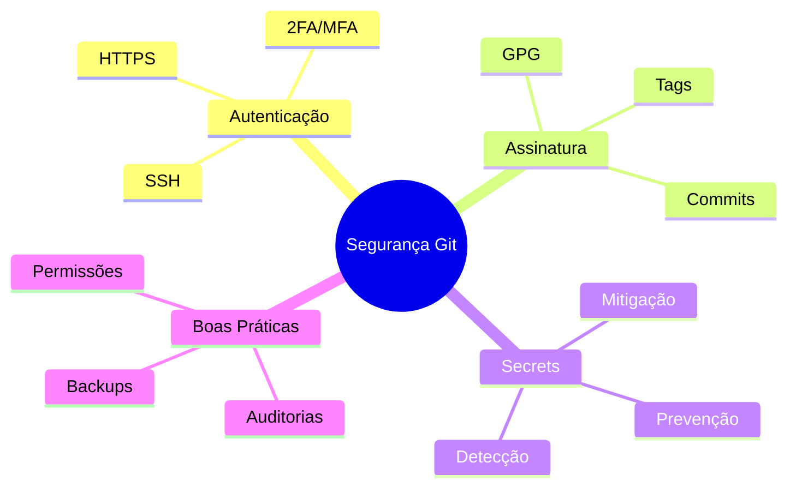
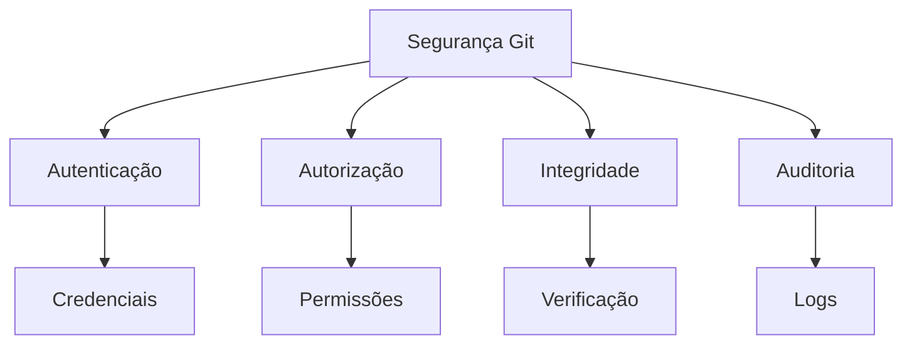
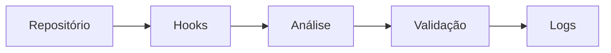
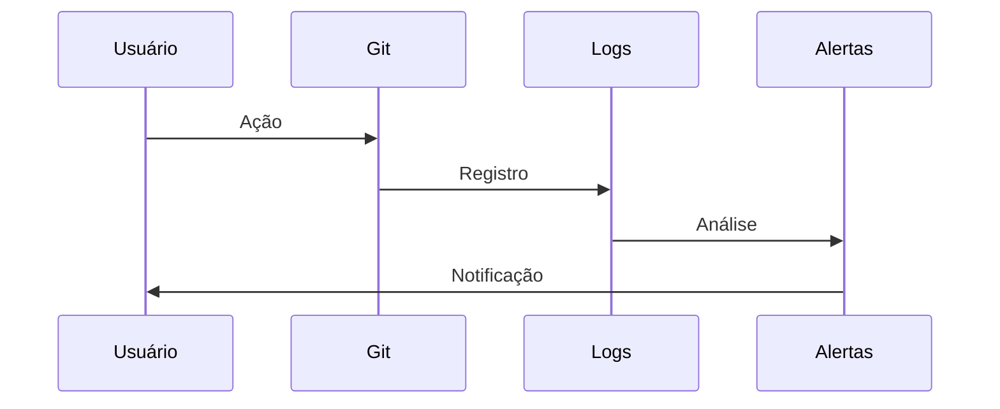

# Segurança no Git

## Visão Geral



## Componentes Principais

### Pilares de Segurança


## Ameaças Comuns

### Vetores de Ataque
```ascii
+------------------------+
|    AMEAÇAS COMUNS     |
|                       |
| • Credenciais vazadas |
| • Commits maliciosos  |
| • Histórico alterado  |
| • Acesso não autor.   |
| • Secrets expostos    |
+------------------------+
```

## Estratégias de Proteção

### Camadas de Segurança


### Ferramentas Recomendadas
1. Git-secrets
2. GitGuardian
3. TruffleHog
4. pre-commit hooks
5. GPG Suite

## Monitoramento

### Logs de Segurança


## Próximos Passos

### Tópicos Relacionados
- Assinatura de commits e tags
- Gerenciamento de secrets
- Autenticação segura
- Melhores práticas

> **Nota**: A segurança é um processo contínuo que requer atenção constante e atualizações regulares das práticas e ferramentas utilizadas.