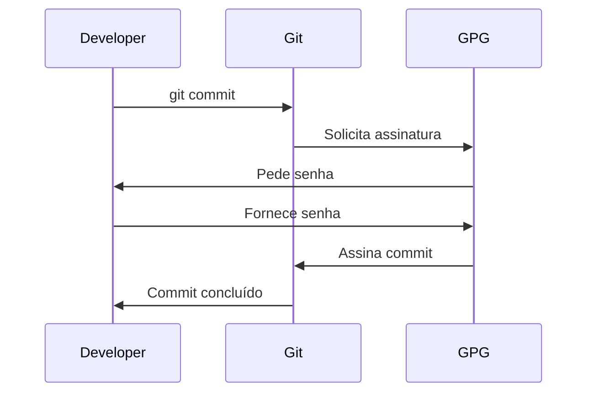
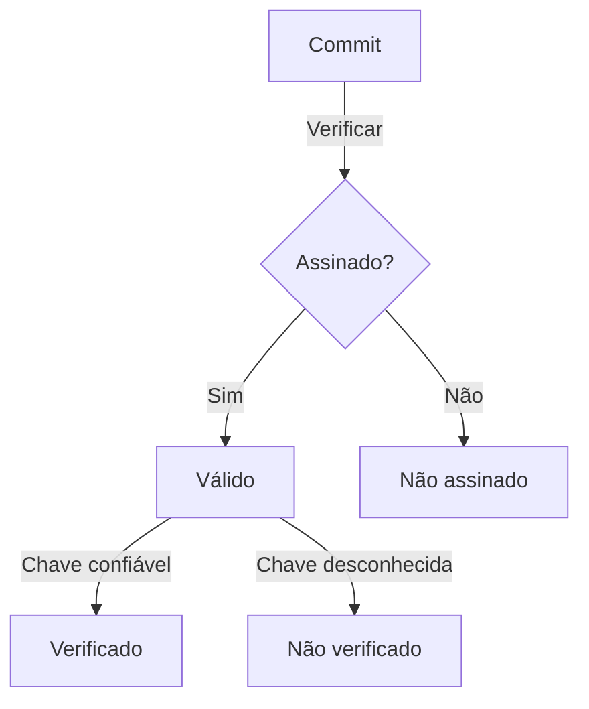
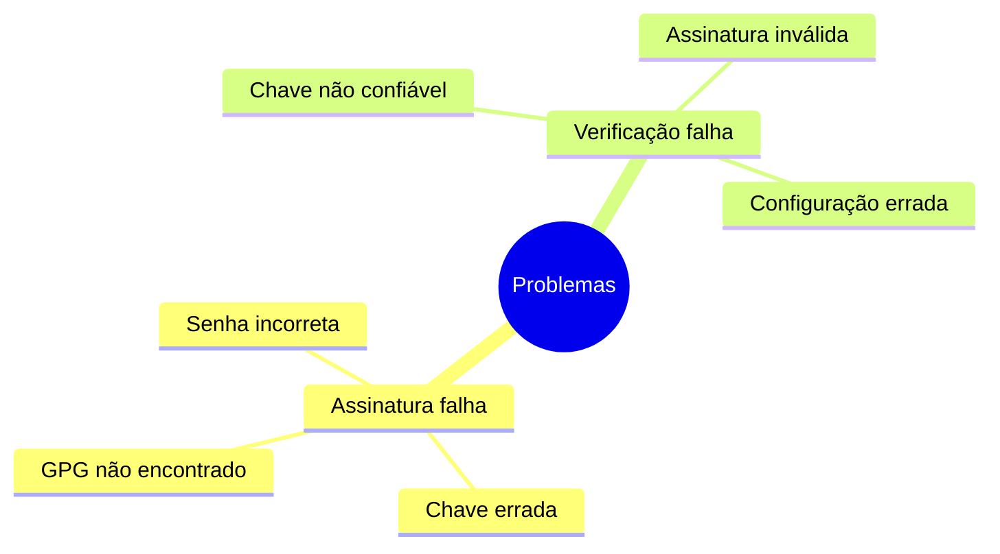

# Assinatura de Commits e Tags

## Configuração GPG

### Setup Inicial
```bash
# Gerar chave GPG
gpg --full-generate-key

# Listar chaves
gpg --list-secret-keys --keyid-format LONG

# Configurar Git
git config --global user.signingkey [KEY_ID]
git config --global commit.gpgsign true
```

## Assinando Commits

### Processo de Assinatura


### Comandos Básicos
```bash
# Commit assinado
git commit -S -m "commit message"

# Verificar assinaturas
git verify-commit HEAD
git verify-tag v1.0.0

# Listar commits assinados
git log --show-signature
```

## Verificação

### Status de Assinatura


## Boas Práticas

### Recomendações
```ascii
+------------------------+
|    BOAS PRÁTICAS      |
|                       |
| • Backup das chaves   |
| • Rotação periódica   |
| • Senha forte         |
| • Chave dedicada     |
| • Expiração definida |
+------------------------+
```

## Troubleshooting

### Problemas Comuns


### Soluções
```bash
# Testar GPG
echo "test" | gpg --clearsign

# Reconfigurar Git GPG
git config --global --unset user.signingkey
git config --global user.signingkey [NEW_KEY_ID]

# Exportar chave pública
gpg --armor --export [KEY_ID]
```

## Integração CI/CD

### Verificação Automatizada
```yaml
name: Verify Signatures
on: [push, pull_request]

jobs:
  verify:
    runs-on: ubuntu-latest
    steps:
      - uses: actions/checkout@v3
      - name: Verify commits
        run: |
          git verify-commit HEAD
```

## Próximos Passos

### Tópicos Relacionados
- Gerenciamento de chaves GPG
- Políticas de assinatura
- Integração com plataformas Git
- Automação de verificação

> **Dica Pro**: Mantenha um backup seguro de suas chaves GPG e considere usar um hardware security module (HSM) para maior segurança.