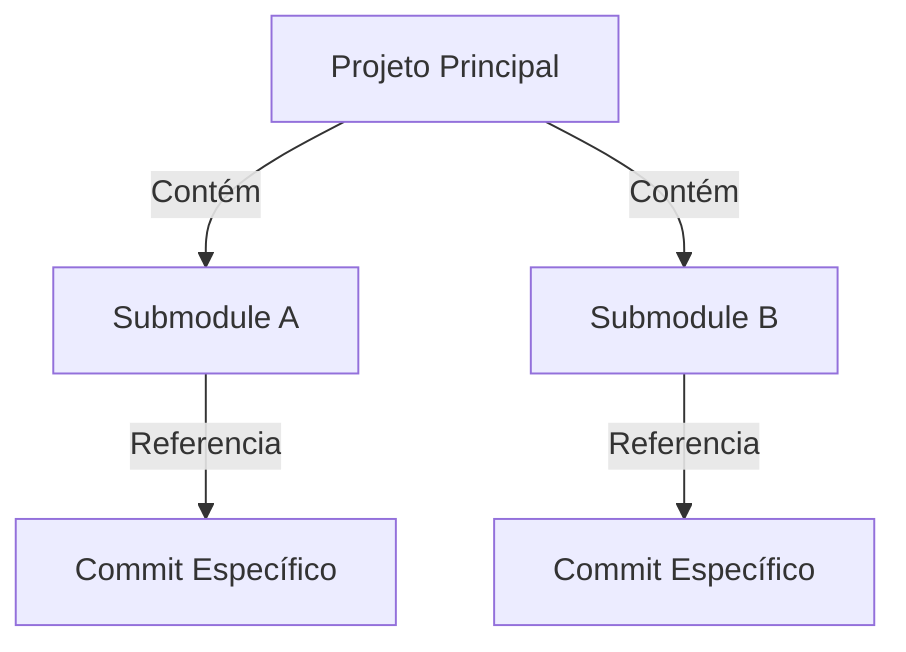
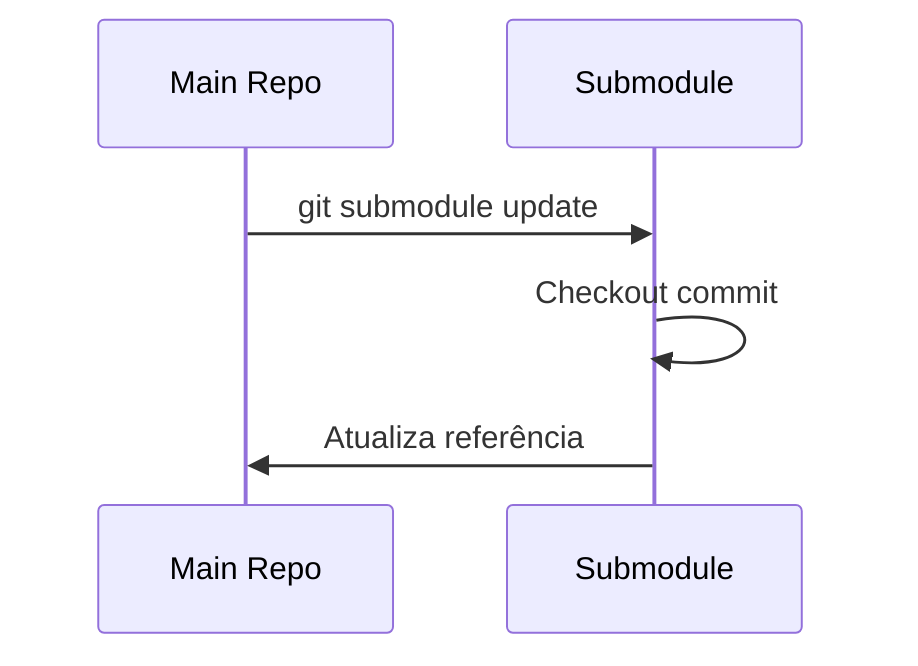
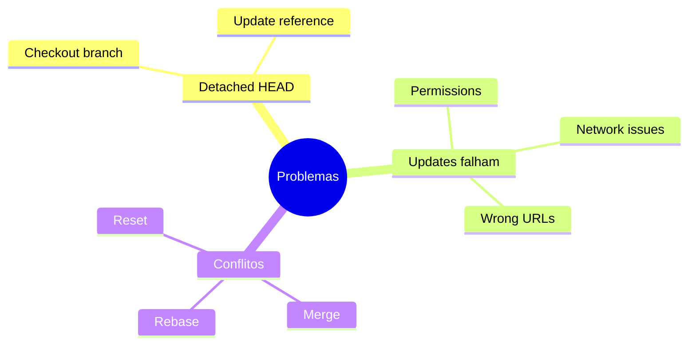
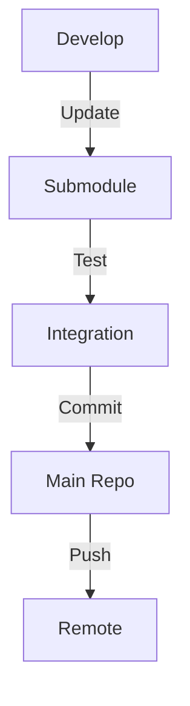
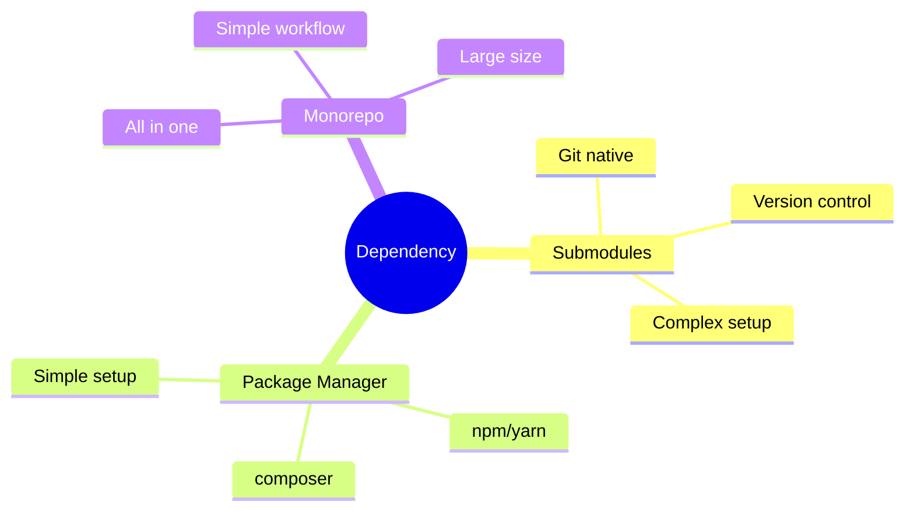

# Git Submodules: Gerenciando Dependências como Submódulos

```ascii
+------------------------+
|     Git Submodules    |
|                       |
| Nested Repositories   |
| Dependency Management |
| Version Control       |
|                       |
| Project Integration   |
+------------------------+
```

## Conceitos Básicos

### O que são Submodules?


### Estrutura
```ascii
projeto/
├── .git/
├── .gitmodules
├── lib/
│   └── dependency/
└── src/
```

## Comandos Essenciais

### Operações Básicas
```bash
# Adicionar submodule
git submodule add https://github.com/user/repo lib/repo

# Inicializar submodules
git submodule init

# Atualizar submodules
git submodule update --init --recursive

# Remover submodule
git submodule deinit lib/repo
git rm lib/repo
```

### Clonagem
```bash
# Clone com submodules
git clone --recursive https://github.com/user/repo

# Ou após clone normal
git submodule update --init --recursive
```

## Gerenciamento

### Atualizando Submodules


### Trabalhando com Branches
```bash
# Entrar no submodule
cd lib/repo

# Mudar branch
git checkout main

# Atualizar
git pull origin main

# Voltar e commitar
cd ../..
git add lib/repo
git commit -m "atualiza submodule"
```

## Boas Práticas

### Recomendações
```ascii
+------------------------+
|    BOAS PRÁTICAS      |
|                       |
| • Versões estáveis   |
| • Commits atômicos   |
| • Documentação clara |
| • Updates planejados |
| • Testes integrados  |
+------------------------+
```

### Configuração
```bash
# Configurar push recursivo
git config push.recurseSubmodules on-demand

# Configurar status detalhado
git config status.submoduleSummary true
```

## Troubleshooting

### Problemas Comuns


### Soluções
```bash
# Resolver detached HEAD
cd submodule
git checkout main
cd ..
git add submodule
git commit

# Forçar update
git submodule update --force --recursive
```

## Workflows

### Desenvolvimento


### CI/CD
```bash
# Script de CI
#!/bin/sh
# Inicializar e atualizar submodules
git submodule update --init --recursive

# Build e teste
for module in $(git submodule | awk '{print $2}'); do
    cd $module
    npm install
    npm test
    cd ..
done
```

## Alternativas

### Comparação


## Dicas Avançadas

### Performance
```bash
# Clone superficial
git clone --depth 1 --shallow-submodules

# Update paralelo
git submodule update --init --recursive --jobs 4
```

### Automação
```bash
# Hook pre-push
#!/bin/sh
git submodule foreach git push

# Hook post-merge
#!/bin/sh
git submodule update --recursive
```

## Próximos Passos

### Tópicos Relacionados
- [Git Subtrees](git-subtrees.md)
- [Dependency Management](dependency-management.md)
- [Monorepo Management](monorepo-management.md)

> **Dica Pro**: Use `git submodule foreach` para executar comandos em todos os submódulos de uma vez. Por exemplo: `git submodule foreach git pull origin main`