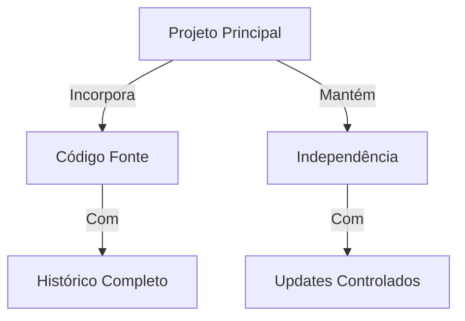
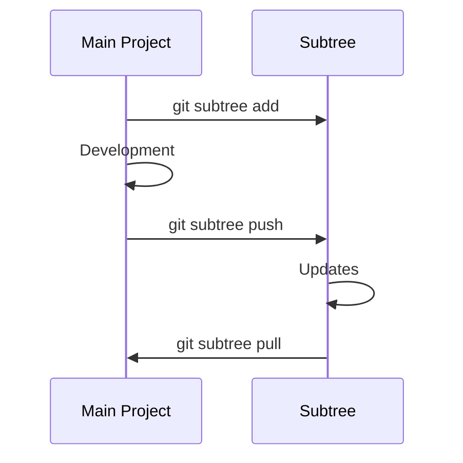
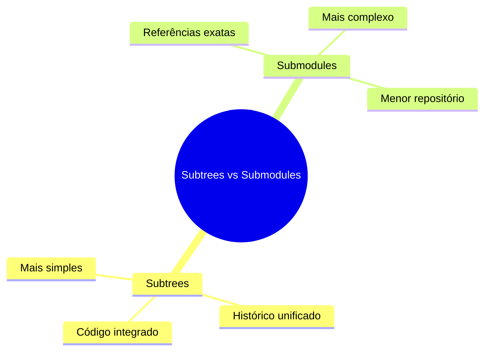
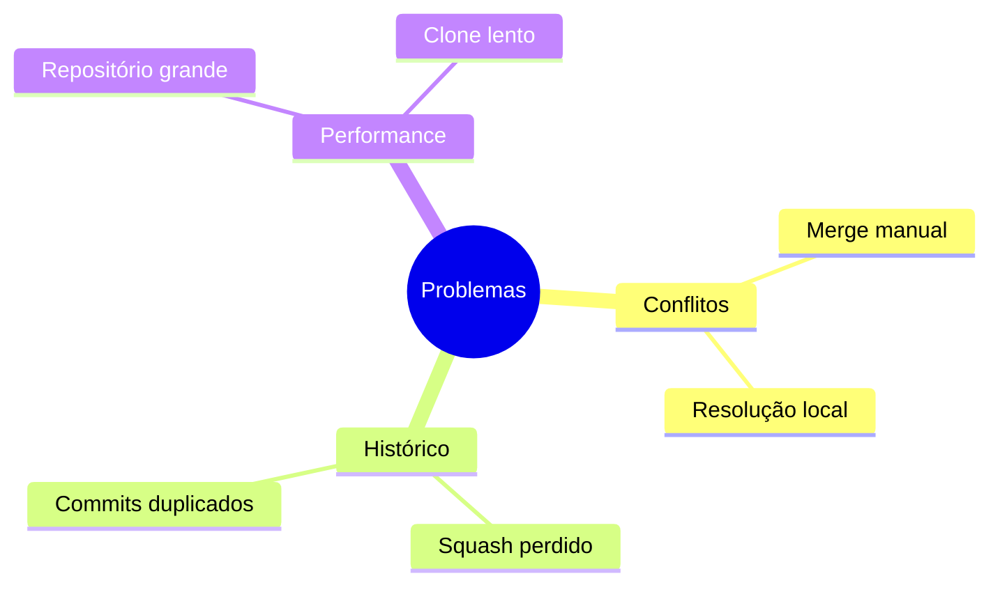
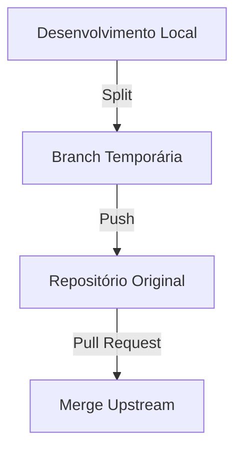

# Git Subtrees: Alternativa Flexível aos Submódulos

```ascii
+------------------------+
|     Git Subtrees      |
|                       |
| Project Integration   |
| Code Sharing          |
| History Preservation  |
|                       |
| Flexible Management   |
+------------------------+
```

## Conceitos Básicos

### O que são Subtrees?


### Estrutura
```ascii
projeto/
├── .git/
├── src/
└── lib/
    └── external/
        └── [código incorporado]
```

## Comandos Essenciais

### Operações Básicas
```bash
# Adicionar subtree
git subtree add --prefix=lib/demo https://github.com/user/demo main --squash

# Atualizar subtree
git subtree pull --prefix=lib/demo https://github.com/user/demo main --squash

# Enviar mudanças
git subtree push --prefix=lib/demo https://github.com/user/demo main
```

### Split e Merge
```bash
# Extrair subtree como branch
git subtree split --prefix=lib/demo -b temp_branch

# Mesclar mudanças
git subtree merge --prefix=lib/demo temp_branch
```

## Gerenciamento

### Fluxo de Trabalho


### Estratégias de Atualização
```bash
# Pull com squash
git subtree pull --prefix=lib/demo \
    https://github.com/user/demo main --squash

# Pull preservando histórico
git subtree pull --prefix=lib/demo \
    https://github.com/user/demo main
```

## Boas Práticas

### Recomendações
```ascii
+------------------------+
|    BOAS PRÁTICAS      |
|                       |
| • Prefixos claros    |
| • Squash quando útil |
| • Updates regulares  |
| • Documentação       |
| • Branches separados |
+------------------------+
```

### Organização
```bash
# Criar alias para comandos comuns
git config alias.sba 'subtree add'
git config alias.sbp 'subtree pull'
git config alias.sbs 'subtree push'
```

## Comparação com Submodules

### Vantagens e Desvantagens


### Quando Usar
```ascii
+------------------------+
|    SUBTREES           |
| • Código estável     |
| • Mudanças raras     |
| • Time único         |
|                      |
|    SUBMODULES        |
| • Updates frequentes |
| • Times separados    |
| • Versões exatas     |
+------------------------+
```

## Troubleshooting

### Problemas Comuns


### Soluções
```bash
# Resolver conflitos
git checkout --theirs lib/demo
git add lib/demo
git commit

# Limpar histórico
git subtree split --prefix=lib/demo --rejoin
```

## Workflows Avançados

### Contribuição Upstream


### Automação
```bash
#!/bin/sh
# Script de atualização
for subtree in lib/*; do
    if [ -d "$subtree" ]; then
        prefix="lib/$(basename $subtree)"
        remote="https://github.com/user/$(basename $subtree)"
        git subtree pull --prefix=$prefix $remote main --squash
    fi
done
```

## Dicas Avançadas

### Performance
```bash
# Split otimizado
git subtree split --prefix=lib/demo \
    --onto=temp_branch -b new_branch

# Push seletivo
git subtree push --prefix=lib/demo \
    origin branch_name --rejoin
```

### Manutenção
```bash
# Verificar subtrees
git log | grep -e "git-subtree-dir:"

# Limpar referências antigas
git gc --aggressive --prune=now
```

## Próximos Passos

### Tópicos Relacionados
- [Git Submodules](git-submodules.md)
- [Monorepo Management](monorepo-management.md)
- [Git Advanced](git-advanced.md)

> **Dica Pro**: Use `--squash` ao adicionar subtrees para manter o histórico limpo, mas considere omiti-lo se precisar manter o histórico completo para referência.