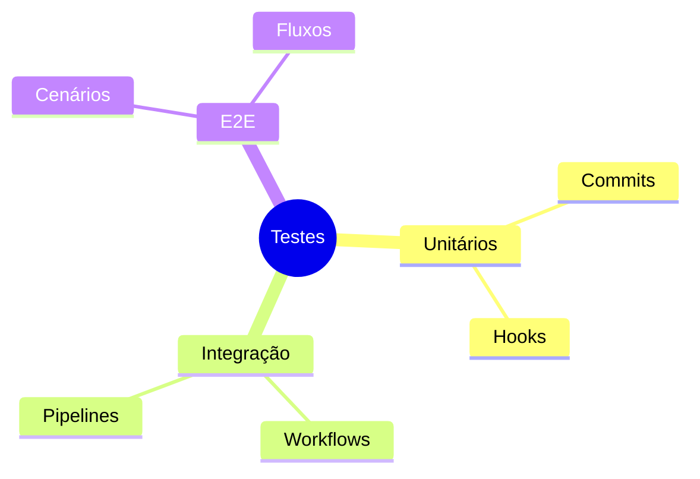
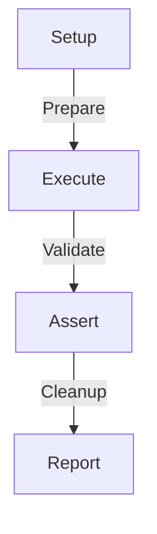
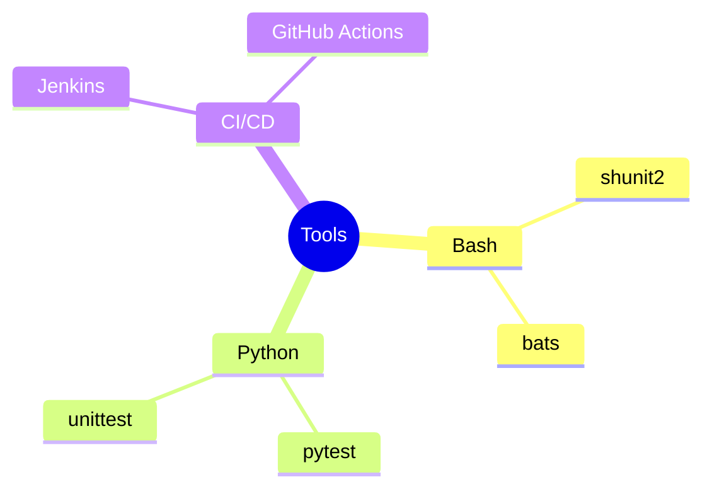

# Git Testing: Garantindo Qualidade no Versionamento

```ascii
+------------------------+
|     Git Testing       |
|                       |
| Testes Automatizados  |
| Validação             |
| Qualidade             |
|                       |
| Confiabilidade        |
+------------------------+
```

## Fundamentos

### Tipos de Testes


### Framework de Testes
```bash
# Estrutura básica
tests/
├── unit/
│   ├── commit_test.sh
│   └── hook_test.sh
├── integration/
│   ├── workflow_test.sh
│   └── pipeline_test.sh
└── e2e/
    ├── scenarios/
    └── flows/
```

## Testes Unitários

### Testando Commits
```bash
#!/bin/bash
test_commit_message() {
    message="$1"
    if ! echo "$message" | grep -qE "^(feat|fix|docs|style|refactor|test|chore):"; then
        return 1
    fi
    return 0
}
```

### Testando Hooks
```bash
#!/bin/bash
test_pre_commit_hook() {
    # Setup
    cp .git/hooks/pre-commit{,.bak}
    
    # Test
    ./pre-commit.sh
    result=$?
    
    # Cleanup
    mv .git/hooks/pre-commit{.bak,}
    return $result
}
```

## Testes de Integração

### Workflow Tests


### Pipeline Tests
```yaml
name: Git Integration Tests
on: [push, pull_request]
jobs:
  test:
    runs-on: ubuntu-latest
    steps:
      - uses: actions/checkout@v2
      - name: Run Tests
        run: |
          ./run_integration_tests.sh
```

## Testes E2E

### Cenários Comuns
```bash
#!/bin/bash
test_branch_workflow() {
    # Setup
    git checkout -b feature/test
    
    # Test
    echo "test" > file.txt
    git add file.txt
    git commit -m "test: add file"
    git push origin feature/test
    
    # Assert
    git log --oneline | grep "test: add file"
    
    # Cleanup
    git checkout main
    git branch -D feature/test
}
```

### Automação E2E
```python
def test_git_workflow():
    """
    Teste completo de workflow Git
    """
    # Setup
    repo = setup_test_repo()
    
    # Execute
    create_branch(repo)
    make_changes(repo)
    create_pr(repo)
    
    # Assert
    assert verify_pr(repo)
    
    # Cleanup
    cleanup_repo(repo)
```

## Ferramentas

### Test Runners


### Relatórios
```ascii
+------------------------+
|    TEST REPORT        |
|                       |
| ✓ Commit Tests       |
| ✓ Hook Tests         |
| ✓ Workflow Tests     |
| ✗ Pipeline Tests     |
| ✓ E2E Tests          |
+------------------------+
```

## Boas Práticas

### Organização
1. Estrutura clara de testes
2. Nomenclatura consistente
3. Isolamento de testes
4. Limpeza após testes
5. Documentação adequada

### Automação
```bash
#!/bin/bash
# Script de teste completo
run_all_tests() {
    echo "Running unit tests..."
    ./run_unit_tests.sh
    
    echo "Running integration tests..."
    ./run_integration_tests.sh
    
    echo "Running E2E tests..."
    ./run_e2e_tests.sh
}
```

## CI/CD Integration

### GitHub Actions
```yaml
name: Git Tests
on: [push, pull_request]
jobs:
  test:
    runs-on: ubuntu-latest
    steps:
      - uses: actions/checkout@v2
      - name: Unit Tests
        run: ./run_unit_tests.sh
      - name: Integration Tests
        run: ./run_integration_tests.sh
      - name: E2E Tests
        run: ./run_e2e_tests.sh
```

## Próximos Passos

### Tópicos Relacionados
- [Git Automation](git-automation.md)
- [Git CI/CD](git-cicd.md)
- [Git Quality](git-quality.md)

> **Dica Pro**: Mantenha seus testes atualizados e execute-os frequentemente para garantir a qualidade do seu workflow Git.