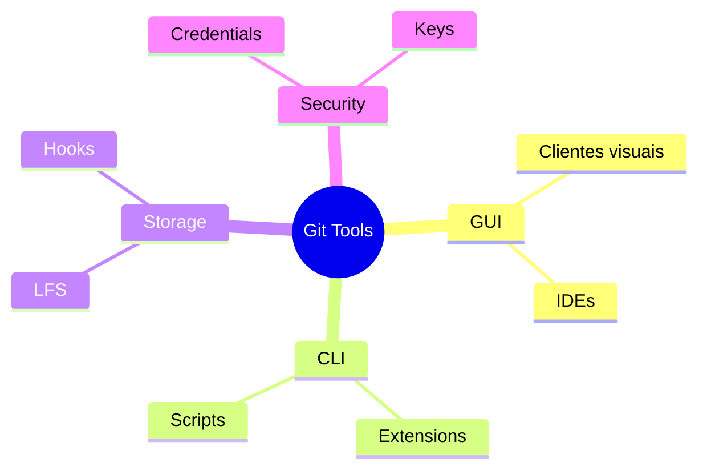
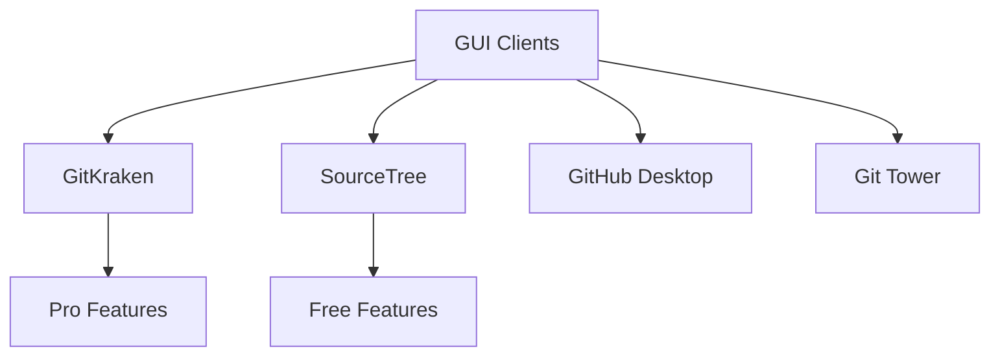
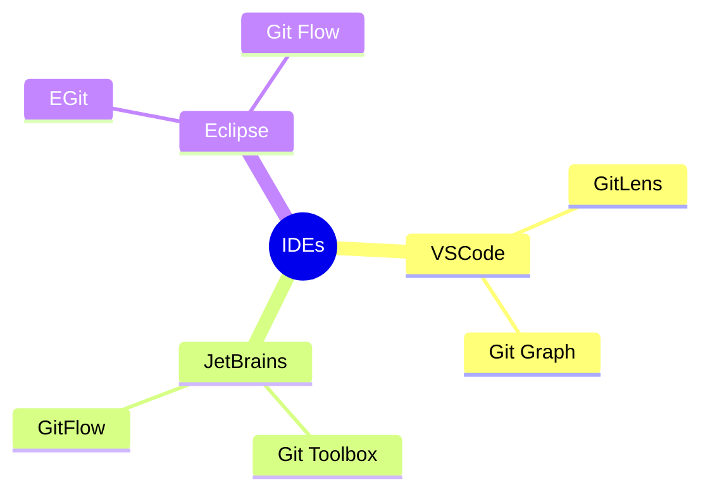
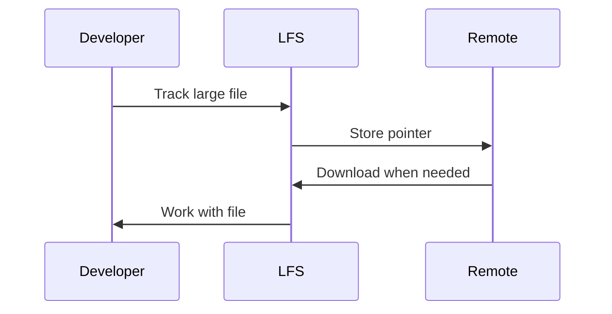
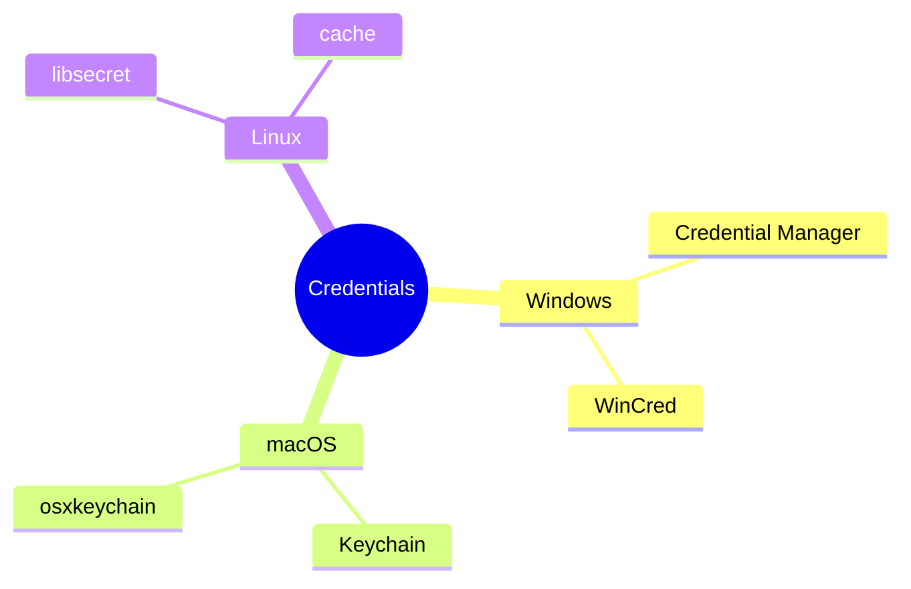
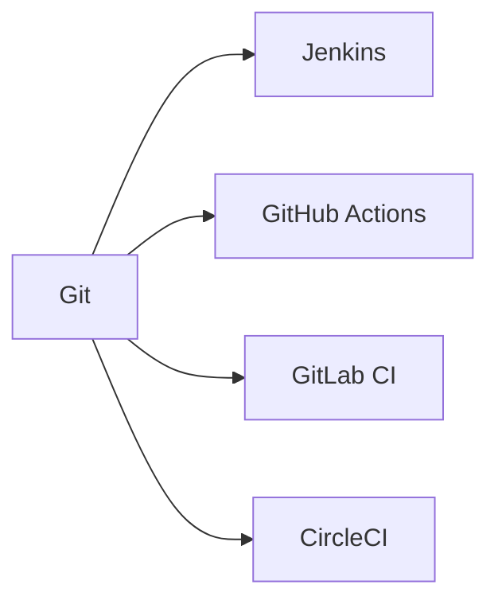
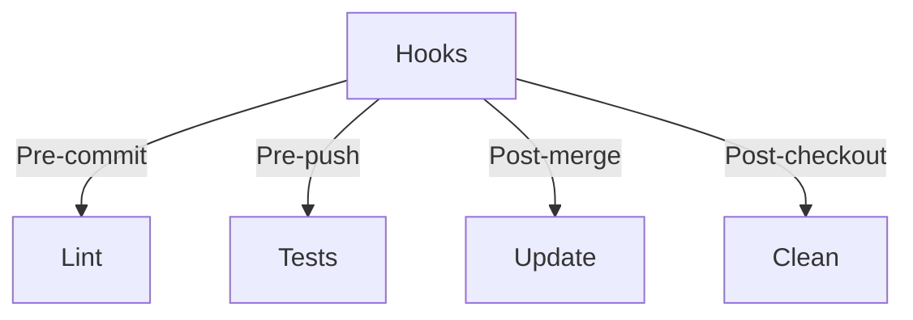

# Ferramentas Git: Expandindo Suas Capacidades

```ascii
+------------------------+
|     Git Tools         |
|                       |
| GUI Clients          |
| Extensions           |
| LFS                  |
| Credentials          |
|                       |
| Power User Tools     |
+------------------------+
```

## Visão Geral

### Categorias


## Ferramentas Essenciais

### GUI Clients


### CLI Enhancers
```bash
# Oh My Zsh Git plugins
git config --global oh-my-zsh.hide-status 0
git config --global oh-my-zsh.hide-dirty 0

# Git Flow
git flow init
git flow feature start nova-feature

# Hub (GitHub CLI)
hub create
hub pull-request
```

## Extensões Populares

### IDE Integration


### Produtividade
```ascii
+------------------------+
|    PRODUTIVIDADE      |
|                       |
| • Auto-complete      |
| • Aliases            |
| • Scripts            |
| • Hooks              |
| • Templates          |
+------------------------+
```

## Git LFS

### Configuração Básica
```bash
# Instalar Git LFS
git lfs install

# Rastrear arquivos grandes
git lfs track "*.psd"
git lfs track "*.zip"

# Verificar tracking
git lfs ls-files
```

### Workflow LFS


## Gerenciamento de Credenciais

### Helpers Disponíveis


### Configuração
```bash
# Windows
git config --global credential.helper manager

# macOS
git config --global credential.helper osxkeychain

# Linux
git config --global credential.helper cache
```

## Integrações

### CI/CD Tools


### Project Management
```ascii
+------------------------+
|    INTEGRAÇÕES        |
|                       |
| • Jira               |
| • Trello             |
| • Monday             |
| • Asana              |
| • ClickUp            |
+------------------------+
```

## Dicas Avançadas

### Customização
```bash
# Aliases personalizados
git config --global alias.standup "log --since yesterday --author $(git config user.email)"
git config --global alias.undo "reset HEAD~1 --mixed"

# Scripts úteis
echo '#!/bin/sh
git checkout master
git pull origin master
git checkout -' > .git/hooks/post-commit
```

### Automação


## Próximos Passos

### Tópicos Relacionados
- [Git GUIs](git-guis.md)
- [Git Extensions](git-extensions.md)
- [Git LFS](git-lfs.md)
- [Git Credential Helpers](git-credential-helpers.md)

> **Dica Pro**: Experimente diferentes ferramentas para encontrar o conjunto que melhor se adapta ao seu workflow. Não existe uma solução única para todos.