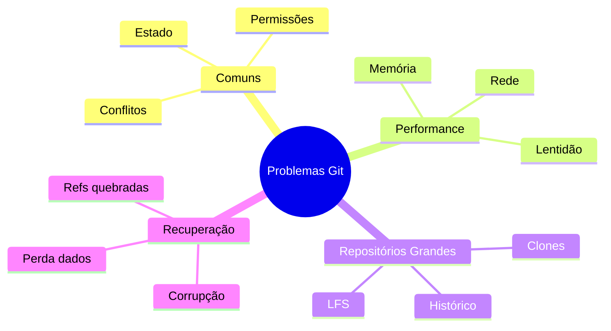

# Troubleshooting Git

Git é uma ferramenta robusta, mas ocasionalmente problemas podem surgir. Este guia ajudará você a diagnosticar e resolver questões comuns.

## Visão Geral

### Categorias de Problemas


## Diagnóstico

### Ferramentas Essenciais
```bash
# Verificar estado do repositório
git status

# Verificar integridade
git fsck --full

# Ver logs detalhados
GIT_TRACE=1 git comando

# Verificar objetos
git count-objects -v
```

### Logs e Debug
```ascii
+------------------------+
|    NÍVEIS DE LOG      |
|                       |
| • GIT_TRACE          |
| • GIT_TRACE_PACK     |
| • GIT_TRACE_PACKET   |
| • GIT_TRACE_PERF     |
| • GIT_TRACE_SETUP    |
+------------------------+
```

## Prevenção

### Boas Práticas
1. Backup regular
2. Manutenção preventiva
3. Monitoramento
4. Documentação
5. Treinamento da equipe

### Configurações Recomendadas
```bash
# Melhorar performance
git config core.preloadindex true
git config core.fsmonitor true

# Aumentar segurança
git config transfer.fsckObjects true

# Melhorar logs
git config core.logallrefupdates true
```

## Próximos Passos

### Tópicos Relacionados
- [Problemas Comuns](common-issues.md)
- [Questões de Performance](performance-issues.md)
- [Repositórios Grandes](large-repositories.md)
- [Procedimentos de Recuperação](recovery-procedures.md)

> **Dica Pro**: Mantenha um registro de problemas encontrados e suas soluções para referência futura.