# Fluxo de Trabalho do Git

## Iniciando um Repositório
Devemos usar o comando abaixo para iniciar o repositório para que o Git consiga ver os arquivos.

```bash
md MilfsGo # Cria a pasta
cd MilfsGo # acessa a pasta
git init
```

## Ciclo de Vida dos Arquivos

### Estados dos Arquivos
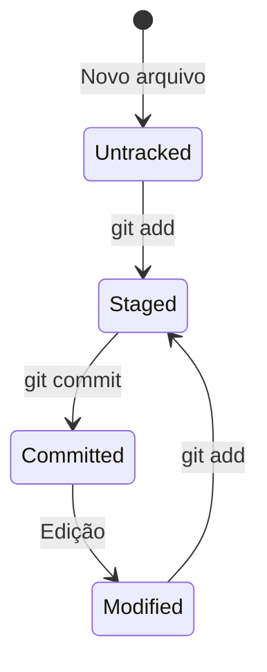

### Áreas do Git
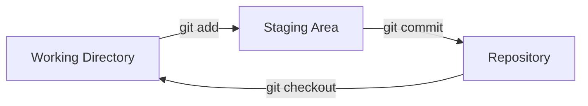

## Fazendo Alterações
Agora vamos fazer alterações básicas como adicionar um *README* para o projeto.

> README são arquivos geralmente em markdown (.md) para registrar a documentação do repositório com informações importantes como:
> - Nome
> - Descrição
> - Como usar
> - Etc

### Criando README
```bash
# Criar e editar README
echo "# MilfsGo" > README.md
echo "Projeto para encontrar milfs na sua região" >> README.md
```

### Adicionando ao Stage
```bash
# Adicionar arquivo específico
git add README.md

# Adicionar todos os arquivos
git add .
```

## Verificando Status
```bash
git status
```

> 
> Resultado da execução do comando...

## Commits

### Anatomia de um Bom Commit
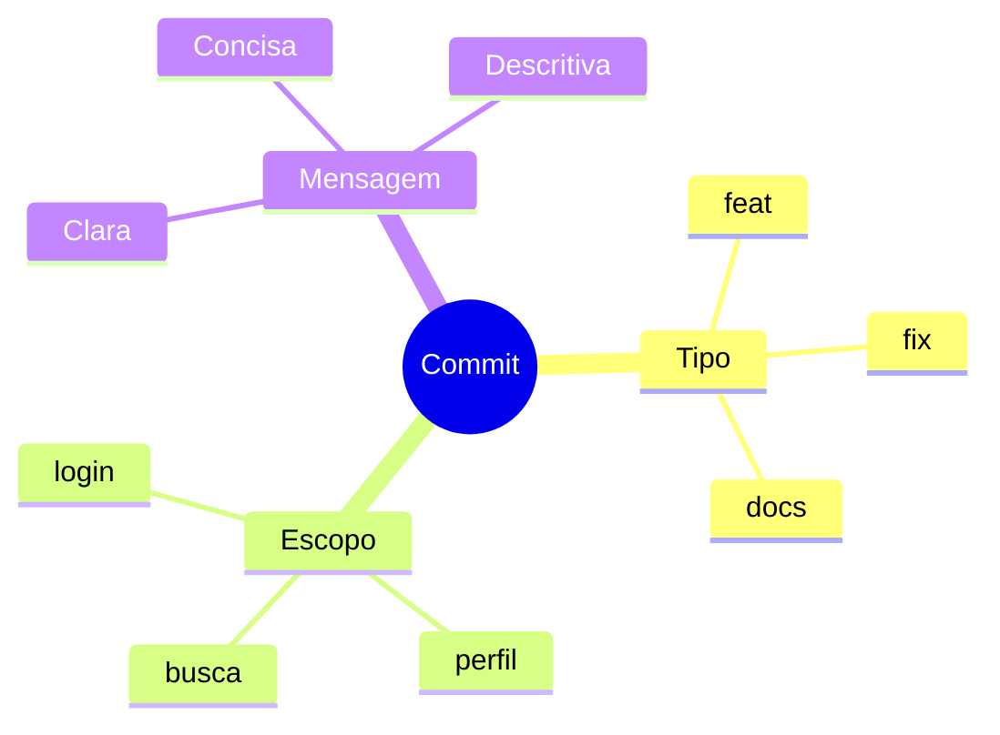

### Padrões de Commit
```bash
# Commits semânticos
git commit -m "feat: adiciona sistema de busca"
git commit -m "fix: corrige bug no filtro de idade"
git commit -m "docs: atualiza documentação de instalação"
```

## Branches

### Fluxo de Branches
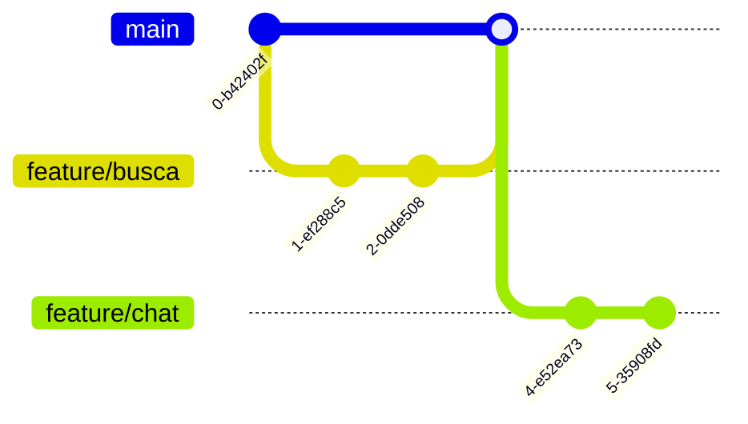

### Comandos de Branch
```bash
# Criar e mudar de branch
git checkout -b feature/nova-busca

# Listar branches
git branch

# Mudar de branch
git checkout main

# Deletar branch
git branch -d feature/antiga
```

## Sincronização com Remoto

### Configurando Remoto
```bash
# Adicionar remoto
git remote add origin https://github.com/user/MilfsGo.git

# Verificar remotos
git remote -v
```

### Push e Pull
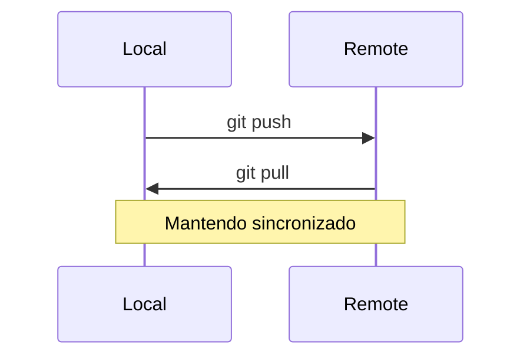

```bash
# Enviar alterações
git push origin main

# Buscar alterações
git pull origin main
```

## Resolução de Conflitos

### Tipos de Conflitos
```ascii
<<<<<<< HEAD
Sua versão
=======
Versão remota
>>>>>>> branch-name
```

### Resolvendo Conflitos
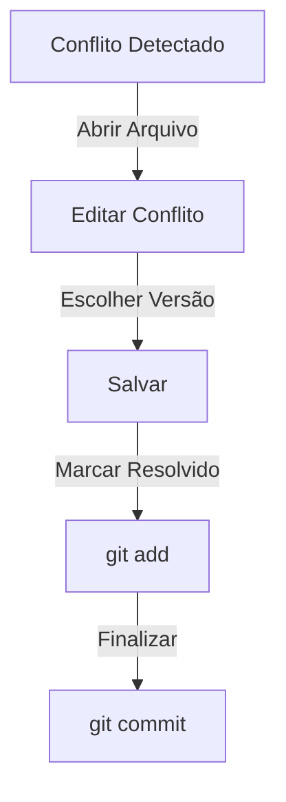

## Stash

### Salvando Trabalho Temporário
```bash
# Guardar alterações
git stash

# Listar stashes
git stash list

# Recuperar alterações
git stash pop
```

### Fluxo com Stash
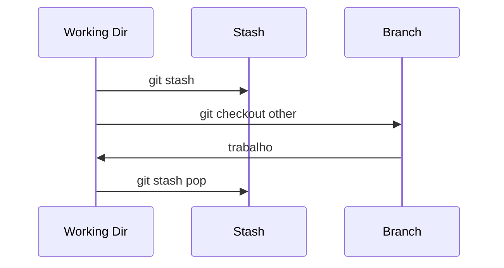

## Tags

### Versionamento
```bash
# Criar tag
git tag -a v1.0.0 -m "Primeira versão estável"

# Listar tags
git tag

# Publicar tags
git push origin --tags
```

### Estrutura de Tags
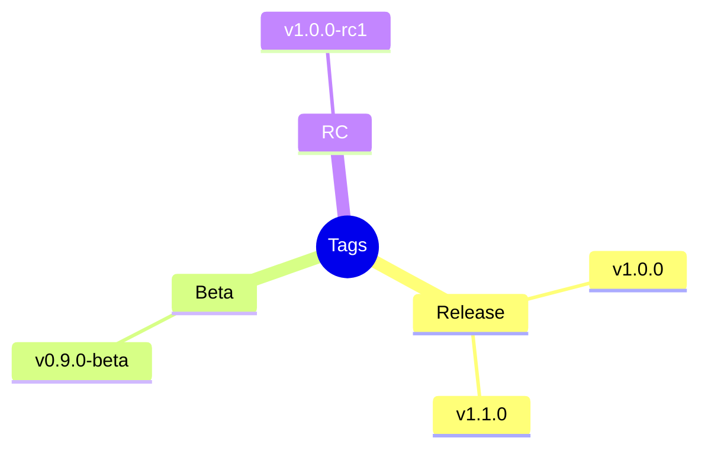

## Logs e Histórico

### Visualizando Histórico
```bash
# Log básico
git log

# Log formatado
git log --oneline --graph --decorate

# Log específico
git log --author="Stifler"
```

### Buscando no Histórico
```bash
# Buscar por mensagem
git log --grep="feat"

# Buscar por conteúdo
git log -S "milf"
```

## Melhores Práticas

### Commits
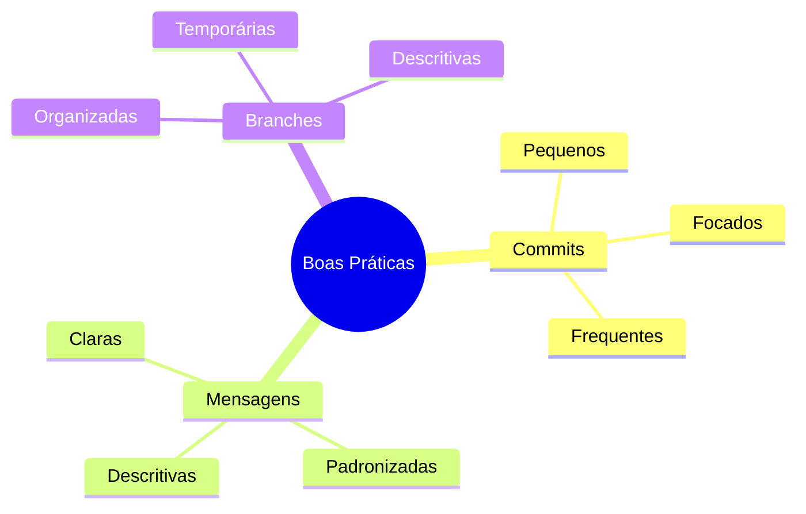

### Workflow Diário
```ascii
📋 Daily Git Workflow

1. [ ] git pull origin main
2. [ ] git checkout -b feature/nova
3. [ ] Desenvolvimento
4. [ ] git add .
5. [ ] git commit -m "feat: nova função"
6. [ ] git push origin feature/nova
7. [ ] Criar Pull Request
```

## Ferramentas Úteis

### GUI Clients
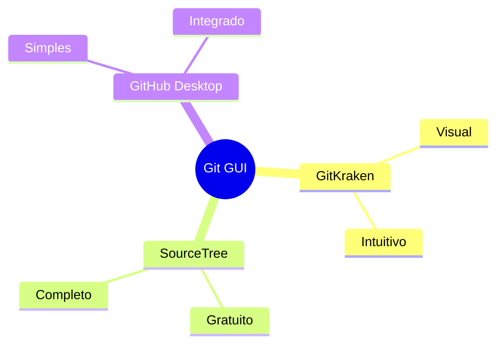

### IDE Integration
- VS Code
- IntelliJ
- Eclipse
- Sublime

## Dicas Avançadas

### Aliases Úteis
```bash
# Configurar aliases
git config --global alias.st status
git config --global alias.co checkout
git config --global alias.br branch
git config --global alias.ci commit
```

### Scripts de Produtividade
```bash
# Atualizar e limpar
git pull origin main && git remote prune origin

# Deletar branches mergeadas
git branch --merged | grep -v "\*" | xargs -n 1 git branch -d
```

## Troubleshooting

### Problemas Comuns
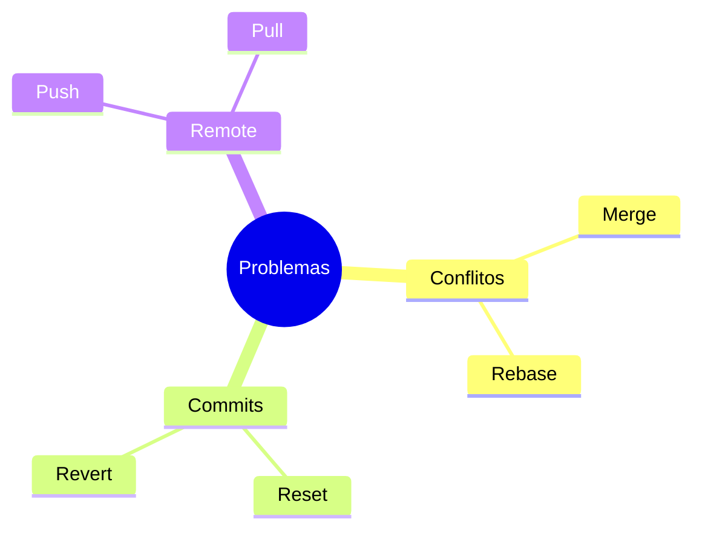

### Soluções
```ascii
🔧 Git Fixes

Commit errado:
└── git reset --soft HEAD^

Branch errada:
└── git checkout -b correct-branch

Conflito:
└── Resolver + git add + git commit
```

## Próximos Passos

### Avançando no Git
1. Git Flow
2. Rebase interativo
3. Git Hooks
4. CI/CD

### Recursos Adicionais
- [Git Documentation](https://git-scm.com/doc)
- [GitHub Guides](https://guides.github.com)
- [Git Cheat Sheet](https://education.github.com/git-cheat-sheet-education.pdf)

> **Dica Pro**: Mantenha um cheat sheet personalizado com seus comandos mais usados!