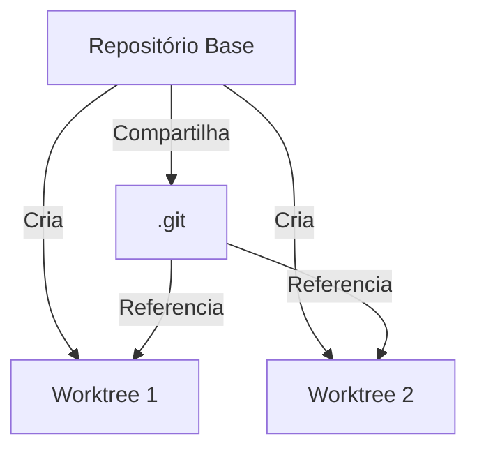
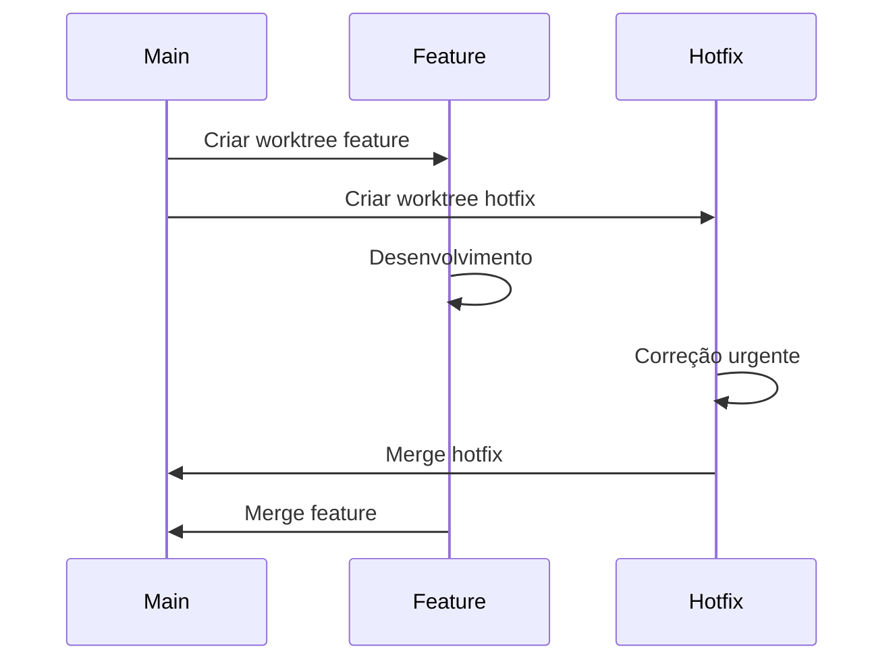
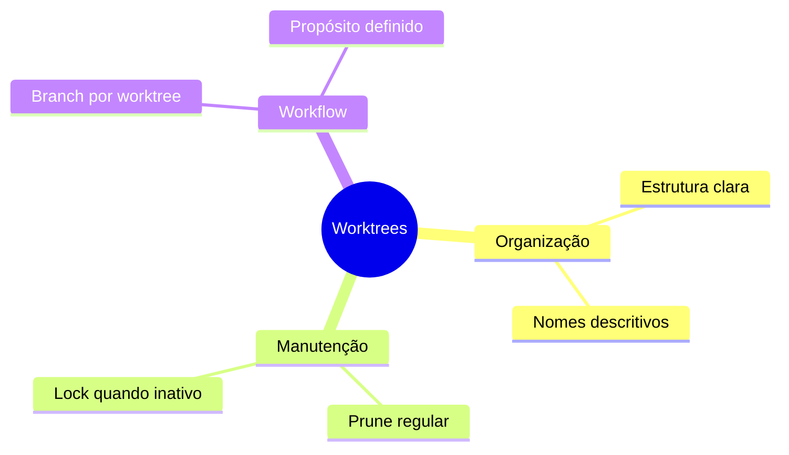
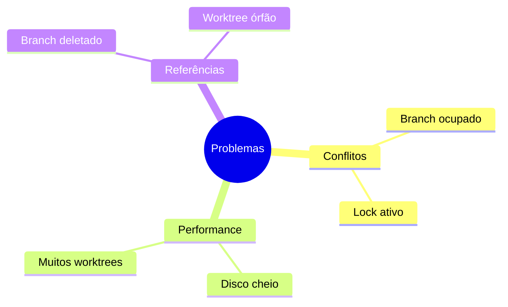
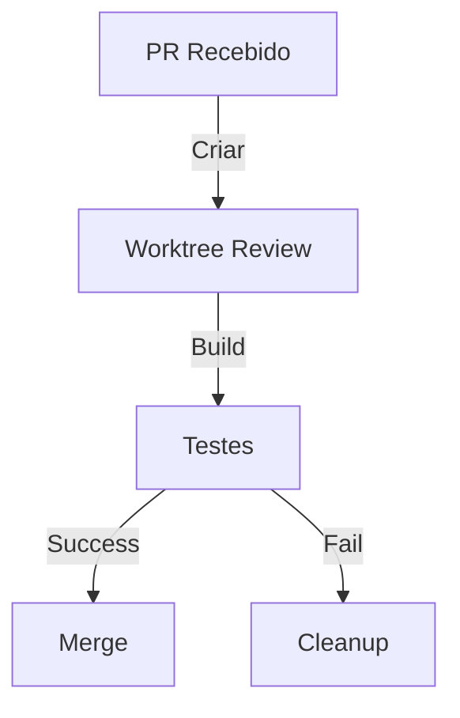
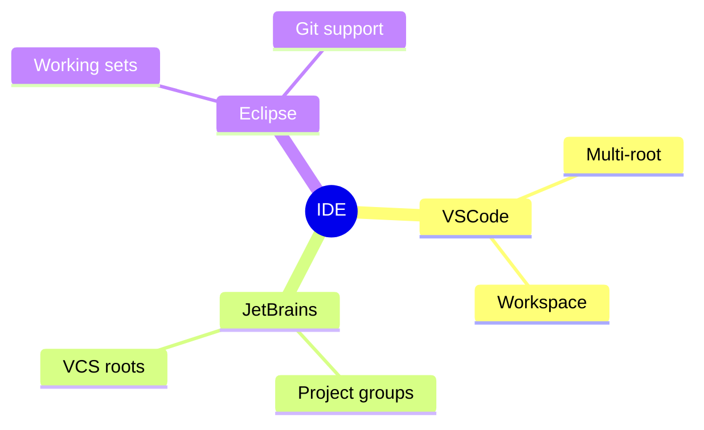

# Git Worktrees: Trabalhando com Múltiplos Diretórios

```ascii
+------------------------+
|     Git Worktrees     |
|                       |
| Multiple Workspaces   |
| Parallel Development  |
| Resource Efficiency   |
|                       |
| Flexible Management   |
+------------------------+
```

## Conceitos Básicos

### O que são Worktrees?


### Estrutura
```ascii
projeto/
├── .git/
├── main/
│   └── [branch main]
├── feature/
│   └── [branch feature]
└── hotfix/
    └── [branch hotfix]
```

## Comandos Essenciais

### Operações Básicas
```bash
# Criar worktree
git worktree add ../feature feature-branch

# Listar worktrees
git worktree list

# Remover worktree
git worktree remove ../feature

# Mover worktree
git worktree move ../feature ../new-feature
```

### Gerenciamento
```bash
# Criar nova branch com worktree
git worktree add -b nova-feature ../feature

# Limpar worktrees inacessíveis
git worktree prune

# Bloquear worktree
git worktree lock ../feature
```

## Casos de Uso

### Desenvolvimento Paralelo


### Cenários Comuns
```ascii
+------------------------+
|    CASOS DE USO       |
|                       |
| • Feature paralela   |
| • Hotfix urgente    |
| • Build separado    |
| • Review de PR      |
| • Testes isolados   |
+------------------------+
```

## Boas Práticas

### Recomendações


### Configuração
```bash
# Alias úteis
git config alias.wt 'worktree'
git config alias.wta 'worktree add'
git config alias.wtl 'worktree list'
git config alias.wtr 'worktree remove'
```

## Troubleshooting

### Problemas Comuns


### Soluções
```bash
# Resolver lock
git worktree unlock ../feature

# Limpar worktrees mortos
git worktree prune

# Forçar remoção
git worktree remove -f ../feature
```

## Workflows Avançados

### CI/CD
```bash
#!/bin/sh
# Script de build paralelo
for branch in feature/* ; do
    git worktree add "../build/${branch##*/}" $branch
    (cd "../build/${branch##*/}" && ./build.sh)
done
```

### Automação


## Dicas Avançadas

### Performance
```bash
# Otimizar espaço
git worktree add --detach ../feature

# Checkout otimizado
git worktree add -f --checkout ../feature
```

### Manutenção
```ascii
+------------------------+
|    MANUTENÇÃO         |
|                       |
| • Backup .git        |
| • Prune regular     |
| • Monitor espaço    |
| • Check locks       |
| • Clean worktrees   |
+------------------------+
```

## Integração com Ferramentas

### IDE Support


## Próximos Passos

### Tópicos Relacionados
- [Git Branches](git-branches.md)
- [Git Workflow](git-workflow.md)
- [Git Performance](git-performance.md)

> **Dica Pro**: Use worktrees para manter builds ou deploys separados do código fonte principal, facilitando a gestão de diferentes ambientes.