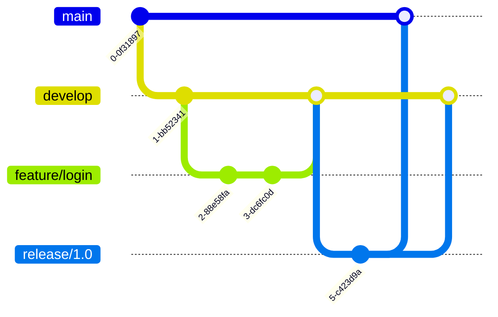
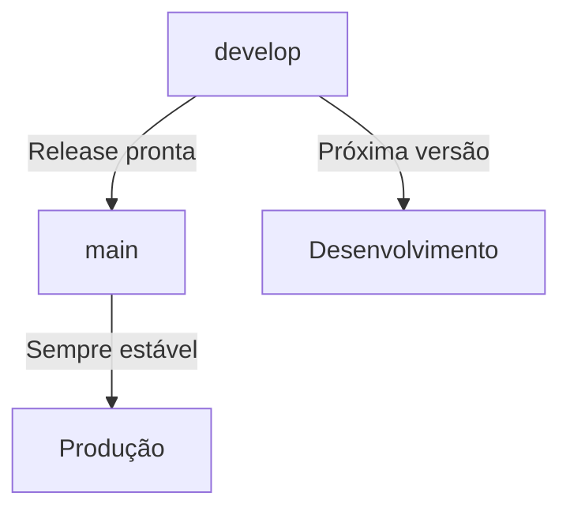
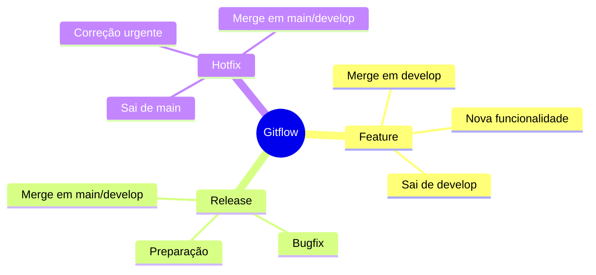
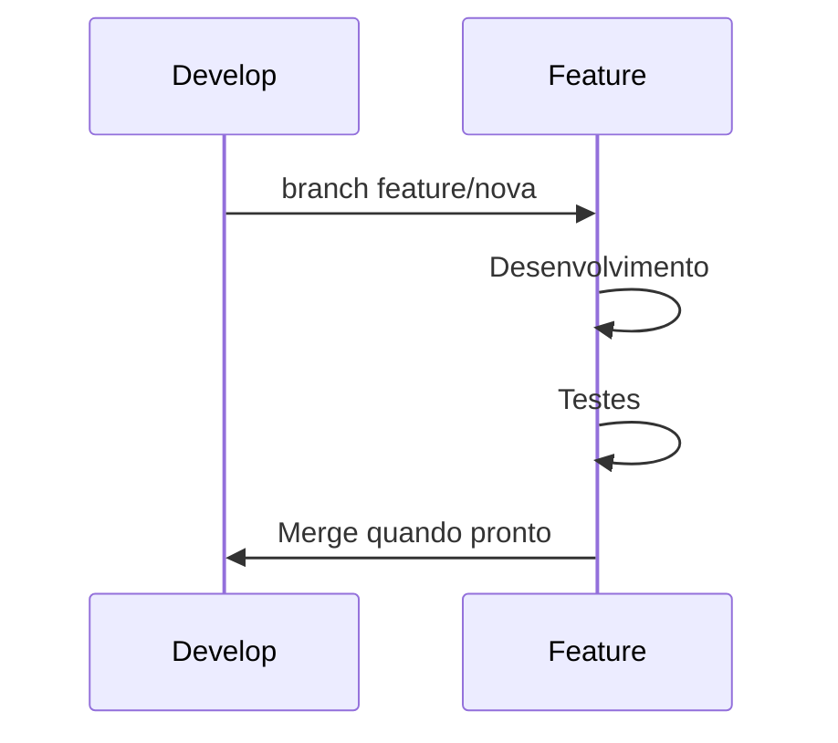
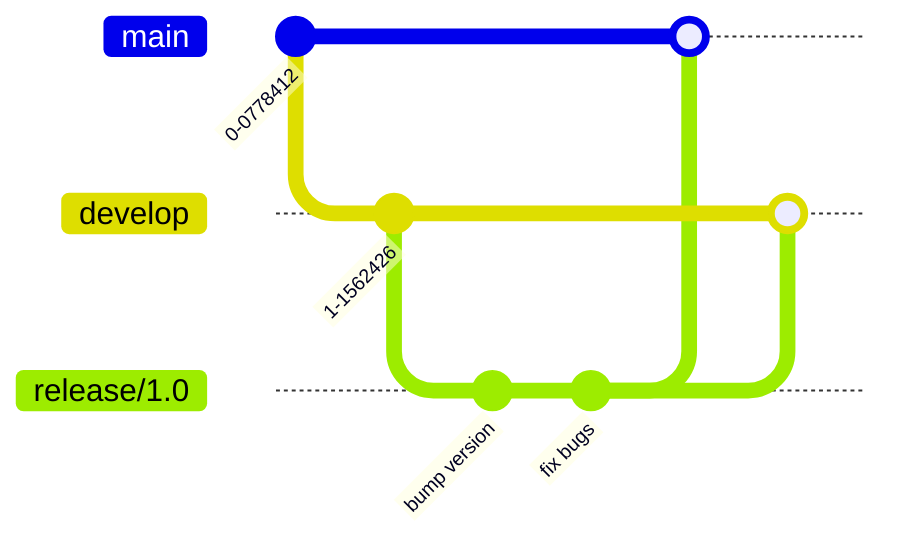
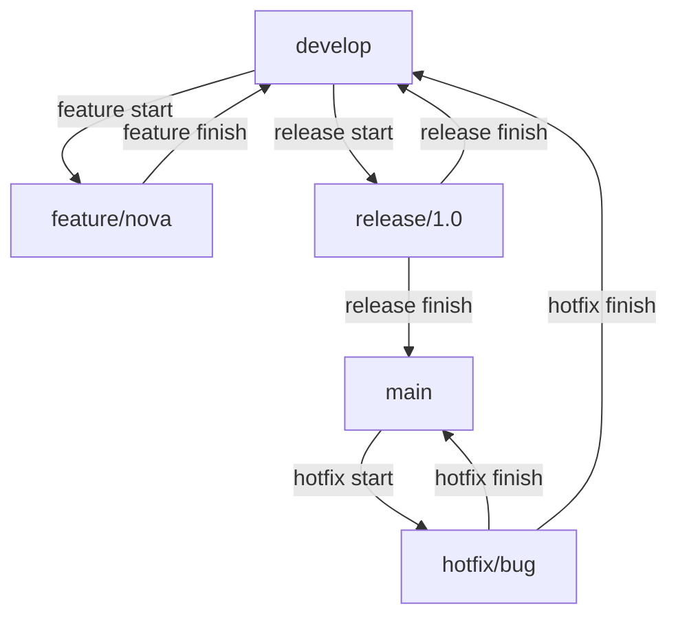
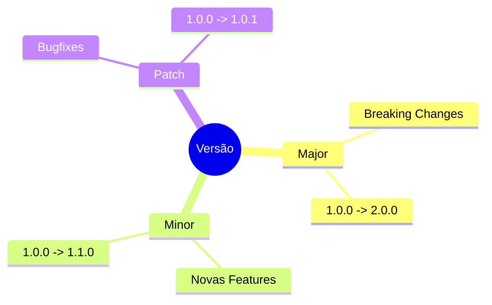
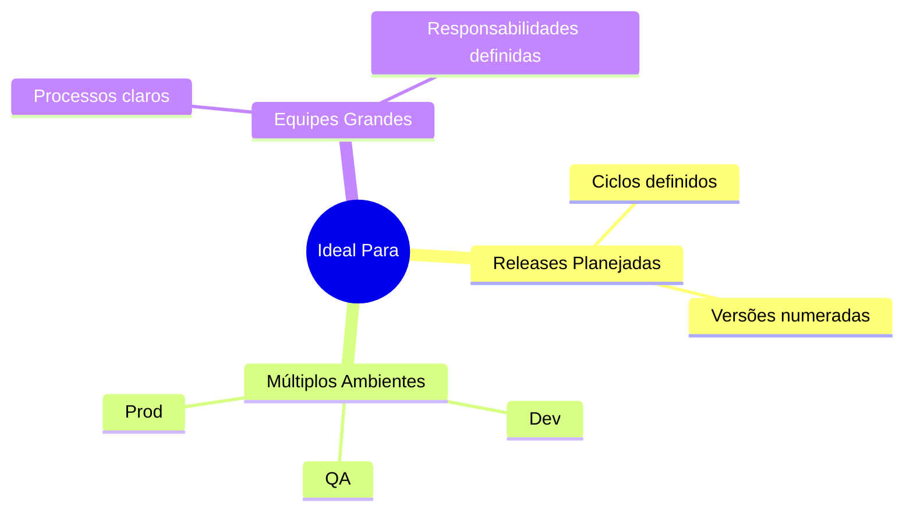
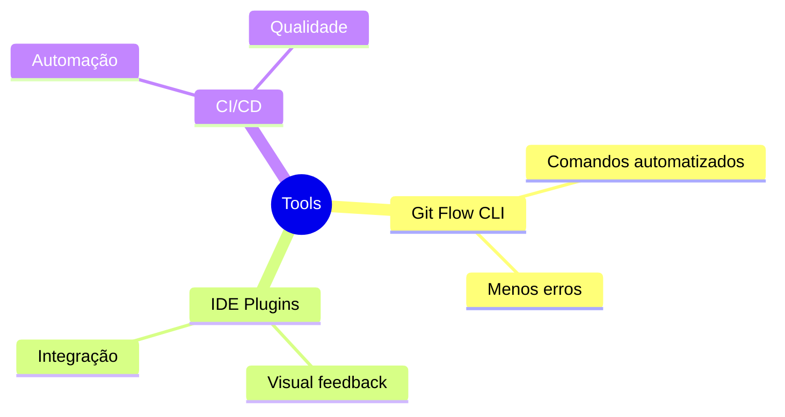
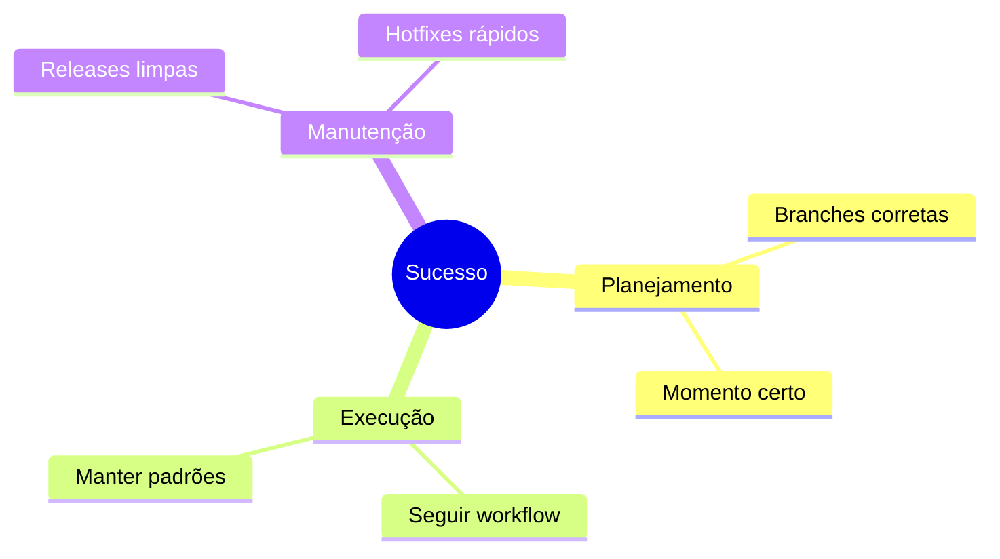

# Gitflow Workflow

Se o Feature Branch é uma festa na casa do Stifler, o Gitflow é o baile de formatura - tem regras, tem estrutura, mas ainda é divertido!

## Estrutura Principal



## Branches Principais

### 1. Main e Develop


### 2. Branches de Suporte


## Ciclo de Vida

### 1. Feature Development


### 2. Preparação de Release


### 3. Hotfix em Produção
```mermaid
gitGraph
    commit
    branch hotfix/bug
    checkout hotfix/bug
    commit id: "fix critical"
    checkout main
    merge hotfix/bug
    checkout develop
    merge hotfix/bug
```

## Comandos Essenciais

### 1. Iniciando Gitflow
```bash
git flow init
```

### 2. Features
```bash
# Iniciar feature
git flow feature start login

# Finalizar feature
git flow feature finish login
```

### 3. Releases
```bash
# Criar release
git flow release start 1.0.0

# Finalizar release
git flow release finish 1.0.0
```

### 4. Hotfixes
```bash
# Criar hotfix
git flow hotfix start bug-critical

# Finalizar hotfix
git flow hotfix finish bug-critical
```

## Fluxo de Trabalho Completo



## Boas Práticas

### 1. Nomenclatura
```ascii
Features:
  feature/login
  feature/user-profile

Releases:
  release/1.0.0
  release/2.1.0

Hotfixes:
  hotfix/security-fix
  hotfix/crash-bug
```

### 2. Versionamento


## Quando Usar Gitflow?



## Prós e Contras

### Vantagens
```ascii
✅ Estrutura clara e definida
✅ Ideal para releases planejadas
✅ Suporte a hotfixes
✅ Processos bem documentados
```

### Desvantagens
```ascii
❌ Mais complexo que feature branch
❌ Overhead para projetos pequenos
❌ Curva de aprendizado maior
❌ Pode ser "pesado" demais
```

## Dicas de Implementação

### 1. Ferramentas de Suporte


### 2. Checklist de Release
```ascii
📋 Release Checklist

1. [ ] Feature freeze
2. [ ] Criar branch release
3. [ ] Bump version
4. [ ] Testes de regressão
5. [ ] Documentação
6. [ ] Code freeze
7. [ ] Deploy staging
8. [ ] Merge em main
9. [ ] Tag version
10.[ ] Deploy prod
```

## Conclusão

Gitflow é como um roteiro de filme bem planejado - tem pré-produção (develop), filmagem (features), edição (release) e até correções de última hora (hotfix). Quando bem executado, o resultado é um blockbuster!

