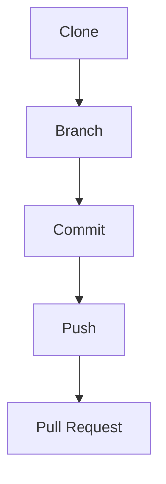
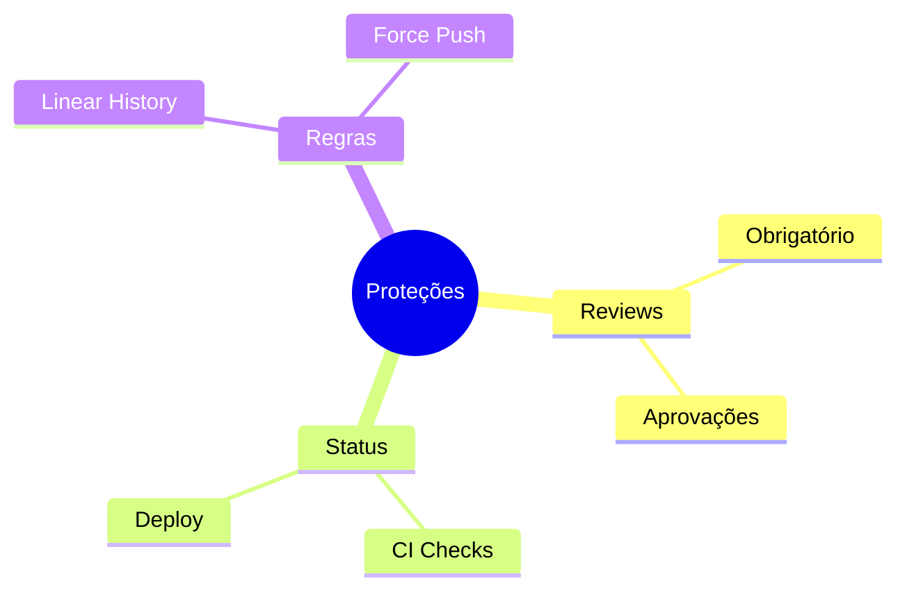
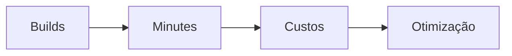

# GitHub: Recursos e Funcionalidades Específicas

## GitHub Actions

### Workflows Básicos
```yaml
# .github/workflows/ci.yml
name: CI
on: [push, pull_request]

jobs:
  build:
    runs-on: ubuntu-latest
    steps:
      - uses: actions/checkout@v3
      - uses: actions/setup-node@v3
      - run: npm ci
      - run: npm test
```

### Matriz de Testes
```yaml
strategy:
  matrix:
    node-version: [14, 16, 18]
    os: [ubuntu-latest, windows-latest]
```

## Segurança

### Dependabot
```yaml
# .github/dependabot.yml
version: 2
updates:
  - package-ecosystem: "npm"
    directory: "/"
    schedule:
      interval: "weekly"
```

### Code Scanning
```yaml
name: "CodeQL"
on:
  push:
    branches: [ "main" ]
  pull_request:
    branches: [ "main" ]
```

## GitHub Packages

### Configuração NPM
```bash
# .npmrc
@owner:registry=https://npm.pkg.github.com
//npm.pkg.github.com/:_authToken=${GITHUB_TOKEN}
```

### Docker Publishing
```bash
# Login no GHCR
echo $GITHUB_TOKEN | docker login ghcr.io -u USERNAME --password-stdin

# Push da imagem
docker push ghcr.io/owner/image:tag
```

## GitHub Pages

### Configuração Jekyll
```yaml
# _config.yml
remote_theme: owner/theme
plugins:
  - jekyll-feed
  - jekyll-seo-tag
```

### Deploy Automático
```yaml
name: Deploy Pages
on:
  push:
    branches: [ main ]
jobs:
  deploy:
    runs-on: ubuntu-latest
    steps:
      - uses: actions/checkout@v3
      - uses: actions/setup-node@v3
      - run: npm run build
      - uses: peaceiris/actions-gh-pages@v3
```

## GitHub Codespaces

### Configuração Dev Container
```json
{
  "name": "Node.js",
  "image": "mcr.microsoft.com/devcontainers/javascript-node:18",
  "customizations": {
    "vscode": {
      "extensions": [
        "dbaeumer.vscode-eslint",
        "esbenp.prettier-vscode"
      ]
    }
  }
}
```

### Prebuild Configuration
```yaml
name: Prebuild
on:
  push:
    branches: [ main ]
jobs:
  prebuild:
    runs-on: ubuntu-latest
    steps:
      - uses: actions/checkout@v3
      - uses: github/codespaces/prebuild@v1
```

## Integrações e Apps

### GitHub CLI
```bash
# Comandos úteis
gh repo create
gh pr create
gh issue list
gh workflow run
```

### GitHub Desktop


## Boas Práticas

### Pull Requests
```markdown
## Template PR
### Descrição
- O que mudou?
- Por que mudou?

### Checklist
- [ ] Testes
- [ ] Documentação
- [ ] Code Review
```

### Branch Protection


## Monitoramento

### Insights
```ascii
+------------------------+
|    MÉTRICAS           |
|                       |
| • Contributors       |
| • Traffic           |
| • Dependencies      |
| • Security          |
+------------------------+
```

### Actions Usage


## Dicas Avançadas

### GitHub API
```bash
# Exemplos de uso da API
curl -H "Authorization: token ${GITHUB_TOKEN}" \
     https://api.github.com/repos/owner/repo/issues

# GraphQL
curl -H "Authorization: bearer ${GITHUB_TOKEN}" \
     -X POST -d '{"query": "..."}' \
     https://api.github.com/graphql
```

### Automações Custom
```javascript
// Webhook handler
app.post('/webhook', (req, res) => {
  const { action, issue } = req.body;
  if (action === 'opened') {
    // Handle new issue
  }
});
```


> **Dica Pro**: Use GitHub Actions para automatizar tarefas repetitivas e manter consistência no projeto.