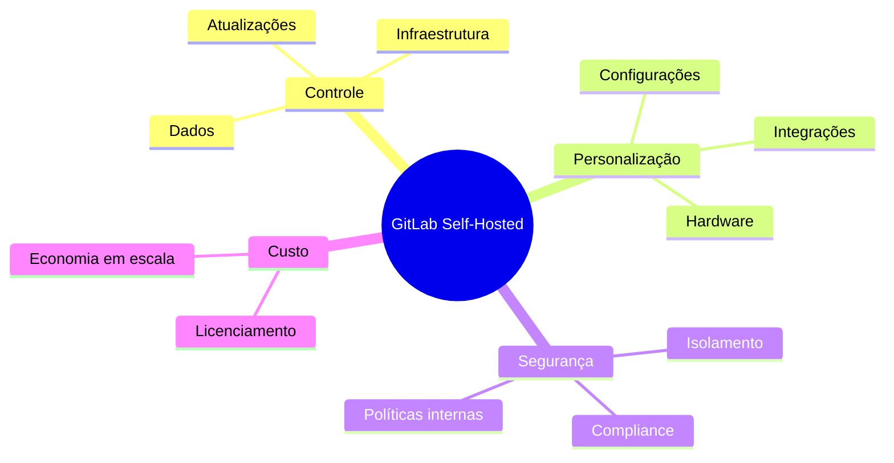
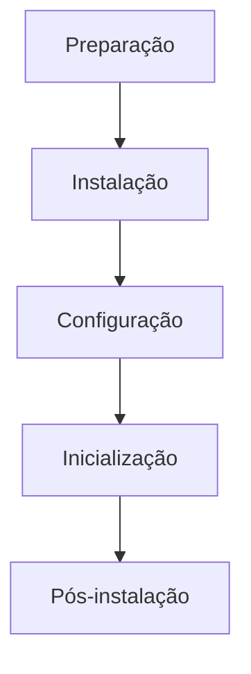
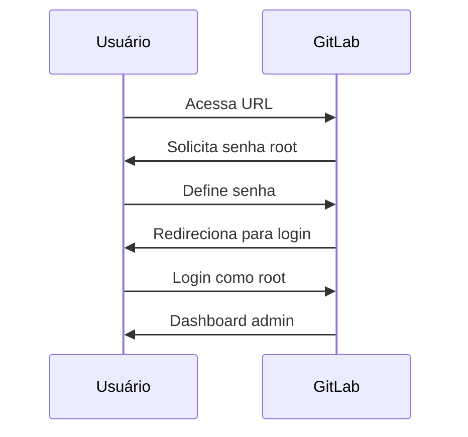
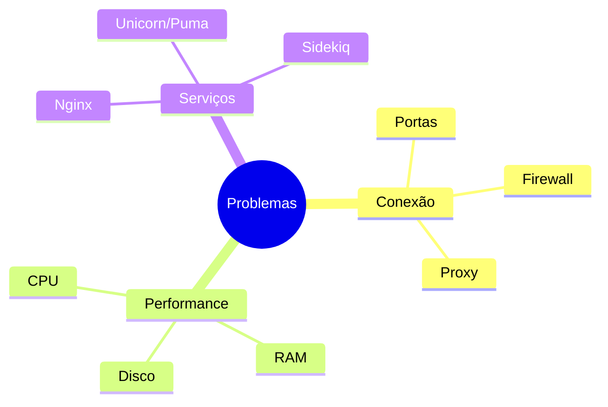
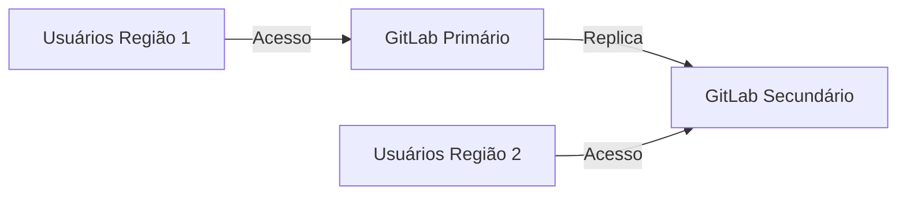

# Instalação do GitLab

```ascii
+------------------------+
|  GitLab Installation  |
|                       |
| Self-Hosted           |
| Omnibus Package       |
| Docker                |
| Kubernetes            |
|                       |
| Múltiplas Opções      |
+------------------------+
```

## Por que Instalar o GitLab Self-Hosted?

Embora o GitLab.com ofereça uma solução hospedada pronta para uso, existem várias razões convincentes para optar por uma instalação self-hosted:

### Vantagens do Self-Hosted


### Casos de Uso Específicos
- **Requisitos de Compliance**: Organizações em setores regulamentados (finanças, saúde, governo) precisam manter dados sensíveis em suas próprias infraestruturas.
- **Ambientes Air-Gapped**: Redes isoladas sem acesso à internet exigem soluções locais.
- **Personalização Avançada**: Necessidade de integração profunda com sistemas internos e fluxos de trabalho específicos.
- **Performance**: Controle sobre recursos de hardware para otimizar desempenho em grandes instalações.
- **Latência Reduzida**: Instalação próxima aos desenvolvedores para operações Git mais rápidas.

```ascii
+------------------------+
|   QUANDO ESCOLHER     |
|                       |
| • Dados sensíveis     |
| • Muitos usuários     |
| • Integração interna  |
| • Controle total      |
| • Compliance          |
| • Redes isoladas      |
+------------------------+
```

## Requisitos de Sistema

### Hardware Recomendado
```ascii
+------------------------+
|    HARDWARE MÍNIMO    |
|                       |
| • 4 CPU cores         |
| • 8GB RAM             |
| • 40GB armazenamento  |
|                       |
|    RECOMENDADO        |
|                       |
| • 8+ CPU cores        |
| • 16GB+ RAM           |
| • SSD 100GB+          |
+------------------------+
```

### Software Necessário
- Sistema operacional Linux (Ubuntu, Debian, CentOS)
- Postfix para envio de emails
- Acesso root ou sudo

## Métodos de Instalação

### Omnibus Package (Recomendado)


#### Ubuntu/Debian
```bash
# Adicionar repositório GitLab
curl -sS https://packages.gitlab.com/install/repositories/gitlab/gitlab-ce/script.deb.sh | sudo bash

# Instalar GitLab CE
sudo apt install gitlab-ce

# Configurar e iniciar
sudo gitlab-ctl reconfigure
```

#### CentOS/RHEL
```bash
# Adicionar repositório GitLab
curl -sS https://packages.gitlab.com/install/repositories/gitlab/gitlab-ce/script.rpm.sh | sudo bash

# Instalar GitLab CE
sudo yum install gitlab-ce

# Configurar e iniciar
sudo gitlab-ctl reconfigure
```

### Docker
```bash
# Executar GitLab CE
docker run --detach \
  --hostname gitlab.exemplo.com \
  --publish 443:443 --publish 80:80 --publish 22:22 \
  --name gitlab \
  --restart always \
  --volume $GITLAB_HOME/config:/etc/gitlab \
  --volume $GITLAB_HOME/logs:/var/log/gitlab \
  --volume $GITLAB_HOME/data:/var/opt/gitlab \
  gitlab/gitlab-ce:latest
```

### Docker Compose
```yaml
# docker-compose.yml
version: '3.7'
services:
  gitlab:
    image: 'gitlab/gitlab-ce:latest'
    restart: always
    hostname: 'gitlab.exemplo.com'
    environment:
      GITLAB_OMNIBUS_CONFIG: |
        external_url 'https://gitlab.exemplo.com'
    ports:
      - '80:80'
      - '443:443'
      - '22:22'
    volumes:
      - '$GITLAB_HOME/config:/etc/gitlab'
      - '$GITLAB_HOME/logs:/var/log/gitlab'
      - '$GITLAB_HOME/data:/var/opt/gitlab'
```

### Kubernetes (Helm)
```bash
# Adicionar repositório Helm
helm repo add gitlab https://charts.gitlab.io/

# Instalar GitLab
helm install gitlab gitlab/gitlab \
  --set global.hosts.domain=exemplo.com \
  --set global.hosts.externalIP=XX.XX.XX.XX \
  --set certmanager-issuer.email=admin@exemplo.com
```

## Configuração Inicial

### Primeiro Acesso
1. Acesse `http://gitlab.exemplo.com` (ou o endereço configurado)
2. Defina a senha para o usuário `root`
3. Faça login com usuário `root` e a senha definida



### Configuração de Email
```ruby
# /etc/gitlab/gitlab.rb
gitlab_rails['smtp_enable'] = true
gitlab_rails['smtp_address'] = "smtp.gmail.com"
gitlab_rails['smtp_port'] = 587
gitlab_rails['smtp_user_name'] = "seu-email@gmail.com"
gitlab_rails['smtp_password'] = "sua-senha"
gitlab_rails['smtp_domain'] = "gmail.com"
gitlab_rails['smtp_authentication'] = "login"
gitlab_rails['smtp_enable_starttls_auto'] = true
gitlab_rails['gitlab_email_from'] = 'gitlab@exemplo.com'
```

Após editar, aplique as alterações:
```bash
sudo gitlab-ctl reconfigure
```

## Atualizações

### Omnibus Package
```bash
# Backup antes de atualizar
sudo gitlab-backup create

# Atualizar pacotes
sudo apt update
sudo apt upgrade gitlab-ce

# Aplicar alterações
sudo gitlab-ctl reconfigure
```

### Docker
```bash
# Puxar nova imagem
docker pull gitlab/gitlab-ce:latest

# Parar e remover container atual
docker stop gitlab
docker rm gitlab

# Iniciar novo container
docker run --detach \
  --hostname gitlab.exemplo.com \
  --publish 443:443 --publish 80:80 --publish 22:22 \
  --name gitlab \
  --restart always \
  --volume $GITLAB_HOME/config:/etc/gitlab \
  --volume $GITLAB_HOME/logs:/var/log/gitlab \
  --volume $GITLAB_HOME/data:/var/opt/gitlab \
  gitlab/gitlab-ce:latest
```

## Troubleshooting

### Problemas Comuns


### Comandos Úteis
```bash
# Verificar status
sudo gitlab-ctl status

# Ver logs
sudo gitlab-ctl tail

# Verificar configuração
sudo gitlab-rake gitlab:check

# Reparar permissões
sudo gitlab-ctl reconfigure

# Reiniciar serviços
sudo gitlab-ctl restart
```

## Instalações Especializadas

### Alta Disponibilidade
```ascii
+------------------------+
|  ALTA DISPONIBILIDADE |
|                       |
| • PostgreSQL replicado|
| • Redis redundante    |
| • Load balancer       |
| • Storage compartilhado|
| • Geo replication     |
+------------------------+
```

### Geo Replication


## GitLab.com vs Self-Hosted

### Comparação
```ascii
+------------------------+
|     GITLAB.COM        |
| • Rápido para começar |
| • Sem manutenção      |
| • Atualizações auto.  |
| • Planos gratuitos    |
|                       |
|     SELF-HOSTED       |
| • Controle total      |
| • Personalização      |
| • Segurança interna   |
| • Integração local    |
+------------------------+
```

### Quando Migrar para Self-Hosted
- Quando sua equipe ultrapassar 100 usuários (potencial economia de custos)
- Quando requisitos de compliance exigirem controle total dos dados
- Quando precisar de integrações profundas com sistemas internos
- Quando a performance se tornar crítica para grandes repositórios

## Próximos Passos

### Tópicos Relacionados
- [Configuração do GitLab](gitlab-configuration.md)
- [Configuração SSH no GitLab](gitlab-ssh-setup.md)
- [Backup e Restauração](gitlab-backup-setup.md)

> **Dica Pro**: Para ambientes de produção, sempre dimensione os recursos de acordo com o número de usuários e repositórios esperados. O GitLab pode consumir muitos recursos em instalações maiores.