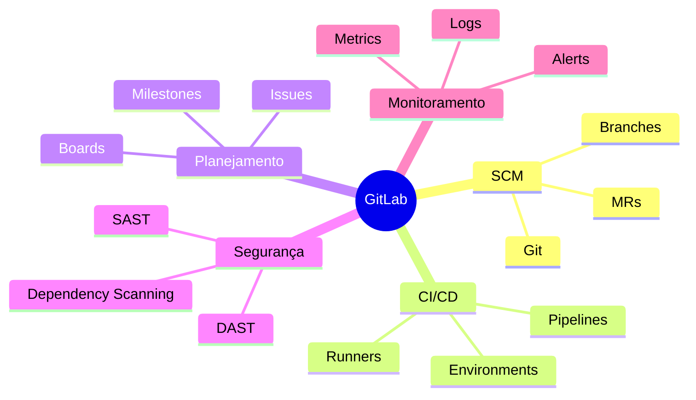
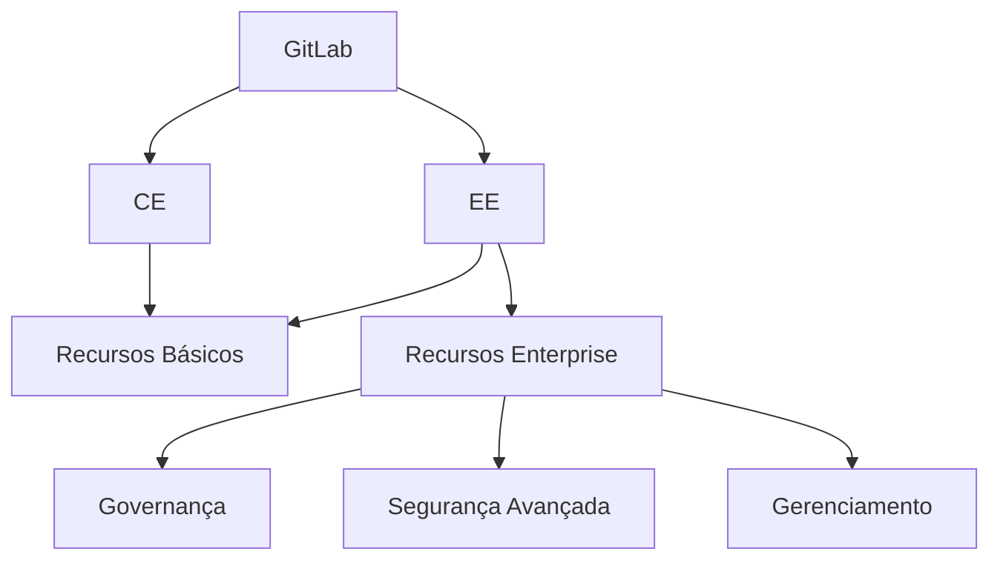
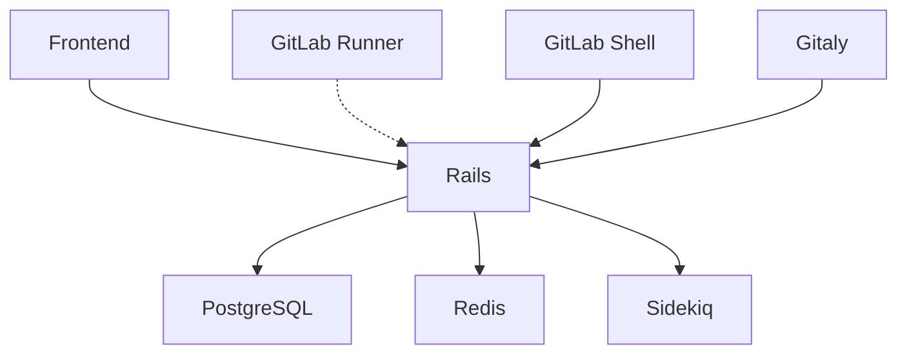
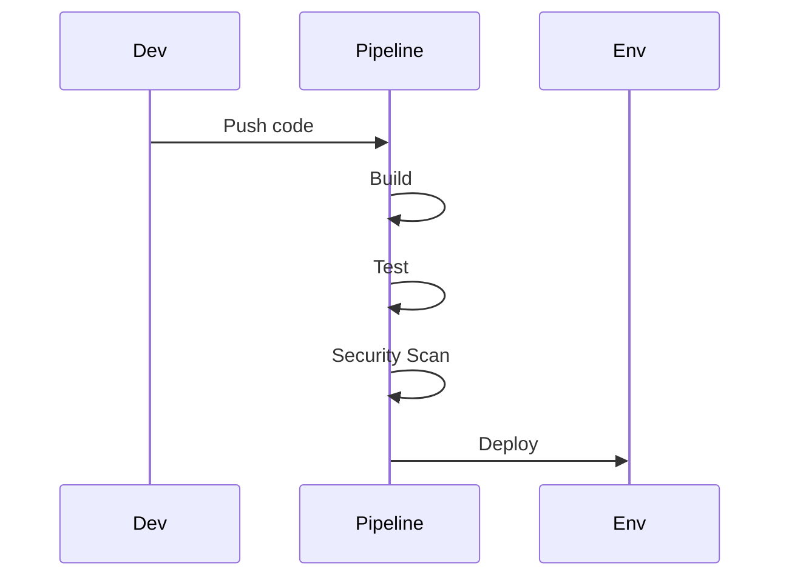
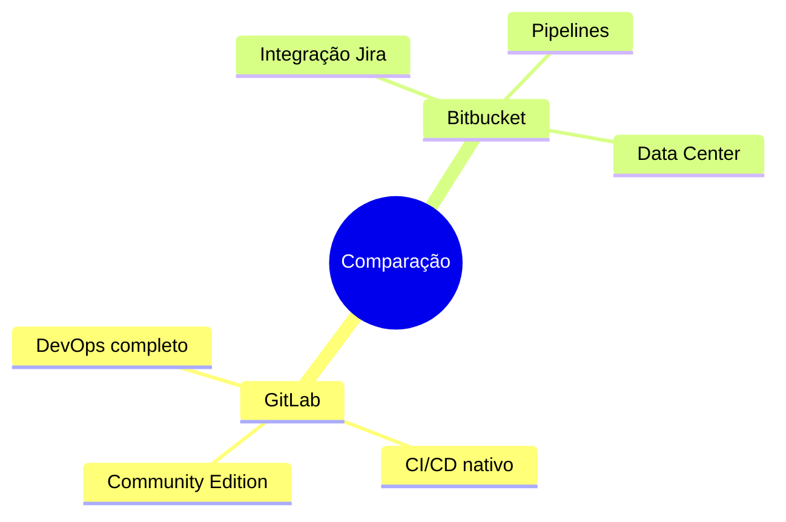

# GitLab: Visão Geral

```ascii
+------------------------+
|        GitLab         |
|                       |
| DevOps Completo       |
| Ciclo de Vida         |
| Colaboração           |
|                       |
| Tudo em Um            |
+------------------------+
```

## O que é GitLab?

O GitLab é uma plataforma DevOps completa, entregue como uma única aplicação. Ele abrange todo o ciclo de vida DevOps, permitindo que equipes colaborem, desenvolvam, testem, implantem e monitorem aplicações em um único ambiente.



## Edições do GitLab

### Comparação
```ascii
+------------------------+
|      EDIÇÕES          |
|                       |
| • Community Edition   |
|   - Open Source       |
|   - Gratuito          |
|                       |
| • Enterprise Edition  |
|   - Comercial         |
|   - Recursos extras   |
|                       |
| • SaaS (gitlab.com)   |
|   - Hospedado         |
|   - Planos variados   |
+------------------------+
```

### Recursos por Edição


## Arquitetura

### Componentes


### Serviços
```ascii
+------------------------+
|     COMPONENTES       |
|                       |
| • Nginx               |
| • Unicorn/Puma        |
| • Sidekiq             |
| • Redis               |
| • PostgreSQL          |
| • Gitaly              |
| • GitLab Workhorse    |
| • GitLab Shell        |
+------------------------+
```

## Principais Recursos

### Gerenciamento de Código
- Repositórios Git
- Merge Requests
- Code Review
- Web IDE
- Snippets

### CI/CD


### Planejamento e Monitoramento
- Issues
- Boards
- Milestones
- Epics (EE)
- Roadmaps (EE)
- Métricas e Analytics

## Comparação com Outras Plataformas

### GitLab vs GitHub
```ascii
+------------------------+
|   GitLab vs GitHub    |
|                       |
| GitLab:               |
| • DevOps completo     |
| • CI/CD integrado     |
| • Self-hosted fácil   |
|                       |
| GitHub:               |
| • Maior comunidade    |
| • Actions             |
| • Melhor UX           |
+------------------------+
```

### GitLab vs Bitbucket


## Próximos Passos

### Tópicos Relacionados
- [Instalação do GitLab](gitlab-installation.md)
- [Configuração do GitLab](gitlab-configuration.md)
- [Configuração SSH no GitLab](gitlab-ssh-setup.md)
- [CI/CD no GitLab](gitlab-ci-cd.md)

> **Dica Pro**: O GitLab oferece uma experiência DevOps completa, mas comece com os recursos básicos e vá expandindo conforme sua equipe se familiariza com a plataforma.