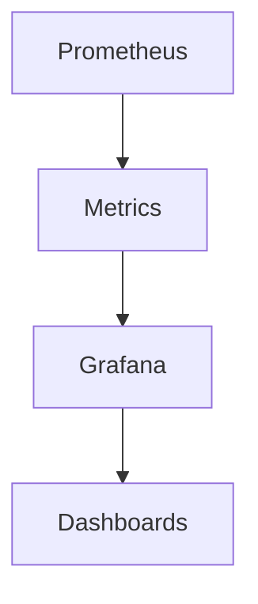
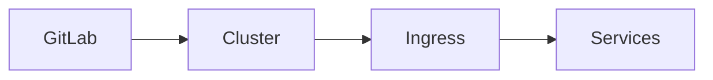
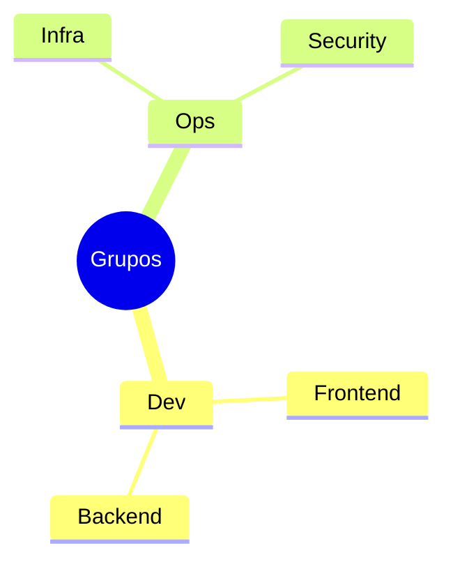

# GitLab: Recursos e Funcionalidades Específicas

## CI/CD Avançado

### Pipeline Completa
```yaml
# .gitlab-ci.yml
stages:
  - build
  - test
  - security
  - deploy

variables:
  DOCKER_IMAGE: $CI_REGISTRY_IMAGE:$CI_COMMIT_SHA

build:
  stage: build
  script:
    - docker build -t $DOCKER_IMAGE .
    - docker push $DOCKER_IMAGE

test:
  stage: test
  services:
    - postgres:13
  variables:
    POSTGRES_DB: test_db
  script:
    - npm run test
    - npm run e2e

security_scan:
  stage: security
  script:
    - gitlab-sast
    - gitlab-dependency-scan

deploy_staging:
  stage: deploy
  environment: staging
  script:
    - kubectl apply -f k8s/
  only:
    - develop
```

### Runner Configuration
```toml
[[runners]]
  name = "docker-runner"
  url = "https://gitlab.com"
  token = "TOKEN"
  executor = "docker"
  [runners.docker]
    tls_verify = false
    image = "docker:latest"
    privileged = true
```

## Container Registry

### Docker Integration
```bash
# Login
docker login registry.gitlab.com

# Build e Tag
docker build -t registry.gitlab.com/group/project .
docker push registry.gitlab.com/group/project
```

### Kubernetes Integration
```yaml
# deployment.yaml
apiVersion: apps/v1
kind: Deployment
spec:
  template:
    spec:
      containers:
      - name: app
        image: registry.gitlab.com/group/project:latest
      imagePullSecrets:
      - name: gitlab-registry
```

## Security Features

### SAST Configuration
```yaml
sast:
  stage: security
  script:
    - gitlab-sast
  artifacts:
    reports:
      sast: gl-sast-report.json
```

### Dependency Scanning
```yaml
dependency_scanning:
  image: registry.gitlab.com/gitlab-org/security-products/dependency-scanning
  script:
    - /analyzer run
```

## Wiki e Documentação

### Markdown Templates
```markdown
# Projeto XYZ

## Visão Geral
- Descrição
- Objetivos
- Arquitetura

## Setup
```bash
git clone ${repo}
npm install
npm start
```

## Contribuição
1. Fork
2. Branch
3. PR
```

### Auto Doc Generation
```yaml
pages:
  stage: deploy
  script:
    - mkdocs build
    - mv site public
  artifacts:
    paths:
      - public
```

## Monitoramento

### Métricas


### Alerting
```yaml
alerting:
  rules:
    - alert: HighErrorRate
      expr: error_rate > 0.5
      for: 5m
      labels:
        severity: critical
```

## Integração com Kubernetes

### Auto DevOps
```yaml
include:
  - template: Auto-DevOps.gitlab-ci.yml

variables:
  POSTGRES_ENABLED: "true"
  STAGING_ENABLED: "true"
  PRODUCTION_ENABLED: "true"
```

### Cluster Integration


## Gerenciamento de Acesso

### RBAC
```yaml
roles:
  - name: developer
    access_level: 30
    permissions:
      - push_code
      - create_merge_request
```

### Group Management


## Analytics e Reporting

### Value Stream
```ascii
+------------------------+
|    MÉTRICAS           |
|                       |
| • Lead Time          |
| • Cycle Time         |
| • Deployment Freq    |
| • Change Failure     |
+------------------------+
```

### Custom Reports
```ruby
# Generate custom report
GitLab::Report.new do |r|
  r.add_metric(:deployments)
  r.add_metric(:issues)
  r.export_csv
end
```

## Próximos Passos

### Recursos Adicionais
- [GitLab University](https://about.gitlab.com/learn/)
- [GitLab Docs](https://docs.gitlab.com)
- [GitLab CI Examples](https://docs.gitlab.com/ee/ci/examples/)

> **Dica Pro**: Use Auto DevOps para começar rapidamente com CI/CD e depois customize conforme necessário.
