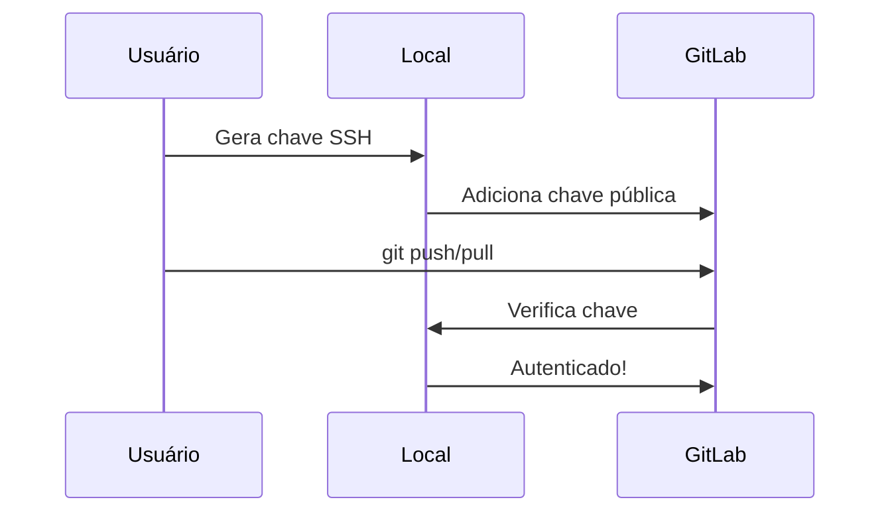
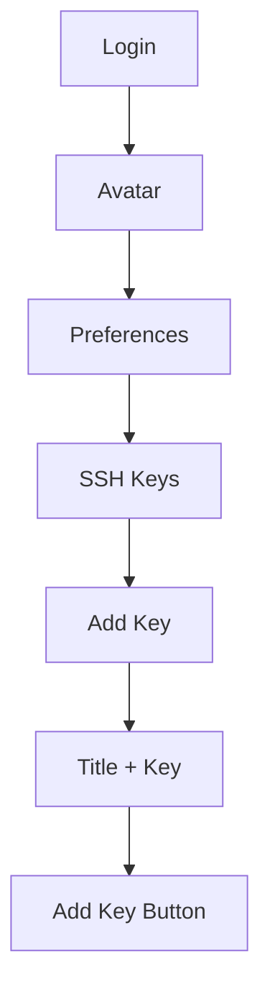
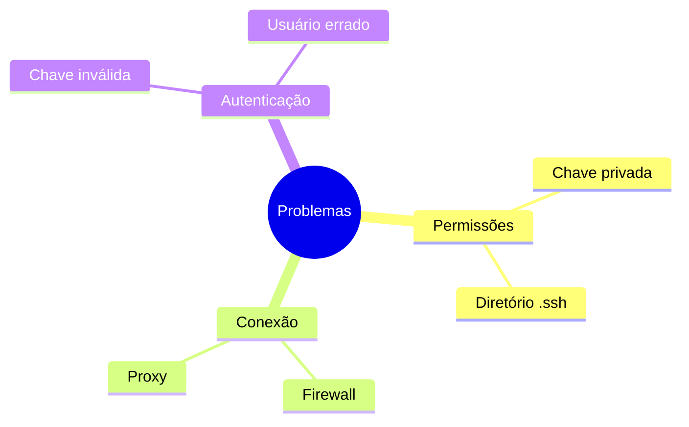

# Configuração SSH no GitLab

```ascii
+------------------------+
|    GitLab SSH Setup   |
|                       |
| Autenticação Segura   |
| Sem Senhas            |
| Clonagem Rápida       |
|                       |
| Acesso Simplificado   |
+------------------------+
```

## Por que usar SSH?

O SSH (Secure Shell) permite que você se conecte e autentique em servidores remotos, como o GitLab, de forma segura sem precisar digitar sua senha a cada operação.



## Gerando Chaves SSH

### No Linux/macOS
```bash
# Gerar nova chave ED25519 (recomendado)
ssh-keygen -t ed25519 -C "seu.email@exemplo.com"

# Ou gerar RSA (compatibilidade)
ssh-keygen -t rsa -b 4096 -C "seu.email@exemplo.com"
```

### No Windows
```bash
# Com Git Bash
ssh-keygen -t ed25519 -C "seu.email@exemplo.com"

# Com PowerShell (OpenSSH)
ssh-keygen -t ed25519 -C "seu.email@exemplo.com"
```

## Adicionando Chave ao SSH Agent

### Linux/macOS
```bash
# Iniciar o ssh-agent
eval "$(ssh-agent -s)"

# Adicionar chave
ssh-add ~/.ssh/id_ed25519
```

### Windows
```bash
# Git Bash
eval "$(ssh-agent -s)"
ssh-add ~/.ssh/id_ed25519

# PowerShell
# Iniciar o serviço
Start-Service ssh-agent
# Adicionar chave
ssh-add $env:USERPROFILE\.ssh\id_ed25519
```

## Adicionando Chave ao GitLab

### Copiando a Chave Pública
```bash
# Linux/macOS
cat ~/.ssh/id_ed25519.pub | pbcopy  # macOS
cat ~/.ssh/id_ed25519.pub | xclip -selection clipboard  # Linux

# Windows
cat ~/.ssh/id_ed25519.pub | clip
```

### Passos no GitLab
1. Faça login no GitLab
2. Clique no seu avatar (canto superior direito)
3. Selecione "Preferences"
4. Navegue até "SSH Keys"
5. Cole sua chave pública
6. Adicione um título descritivo (ex: "Laptop Trabalho")
7. Clique em "Add key"



## Testando a Conexão

```bash
# Testar conexão SSH com GitLab
ssh -T git@gitlab.com

# Resposta esperada
# Welcome to GitLab, @username!
```

## Usando SSH com Repositórios

### Clonando via SSH
```bash
# Clonar repositório
git clone git@gitlab.com:grupo/projeto.git

# Verificar remote
git remote -v
```

### Alterando Repositório Existente
```bash
# Mudar de HTTPS para SSH
git remote set-url origin git@gitlab.com:grupo/projeto.git
```

## Configurações Avançadas

### Múltiplas Chaves
```bash
# ~/.ssh/config
Host gitlab.com
  HostName gitlab.com
  User git
  IdentityFile ~/.ssh/gitlab_key
  IdentitiesOnly yes

Host gitlab-trabalho
  HostName gitlab.trabalho.com
  User git
  IdentityFile ~/.ssh/trabalho_key
  IdentitiesOnly yes
```

### Segurança Adicional
```bash
# Proteger chave com passphrase
ssh-keygen -t ed25519 -C "seu.email@exemplo.com" -o -a 100

# Usar ssh-agent para armazenar passphrase
ssh-add ~/.ssh/id_ed25519
```

## Troubleshooting

### Problemas Comuns


### Soluções
```bash
# Verificar permissões
chmod 700 ~/.ssh
chmod 600 ~/.ssh/id_ed25519
chmod 644 ~/.ssh/id_ed25519.pub

# Debug de conexão
ssh -vT git@gitlab.com

# Verificar chaves carregadas
ssh-add -l
```

## Boas Práticas

### Segurança
```ascii
+------------------------+
|    BOAS PRÁTICAS      |
|                       |
| • Use ED25519         |
| • Adicione passphrase |
| • Backup seguro       |
| • Revogue se perdida  |
| • Renove anualmente   |
+------------------------+
```

### Organização
```bash
# Nomenclatura clara
id_ed25519_gitlab_pessoal
id_ed25519_gitlab_trabalho

# Comentários descritivos
ssh-keygen -t ed25519 -C "Laptop Pessoal - GitLab"
```

## Próximos Passos

### Tópicos Relacionados
- [Configuração do GitLab](gitlab-configuration.md)
- [GitLab CI Setup](gitlab-ci-setup.md)
- [Segurança no GitLab](gitlab-security-setup.md)

> **Dica Pro**: Configure o SSH uma vez e esqueça senhas para sempre. Seu fluxo de trabalho com Git ficará muito mais rápido e seguro.