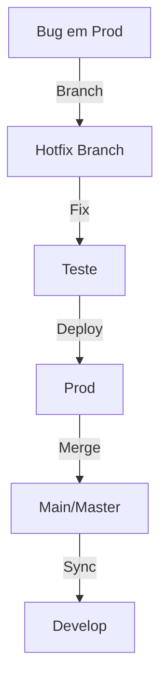
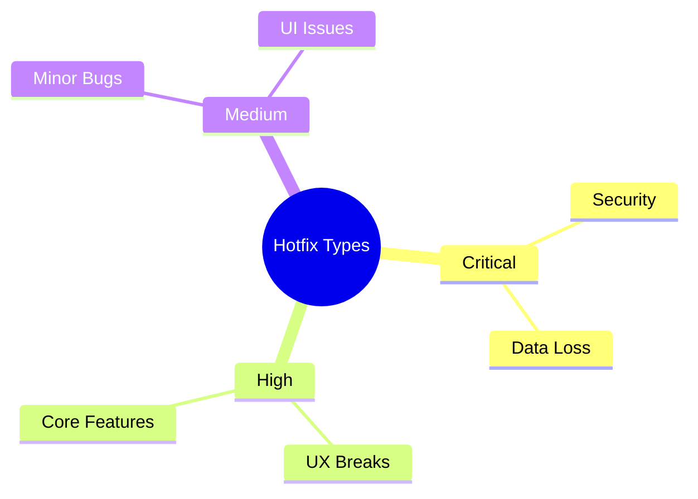
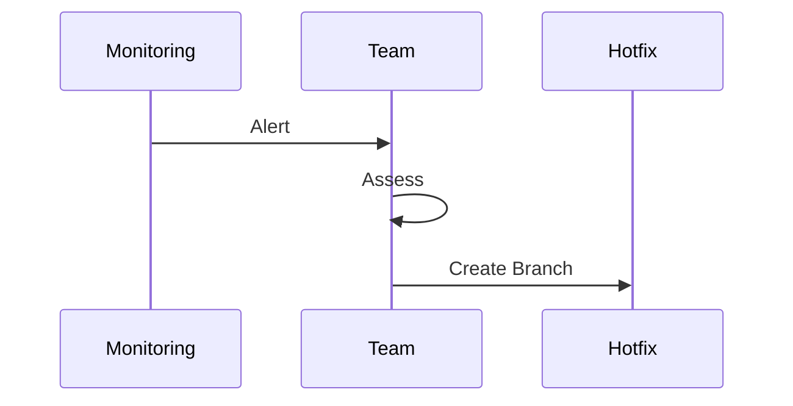
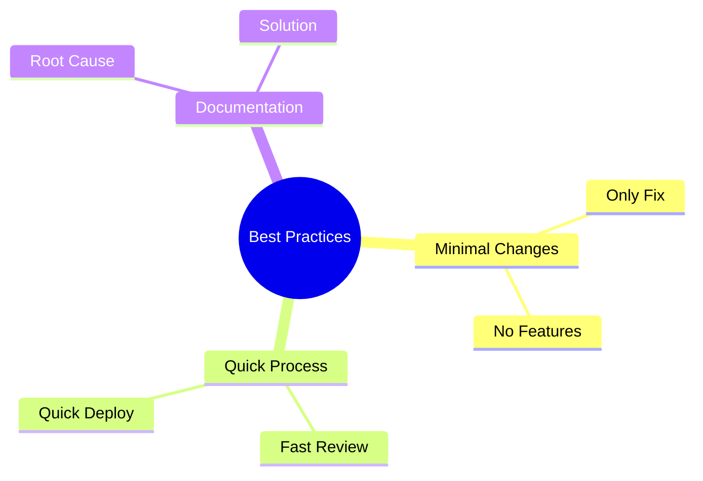
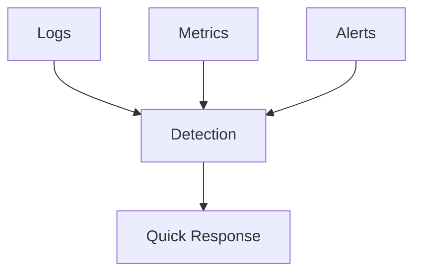
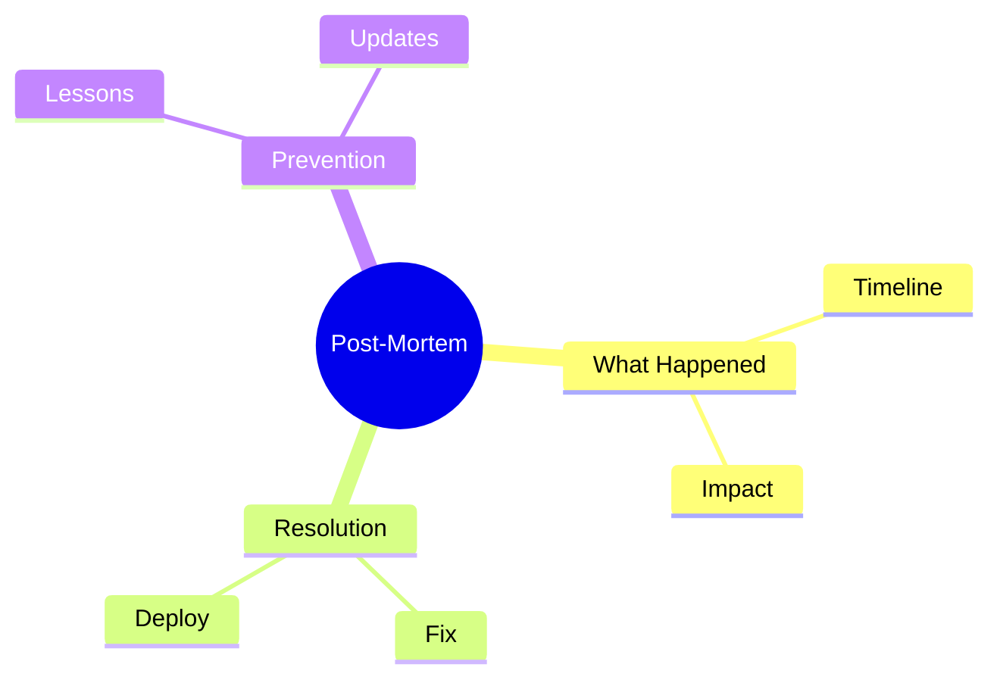
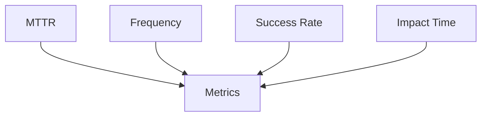
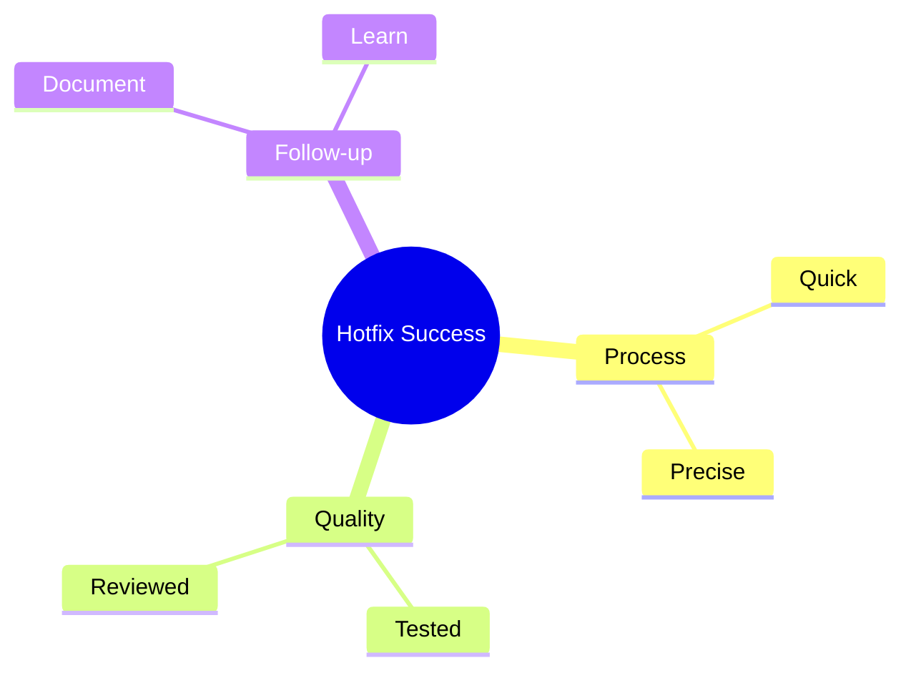

# Estratégias de Hotfix

Como o Stifler diria: "Bugs em produção são como aquela festa que começa a dar errado - você precisa agir rápido e com precisão!"

## Anatomia de um Hotfix

### 1. Fluxo Básico


### 2. Estrutura de Branch
```ascii
main/master
    |
    |--hotfix/bug-123
    |     |
    |     `-- fix
    |
    `-- merge
```

## Tipos de Hotfix

### 1. Por Severidade


### 2. Por Escopo
```ascii
🔧 Hotfix Scopes

CRITICAL
├── Security Patches
├── Data Corruption
└── System Crash

URGENT
├── Business Logic
├── Payment Issues
└── Core Features

STANDARD
├── UI Fixes
├── Performance
└── Minor Bugs
```

## Processo de Hotfix

### 1. Identificação


### 2. Execução


### 3. Checklist de Hotfix
```ascii
🚨 Hotfix Checklist

1. [ ] Identificar causa raiz
2. [ ] Criar branch hotfix
3. [ ] Implementar correção
4. [ ] Testes de regressão
5. [ ] Code review
6. [ ] Deploy em staging
7. [ ] Validação
8. [ ] Deploy em prod
9. [ ] Merge em main
10.[ ] Sync develop
```

## Comandos Git para Hotfix

### 1. Workflow Git
```bash
# Criar hotfix branch
git checkout -b hotfix/bug-123 main

# Commit fix
git commit -m "fix: corrige bug crítico #123"

# Merge em main
git checkout main
git merge --no-ff hotfix/bug-123

# Sync develop
git checkout develop
git merge --no-ff hotfix/bug-123
```


## Boas Práticas

### 1. Regras de Ouro


### 2. Comunicação
```ascii
📢 Communication Flow

1. Alert Team
2. Assess Impact
3. Plan Fix
4. Update Status
5. Deploy Notice
6. Resolution Note
```

## Prevenção

### 1. Monitoramento


### 2. Checklist Preventivo
```ascii
🛡️ Prevention Checklist

1. [ ] Monitoring setup
2. [ ] Alert thresholds
3. [ ] Backup strategy
4. [ ] Rollback plan
5. [ ] Team contacts
```

## Documentação

### 1. Template de Hotfix
```ascii
🔥 Hotfix Documentation

Issue: #123
Severity: Critical
Impact: Payment System

Root Cause:
- Invalid transaction handling

Fix:
- Added validation
- Updated error handling

Testing:
- Unit tests added
- Integration verified
- Staging validated
```

### 2. Post-Mortem


## Automação

### 1. Pipeline de Hotfix


### 2. Scripts Automatizados
```bash
#!/bin/bash
# hotfix.sh

VERSION=$1
BRANCH="hotfix/$VERSION"

git checkout -b $BRANCH main
# run tests
# deploy staging
# await approval
# deploy prod
```

## Métricas e KPIs

### 1. Indicadores Chave


### 2. Dashboard
```ascii
📊 Hotfix Metrics

MTTR: 45min
Success Rate: 98%
Frequency: 2/month
Impact Time: 30min
```

## Conclusão

Como o Stifler aprendeu: em emergências, mantenha a calma, siga o processo e aja rápido! Um bom processo de hotfix é como ter um extintor de incêndio sempre à mão - você torce para não precisar, mas quando precisa, salva a festa!

