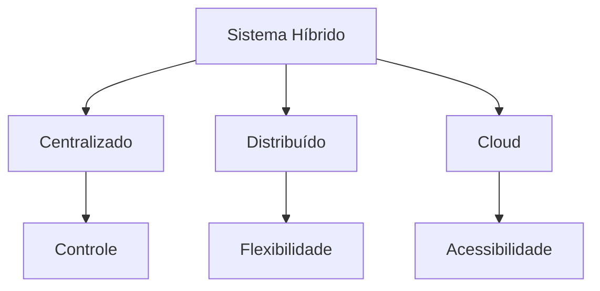
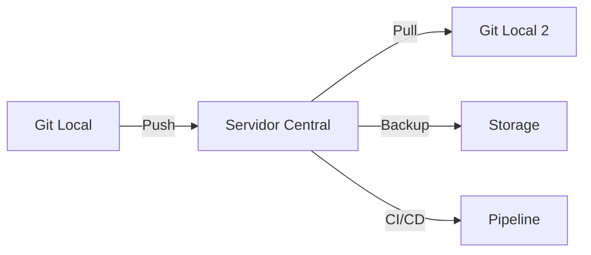
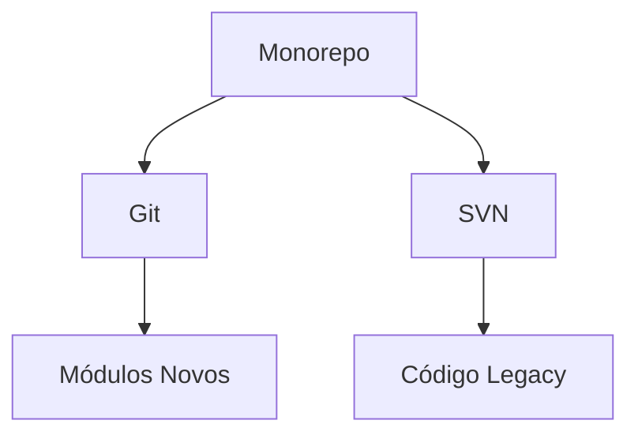
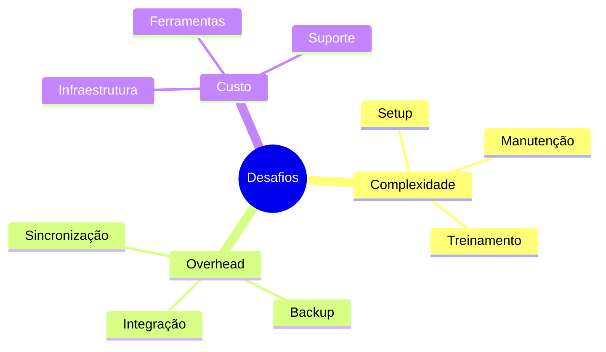
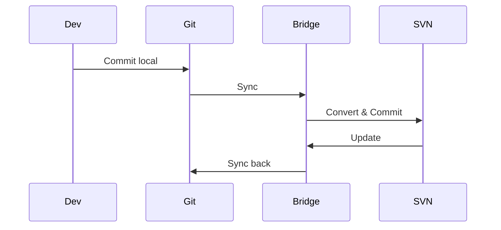
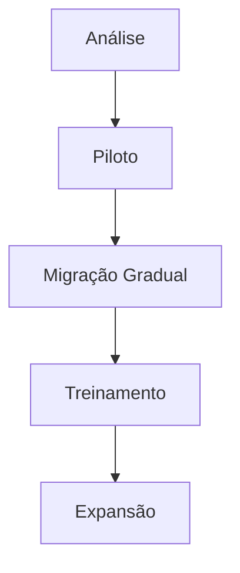
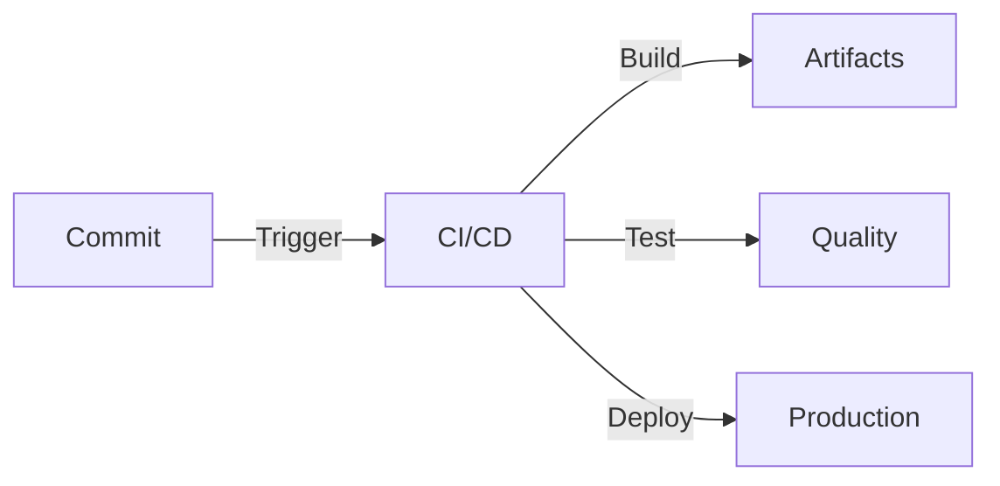
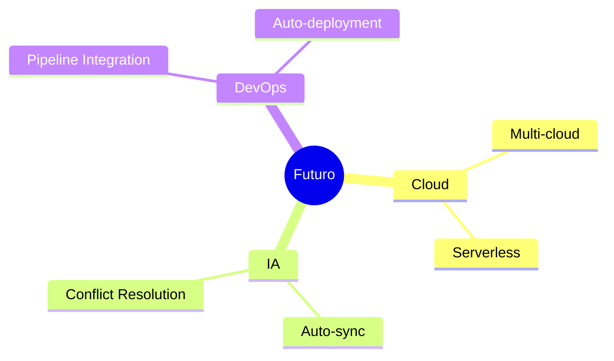

# Controle de Versão Híbrido

O controle de versão híbrido combina características de diferentes sistemas de versionamento para criar soluções mais flexíveis e adaptáveis.

## Conceitos Básicos

### O que é Controle de Versão Híbrido?


### Características Principais
- **Flexibilidade**: Combina múltiplos modelos
- **Adaptabilidade**: Ajusta-se às necessidades
- **Escalabilidade**: Cresce com o projeto
- **Compatibilidade**: Integra diferentes sistemas

## Modelos Comuns

### Git + Servidor Central


### Monorepo Híbrido


## Vantagens e Desvantagens

### Vantagens
1. **Flexibilidade Máxima**
   - Adapta-se a diferentes equipes
   - Suporta múltiplos workflows
   - Integra sistemas legados

2. **Melhor Controle**
   - Governança centralizada
   - Liberdade local
   - Backup redundante

3. **Transição Suave**
   - Migração gradual
   - Menor resistência
   - Aprendizado progressivo

### Desvantagens


## Implementações Práticas

### Modelo Git + SVN


### Exemplo de Configuração
```bash
# Git com SVN remote
git svn clone https://svn.example.com/repo
git svn fetch
git svn rebase
git svn dcommit

# Git com múltiplos remotes
git remote add github https://github.com/user/repo
git remote add gitlab https://gitlab.com/user/repo
```

## Melhores Práticas

### 1. Planejamento
- Defina claramente os objetivos
- Mapeie os sistemas existentes
- Estabeleça políticas de uso

### 2. Implementação


### 3. Manutenção
- Monitore performance
- Atualize bridges/conectores
- Mantenha documentação

## Ferramentas e Integrações

### Populares
- **git-svn**: Bridge Git-SVN
- **SubGit**: Migração e sincronização
- **GitLab**: Suporte multi-repo

### Automação


## Casos de Uso

### Enterprise
- Sistemas legados + modernos
- Múltiplas equipes
- Requisitos de compliance

### Startups
- Rápida iteração
- Flexibilidade máxima
- Integração cloud

## Futuro do Versionamento Híbrido

### Tendências


### Inovações Esperadas
- Sincronização inteligente
- Resolução automática de conflitos
- Integração com blockchain
- Análise preditiva de código

## Recursos Adicionais

### Documentação
- [Git-SVN Guide](https://git-scm.com/docs/git-svn)
- [SubGit Docs](https://subgit.com/documentation)
- [Hybrid VCS Best Practices](https://example.com/hybrid-vcs)

### Comunidade
- Fóruns de discussão
- Grupos de usuários
- Conferências técnicas

> **Dica Pro**: Comece pequeno, com um projeto piloto, antes de expandir para toda a organização!