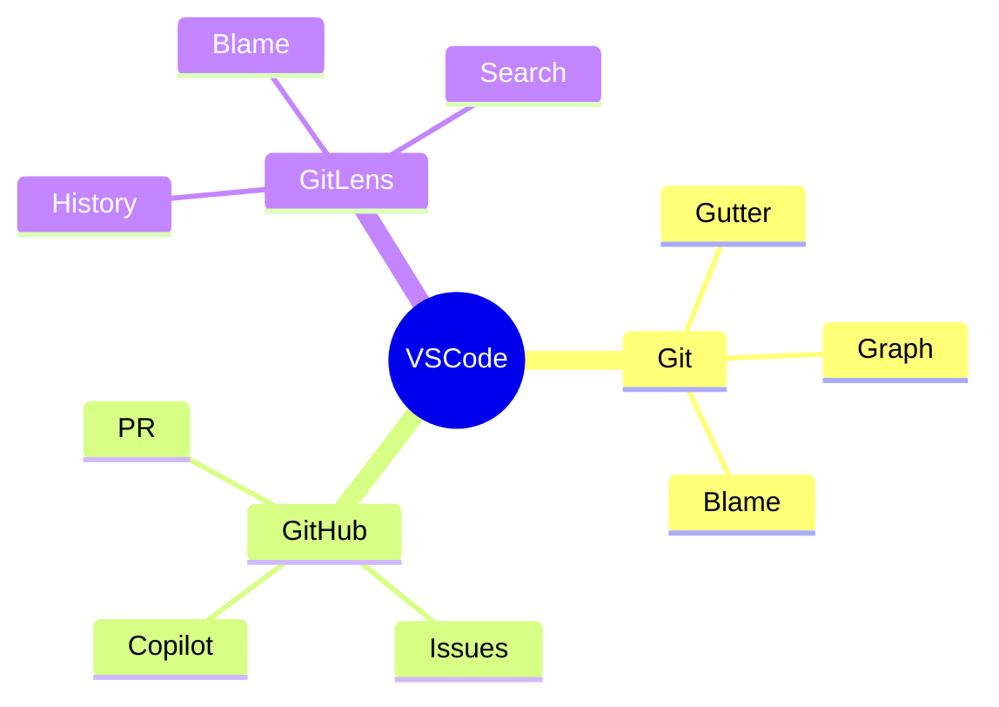
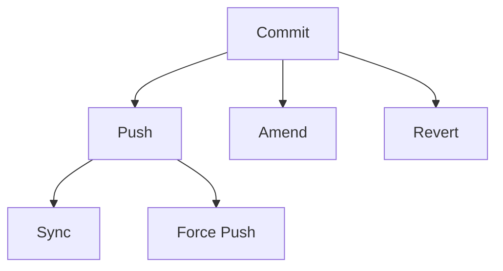

# Integração com IDEs

A integração do controle de versão com IDEs (Ambientes de Desenvolvimento Integrado) proporciona uma experiência de desenvolvimento mais fluida.

## IDEs Populares

### 1. Visual Studio Code

### 2. IntelliJ IDEA
- Git Integration
- Merge Tools
- Branch Management
- Commit Interface

### 3. Eclipse
- EGit Plugin
- Team Synchronization
- History View
- Compare Editor

## Recursos Essenciais

### 1. Visualização
- Diff inline
- Branch graph
- Blame annotations
- Change markers

### 2. Operações

## Extensões Recomendadas

### VSCode
1. GitLens
2. GitHub Pull Requests
3. Git History
4. Git Graph

### IntelliJ
1. Git Tool Box
2. GitHub Copilot
3. Git Flow Integration