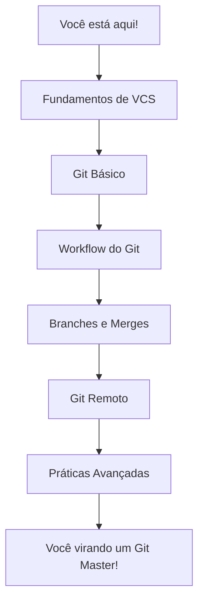
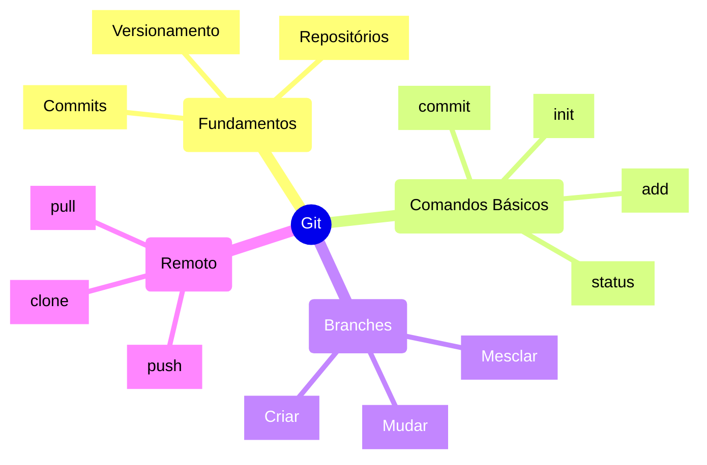

# Intro - Aprenda sobre VCS

## Nota do Autor
Olá pessoas, nesse texto irei falar sobre VCS (Sistema de Versionamento de Código, sigla em inglês) ou melhor, como o tema é mais conhecido - falarei sobre Git.

## O que você vai aprender aqui?
> 
>
> "Deixa que o Stifler te explica essa parada!"

Nesse guia você vai aprender:
- Como não perder código igual perdeu aquela crush do ensino médio
- Como trabalhar em equipe sem querer matar seus colegas
- Como versionar código igual um profissional (e não usando `projeto-final-v3-agora-vai-mesmo.zip`)
- Como usar Git e não passar vergonha nas entrevistas de emprego

## Roadmap de Aprendizado
> 
>
> A estrada do conhecimento é longa, mas é divertida!

## Mapa Mental dos Conceitos
> Para você que gosta de ver o todo antes de se perder nos detalhes
> (tipo quando você olha o cardápio inteiro antes de pedir)

## Por que você deveria aprender Git?
> 
>
> "Confia no pai que essa é boa!"

Imagina só:
- Você tá lá, codando tranquilo
- Fez alterações MASSAS no projeto
- Aí seu PC resolve dar aquela travada marota
- E... BOOM! 💥 Perdeu tudo!

Ou pior:
- Você e seu amigo precisam trabalhar no mesmo projeto
- Vocês ficam trocando arquivo por WhatsApp
- `projeto_final.zip`, `projeto_final_v2.zip`, `projeto_final_v2_agora_vai.zip`
- No final ninguém sabe qual é a versão certa 🤦‍♂️

É aí que entra o Git! Ele é tipo aquele amigo que:
- Guarda todas as versões do seu código
- Deixa você voltar no tempo quando der m*rda
- Permite que você e seus amigos trabalhem juntos sem criar caos
- Te salva de passar vergonha em entrevistas de emprego

## Pré-requisitos
> 
>
> "O que eu preciso saber antes de começar?"

- Saber usar um terminal básico (tipo `cd`, `ls`, essas coisas)
- Ter um editor de código (VSCode, Sublime, ou qualquer outro que você curta)
- Vontade de aprender (e senso de humor para aguentar minhas piadas ruins)

## Como usar este guia
Este material está organizado de forma progressiva:
1. Começamos com o básico dos básicos
2. Vamos evoluindo aos poucos
3. No final você estará usando Git igual um profissional

> **Dica do Stifler**: Não pule etapas! É tipo American Pie, você precisa ver o primeiro filme antes de entender as piadas do segundo! 

## Bora começar?
> 
>
> É hora de botar a mão na massa!

Escolha sua aventura:
- [Fundamentos de Versionamento](version-control-basics.md) - Para entender o básico
- [História do Git](git-history.md) - Para os curiosos
- [Git na Prática](git-workflow.md) - Para quem quer ir direto ao código

---

> **Nota**: Se em algum momento você se perder, não se preocupe! 
> É normal, todo mundo já passou por isso. 
> Até o Stifler já perdeu código antes de aprender Git!