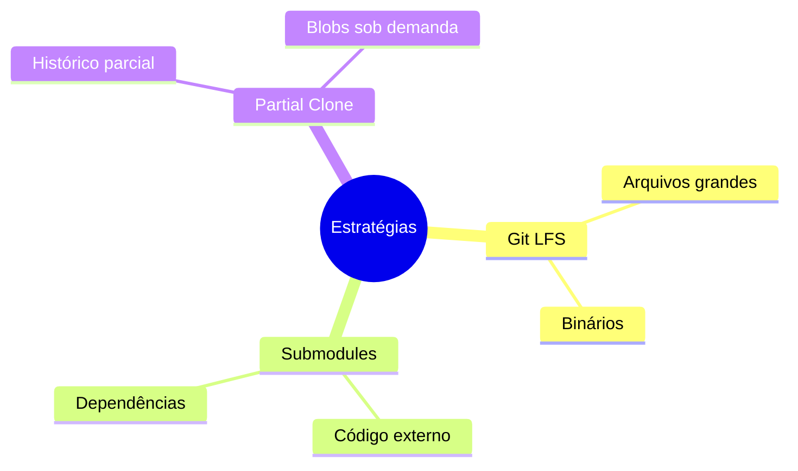
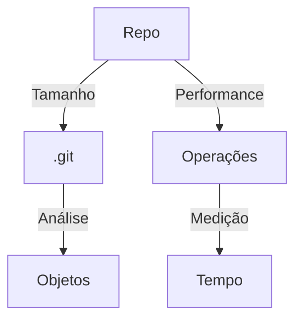

# Gerenciando Repositórios Grandes

## Estratégias

### Abordagens


### Configurações
```bash
# Configurar LFS
git lfs install
git lfs track "*.psd"

# Clone parcial
git clone --filter=blob:none URL

# Sparse checkout
git sparse-checkout set dir1 dir2
```

## Otimização

### Técnicas
```ascii
+------------------------+
|    OTIMIZAÇÕES        |
|                       |
| • Git LFS            |
| • Partial clone      |
| • Shallow clone      |
| • Sparse checkout    |
| • Bfg-repo-cleaner   |
+------------------------+
```

### Limpeza
```bash
# Remover arquivos grandes
git filter-branch --tree-filter \
'rm -rf path/to/large/file' HEAD

# Limpar histórico
git gc --aggressive --prune=now
```

## Monitoramento

### Métricas Importantes


### Ferramentas
```bash
# Análise de tamanho
git count-objects -vH

# Objetos grandes
git verify-pack -v .git/objects/pack/*.idx | \
sort -k 3 -n | tail -10

# Status LFS
git lfs status
```

## Boas Práticas

### Recomendações
1. Use Git LFS para binários
2. Implemente partial clone
3. Mantenha histórico limpo
4. Monitore crescimento
5. Documente políticas

### Manutenção Regular
```bash
# Limpeza periódica
git maintenance start

# Verificação
git fsck --full

# Compactação
git repack -ad
```

## Próximos Passos

### Tópicos Relacionados
- [Performance Issues](performance-issues.md)
- [Recovery Procedures](recovery-procedures.md)
- [Common Issues](common-issues.md)

> **Dica Pro**: Estabeleça políticas claras para gerenciamento de arquivos grandes antes que o repositório cresça demais.