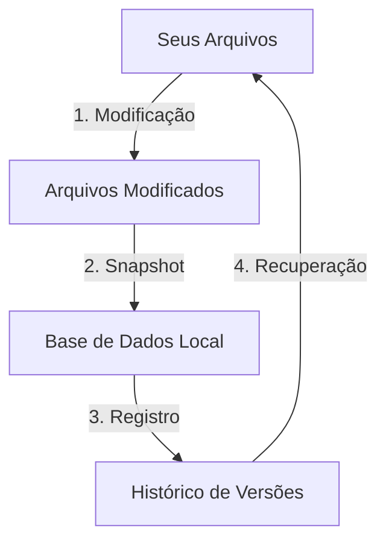
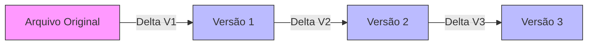
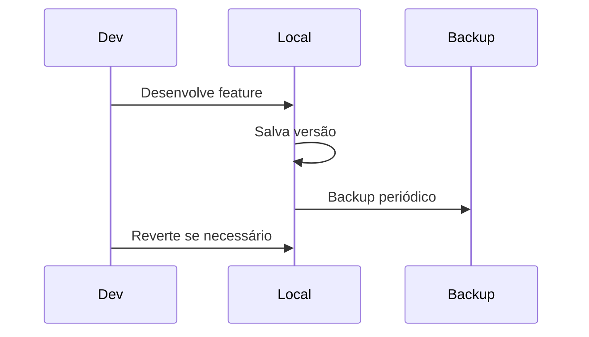
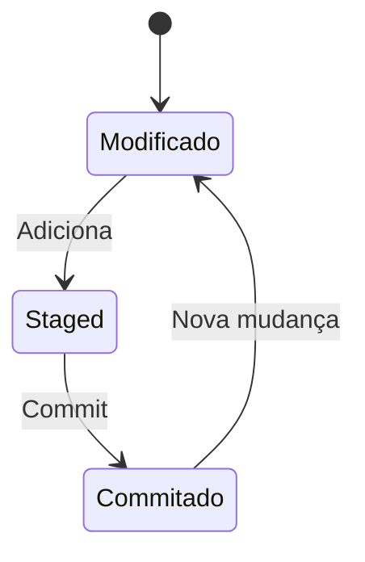
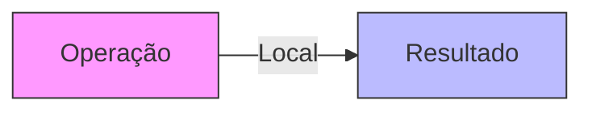
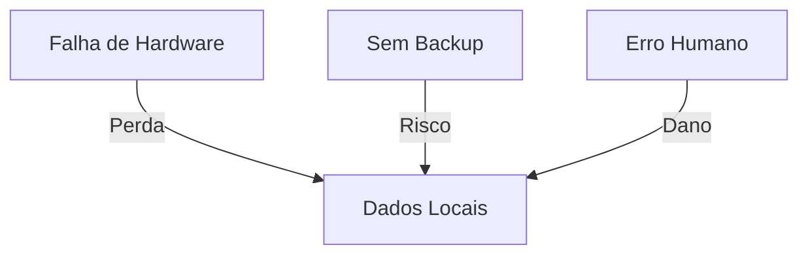
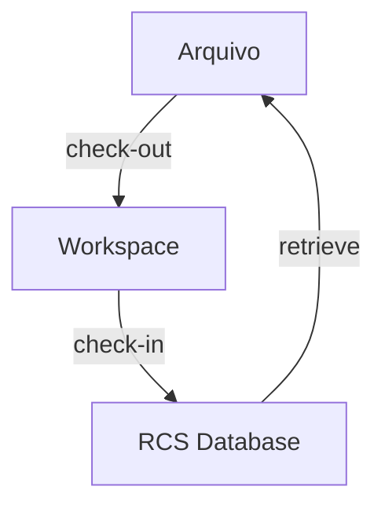
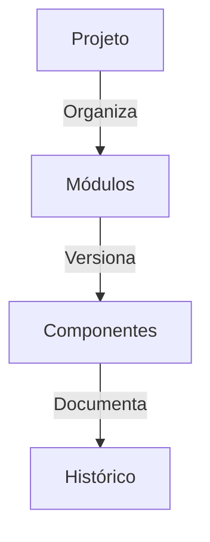

# Sistemas de Controle de Versão Local

Um sistema de controle de versão local é a primeira e mais básica forma de versionamento de código. Imagine como uma máquina do tempo pessoal para seu código, onde todas as mudanças são registradas e armazenadas localmente no seu computador.

## Como Funciona na Prática



### Analogia com um Álbum de Fotos
```ascii
+------------------------+
|     Seu Projeto       |
|  +-----------------+  |
|  | Versão Atual    |  |
|  +-----------------+  |
|  | Versão Anterior |  |
|  +-----------------+  |
|  | Versões Antigas |  |
|  +-----------------+  |
+------------------------+
```

## Componentes Principais

### 1. Base de Dados Local
- Armazena todas as mudanças
- Mantém metadados (autor, data, descrição)
- Gerencia diferentes versões
- Organiza o histórico completo

### 2. Sistema de Tracking


### 3. Mecanismo de Snapshots
```ascii
Tempo ------>

V1  [Snapshot 1]
    |
V2  [Snapshot 2]
    |
V3  [Snapshot 3]
    |
V4  [Snapshot 4]
```

## Cenários de Uso

### 1. Desenvolvimento Solo


### 2. Projetos Pessoais
```ascii
+-------------------+
| Projeto Pessoal   |
|                   |
| + Código         |
| + Documentação   |
| + Recursos      |
| + Configurações |
+-------------------+
      |
      v
+-------------------+
| Sistema Local VCS |
+-------------------+
```

## Processo de Versionamento

### 1. Criação de Versões


### 2. Recuperação de Versões
```ascii
HEAD (Versão Atual)
    |
    v
[V3] --> [V2] --> [V1]
    ^
    |
  Checkout
```

## Vantagens Detalhadas

### 1. Simplicidade
- Fácil de configurar
- Sem dependências externas
- Interface simples
- Aprendizado rápido

### 2. Performance


### 3. Autonomia
- Trabalho offline
- Controle total
- Independência de rede
- Decisões imediatas

## Limitações Detalhadas

### 1. Riscos de Perda


### 2. Colaboração Limitada
```ascii
Desenvolvedor 1     Desenvolvedor 2
     |                   |
  Versão A            Versão B
     |                   |
     X------------------X
     |                   |
Impossível Sincronizar
```

## Ferramentas Populares

### 1. RCS (Revision Control System)


### 2. SCCS (Source Code Control System)
```ascii
+------------------+
| SCCS Structure   |
|                  |
| s.file1          |
| s.file2          |
| s.file3          |
+------------------+
```

## Melhores Práticas

### 1. Organização


### 2. Backup Regular
```ascii
+----------------+
| Projeto Local  |
+----------------+
        |
        v
+----------------+
| Backup Externo |
+----------------+
        |
        v
+----------------+
| Cloud Storage  |
+----------------+
```

### 3. Documentação
- Comentários claros
- Descrições de versão
- Registro de mudanças
- Notas de implementação
```