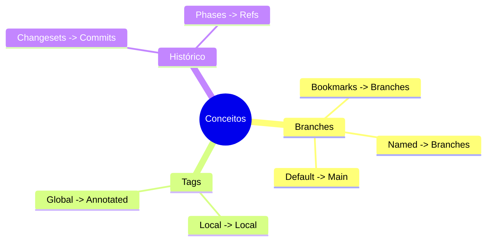
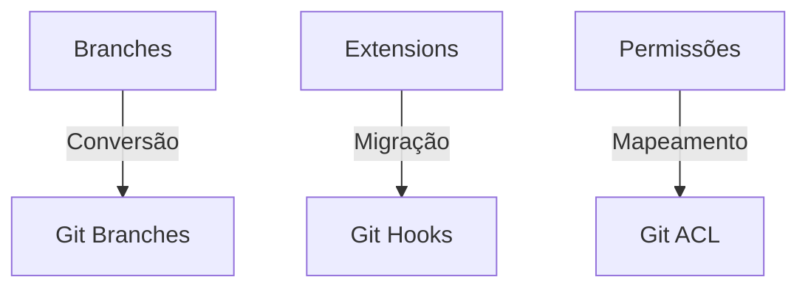
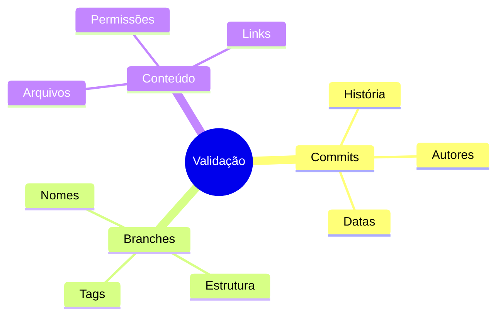

# Migrando de Mercurial para Git

## Processo de Migração

### Preparação
```bash
# Instalar fast-export
git clone https://github.com/frej/fast-export.git

# Preparar diretórios
mkdir git_repo
cd git_repo
git init
```

### Migração Básica
```bash
# Executar conversão
../fast-export/hg-fast-export.sh -r /path/to/hg_repo

# Checkout do resultado
git checkout HEAD
```

## Mapeamento de Conceitos

### Equivalências


## Desafios Comuns

### Problemas e Soluções


## Scripts de Migração

### Conversão Completa
```bash
#!/bin/bash
# Script de migração completa

# Preparar ambiente
git init git_repo
cd git_repo

# Converter repositório
/path/to/fast-export/hg-fast-export.sh \
    -r /path/to/hg_repo \
    --force

# Checkout e limpeza
git checkout HEAD
git gc --aggressive
```

### Mapeamento de Usuários
```bash
#!/bin/bash
# Gerar mapeamento de autores
hg log | grep user: | sort -u | \
sed 's/user: *//' > authors.txt

# Criar arquivo de mapeamento
while read author; do
    echo "\"$author\"=\"$author <$author@example.com>\""
done < authors.txt > authors-map.txt
```

## Validação

### Checklist


## Pós-Migração

### Configuração Git
```bash
# Configurar remote
git remote add origin git@github.com:org/repo.git

# Push inicial
git push -u origin --all
git push origin --tags

# Limpar referências antigas
git gc --aggressive --prune=now
```

## Melhores Práticas

### Recomendações
```ascii
+------------------------+
|    MIGRAÇÃO HG->GIT   |
|                       |
| 1. Backup completo    |
| 2. Teste piloto       |
| 3. Validação dados    |
| 4. Treinar equipe     |
| 5. Documentar processo|
+------------------------+
```