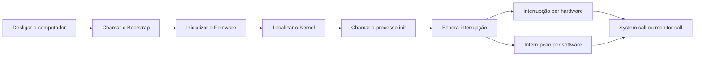
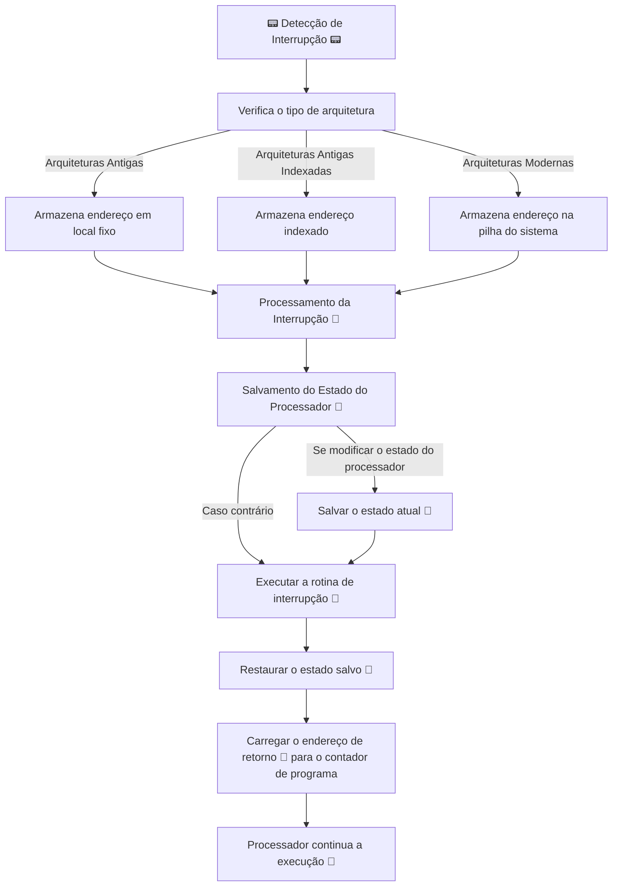
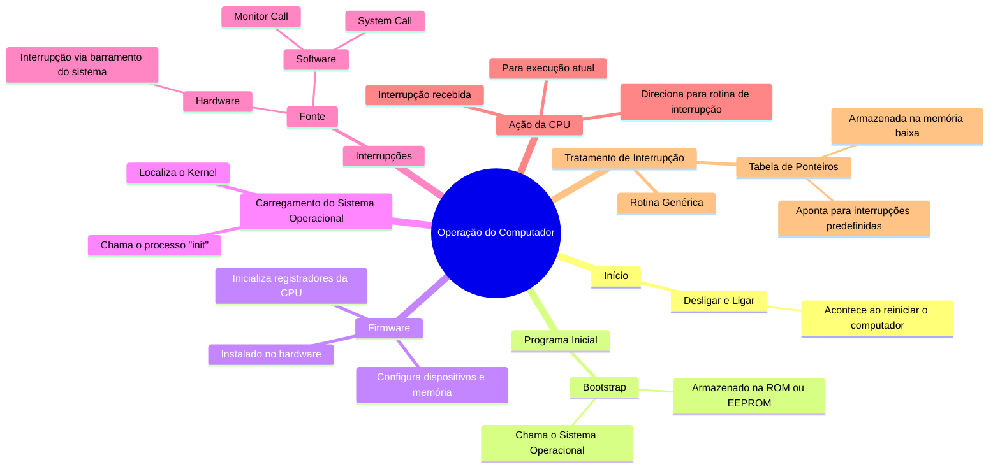

# 1.2 Operação do Computador

Ao desligar o computador e ligá-lo, o que acontece? Como ele "chama" o Sistema Operacional.

Para o computador começar a funcionar, ele chama um programa básico, chamado de **bootstrap**. Normalmente, este programa está alocado na memória apenas de leitura (**ROM**) ou é salvo na memória de somente leitura apagável programavelmente (**EEPROM**).

Este programa é conhecido como **Firmware**, pois está instalado diretamente no hardware, assim, ele inicializa todos os aspectos do sistema, desde os registradores da CPU até os dispositivos e o conteúdo na memória.

Para carregar o SO, ele precisa localizar o **Kernel**, que é o núcleo do sistema operacional. Assim que o Kernel é carregado na memória do computador, ele chama um processo chamado **init**, que espera uma interrupção do sistema ou do hardware. Os dois casos são:

- Se for pelo hardware, ele envia uma interrupção por sinal para a CPU, via normalmente o barramento do sistema;
- Se for por software, ele pode fazer de duas maneiras: chamando uma **system call** (chamada do sistema) ou usando um **monitor call** (monitor de chamada). Essas são operações especiais executadas para disparar uma interrupção, enviando um sinal para a CPU.



Quando a CPU recebe uma interrupção, ela para o que está fazendo e executa a rotina de tratamento correspondente:


A CPU então manda a execução para uma **localização fixa na memória**, onde essa localização contém o **endereço inicial** da rotina para **atender a essa interrupção**.

Essas **interrupções** podem ser tratadas de diferentes maneiras, e cada computador possui seu próprio mecanismo. Um método simples para isso é tratar a transferência chamando uma rotina genérica.
Para dar mais enfoque em velocidade pode ser usada uma **tabela de ponteiros a pontando para as interrupções**, já que elas devem ser predefinidas. **Essa tabela é armazenada em memoria baixa**, sendo ela a primeira parte ou locação da memoria.

Esse **vetor de interrupção** vai ser indexado exclusivamente pelo número do dispositivo, fornecido com a requisição da interrupção para gerar o endereço do tratamento da interrupção:

```
┌───────────────────────────────────────────────┐
│                  Interrupção 🔔               
└───────────────────────────────────────────────┘
   ┌───────────────────────────────────────────┐
   │     CPU manda execução para local         
   │      fixo na 💾, com endereço da          
   │     rotina de tratamento. 🏃‍♂️              
   └───────────────────────────────────────────┘
        ┌───────────────────────────────┐
        │  Diferentes formas de tratar  
        │   interrupções, cada 🖥️       
        │   com seu próprio jeito.     
        └───────────────────────────────┘
             ┌───────────────────────┐
             │    Método simples:    
             │  Transfere para uma   
             │   rotina genérica. 🔁 bootsrap
             └───────────────────────┘
                  ┌───────────────────────┐
                  │   Método rápido:      
                  │  📋 Tabela de         
                  │  ponteiros para       
                  │  interrupções, em     
                  │  memória baixa. 🔽    
                  └───────────────────────┘
                       ┌───────────────────┐
                       │  📋 Vetor usa     
                       │ 📟 dispositivo    
                       │ para gerar        
                       │ endereço do       
                       │ tratamento. 🔍    
                       └───────────────────┘
```

A arquitetura de interrupção **precisa salvar o endereço da instrução interrompida**, em projetos:
- Em alguns antigos armazenam o endereço da interrupção de **maneira fixa ou local indexado** por um numero do dispositivo;
- Em arquiteturas modernas, eles armazenam em **pilhas do sistema**;

Se a rotina de interrupção precisar modificar algum estado do processador, por exemplo alterando os valores do **registrador**:
- Ela vai **salvar** o estado atual, explicitamente;
- Depois **carregar** e **restaurar** esse estado para depois **retornar**;
- Em seguida será carregado para o **contador de programa** o **endereço do retorno** e o **processador** que foi **interrompido** continua como se nada tivesse acontecido:




## Diagrama


