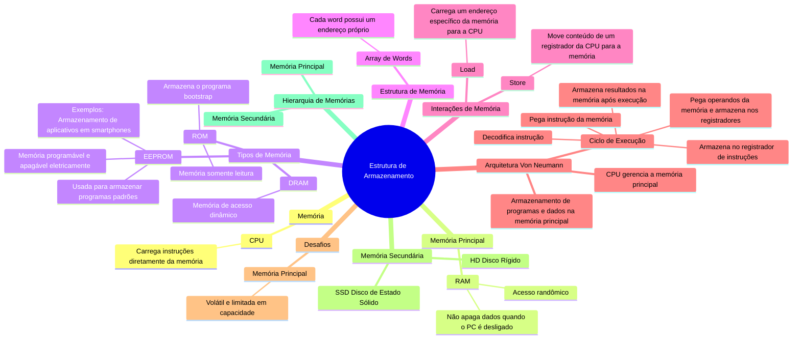
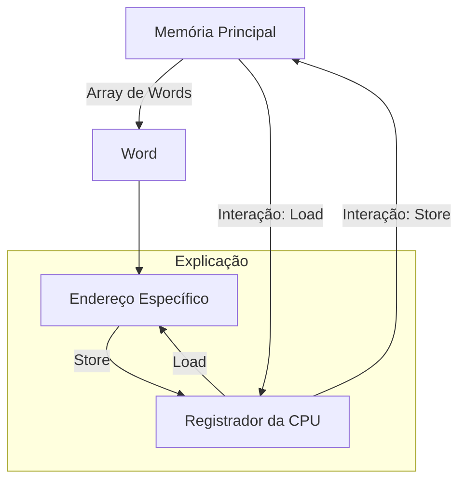
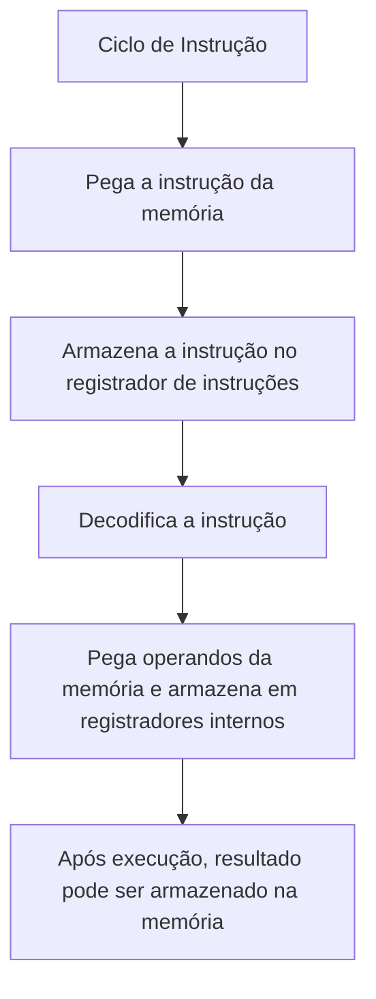
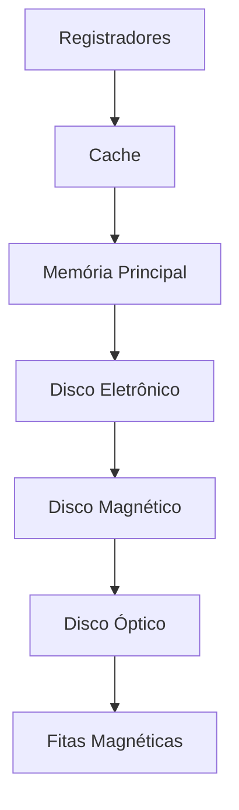

# 1.3 Estrutura de Armazenamento

Para os computadores que temos a **CPU** só consegue carregar instruções que vêm diretamente da memória.
- A memória não sendo nada, mas a **Memória Principal** - aquela cujo acesso é randômico, ou seja, desligar o PC não apaga os dados armazenados, que é a memória **RAM**.

## Diagrama

 

> 🔗 Veja mais sobre tipos de memória em:
{style="note"}

A memória RAM é comumente feita numa arquitetura de semicondutores chamada de **Dynamic Random Access Memory** (DRAM) ou, em português, **memória de acesso dinâmica**.

Um outro tipo de memória é aquela que só serve para leitura, assim como a mulher do seu amigo, apenas olhe. As conhecidas são:
- **ROM** (Read Only Memory) ==> normalmente vem nos computadores e é usada para armazenar o programa bootstrap.
	- Além disso, é usada por empresas de jogos para guardar os jogos, já que ela possui essa natureza imutável.
- **EEPROM** (Electrically Erasable Programmable Read Only Memory)
	- Por não ser modificado com frequência, essa memória costuma ser usada para armazenar programas padrões de modo estático.
		- Smartphones, por exemplo, utilizam a EEPROM de modo que as fabricantes armazenam nele os aplicativos de fábrica.

Quaisquer destas memórias utilizam **um array de words** ou uma **unidade de armazenamento**.
- Cada *word* possui seu próprio endereço.
- As interações se dão por instruções:
	- `load`  - carrega um endereço específico da **memória principal** para um dos **registradores** da CPU.
	- `store` - move um conteúdo de um **registrador da CPU** para a **memória principal**.

*Ilustração de um esquema sobre instruções da CPU (`load` e  `store`)*

> A CPU carrega e armazena essas instruções tanto explicitamente (dizer para ela fazer) como de maneira automática - ela faz sozinha o carregamento da memória principal para serem executadas.
> {style="note"}

A arquitetura mais usada nos computadores modernos é a de **Von Neumann**. Essa arquitetura funciona da seguinte forma:
- Programas e dados são armazenados na memória principal.
- A CPU gerencia a memória principal.

Vamos para um ciclo de execução - quando uma instrução é dada:
1. Pega a instrução da memória.
2. Armazena essa instrução no **registrador de instruções**.
3. Essa instrução é então decodificada.
	1. Pode pegar operandos da memória e armazená-los em registradores internos.
4. Após a execução dos operandos, o resultado pode ser armazenado na memória.

***Diagramas de Execução de Instrução***

<note>

A unidade de memória só consegue ver um fluxo de endereços de memória. Ela não sabe:
- Como são gerados (Gerados por contador de instruções, indexação, endereços literais e etc)
- Para que servem
- Se são instruções ou dados. 

</note>

Seria bom, mas a vida não é um morango, a memória principal não consegue armazenar todos os dados e programas. Entretanto, não temos isso, já que:
- **A memória principal é volátil**, ela perde os dados assim que a máquina é desligada.
- A memória principal possui um **armazenamento irrisoriamente pequeno** para armazenar todos os programas e dados.

Assim, precisamos de outro tipo de memória chamado **memória secundária**, que tem o propósito de armazenar dados e programas de maneira permanente.

Um bom exemplo de memória secundária é o HD (Disco Rígido) e também temos outro tipo que está se tornando mais popular no mercado, o SSD (Disco de Estado Sólido).

No entanto, não há apenas dispositivos de armazenamento nessa hierarquia. Também podemos fazer uma hierarquia desses dispositivos, que é assim:

***Diagramas de Dispositivos de Armazenamento:***

