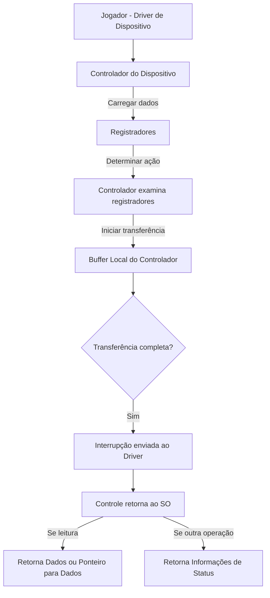
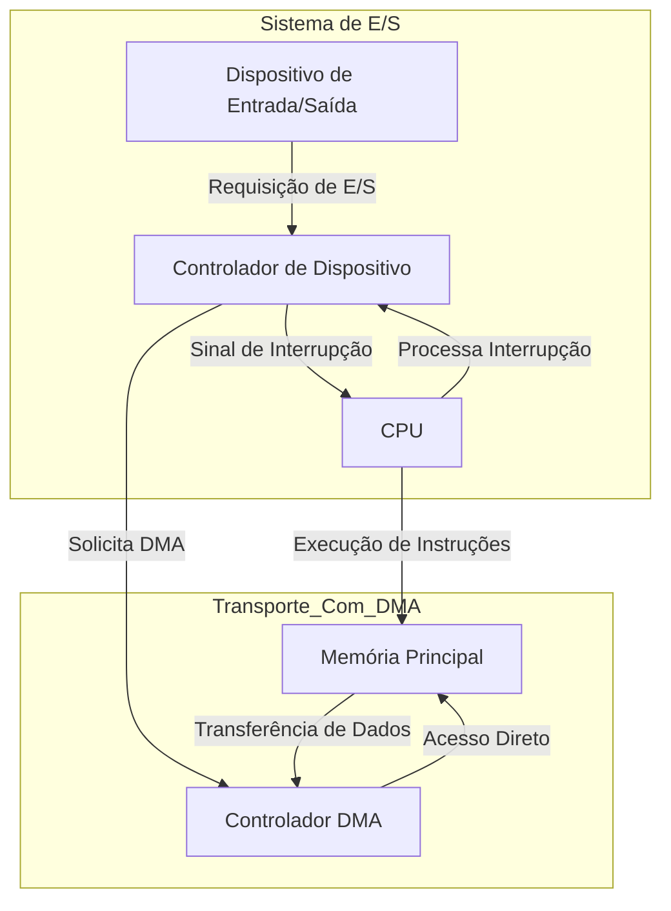
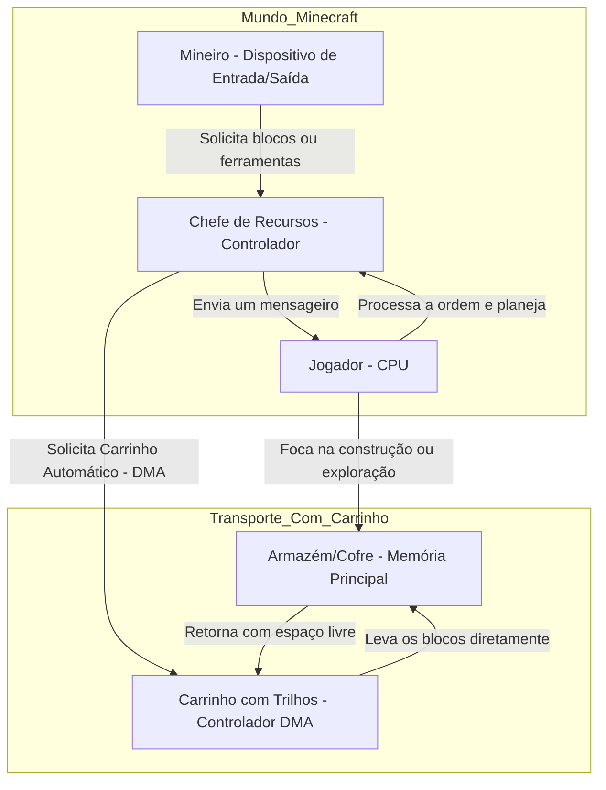

# 1.4 Estrutura de Entrada e Saída

Os dispositivos de Entrada e Saída (ou E/S), são um dos grandes pontos importantes para um Sistema Operacional, como podemos notar no armazenamento que possui grande importância para ser um dispositivo de E/S.
- Um outro ponto importante é que grande parte do código do SO é pensado para E/S;
	- Tanto por causa da **confiabilidade** como **desempenho**.

<note>

Um sistema computadorizado para uso geral, consiste em:
- CPU
- Diversos tipos de controladores de dispositivos conectados por um barramento comum
- Cada controlador possui um tipo específico de dispositivo

</note>

Por exemplo, para o controlador SCSI (Small Computer-System Interface) podemos ter sete ou até mais dispositivos conectados ao mesmo controlador.

Cada controlador armazena **buffer local** e um **conjunto de registradores de uso especial**.

Os controladores tem duas funções básicas, que se baseiam:
- **Move** os dados para os dispositivos periféricos que controla.
- **Gerencia** o uso do buffer local.

Tais sistemas possuem um **driver de dispositivo** (driver de dispositivo) que serve como ponte entre o dispositivo e o sistema, permitindo que a **entrada dos dispositivos** tenha uma **saída uniforme** para o restante do sistema.

O funcionamento de uma operação de E/S:
- O **driver de dispositivo** carrega os **registradores** apropriados para dentro do **controlador do dispositivo**.
- O **controlador** examina o **conteúdo** que tem nos **registradores**, para determinar que ação deve ser tomada.
- O controlador começa a transferir os dados do dispositivo para o seu buffer local.
- Assim que a transferência está concluída, o **controlador de dispositivo** envia uma **interrupção** para o **driver de dispositivo** informando que a transferência foi concluída.
- O driver de dispositivo então retorna o controle diretamente para o SO, retornando os dados ou um ponteiro para esses dados, possivelmente, caso a operação seja de leitura.
  - Para outras operações, o driver retorna informações de status.

***Representação:***

> Para pequenas porções de dados, essa arquitetura de E/S por interrupção funciona bem, mas não funciona somente com isso há muito tempo, por isso, se usarmos essa forma para grandes volumes de dados como E/S de disco causa um **overhead** (que é uma sobrecarga).
{style="note"}

Com esse grande problema, precisamos então de um outro dispositivo, um que armazene esses dados para que o acesso seja mais rápido, para isso usamos a **DAM** (Direct Access Memory ou Memória de Acesso Direto).

Logo o ciclo se torna assim:
- Depois de configurar buffers, ponteiros e contadores, o dispositivo de E/S, o controlador de dispositivo **move um bloco inteiro de dados** diretamente para ou do seu próprio buffer local para a memória.
    - Somente **uma interrupção é feita por bloco**, para que seja avisado ao driver de dispositivo que a **transferência foi concluída**.

> Nesta etapa de transferência direta não ocorre intervenção da CPU, assim apenas o controlador de dispositivo cuida dessa tarefa.
{style="note"}

Para alguns sistemas não é utilizado essa arquitetura de barramento e sim de switch:
- Nesse tipo de sistema, os vários componentes do sistema podem interagir entre si ao mesmo tempo.
- Ao invés de competir por ciclos de um barramento compartilhado.
- Assim o **DMA** consegue ser ainda mais eficiente.

***Representação da interação dos componentes num sistema:***

- ***Com Mineiro:***

