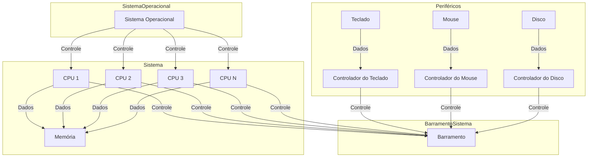
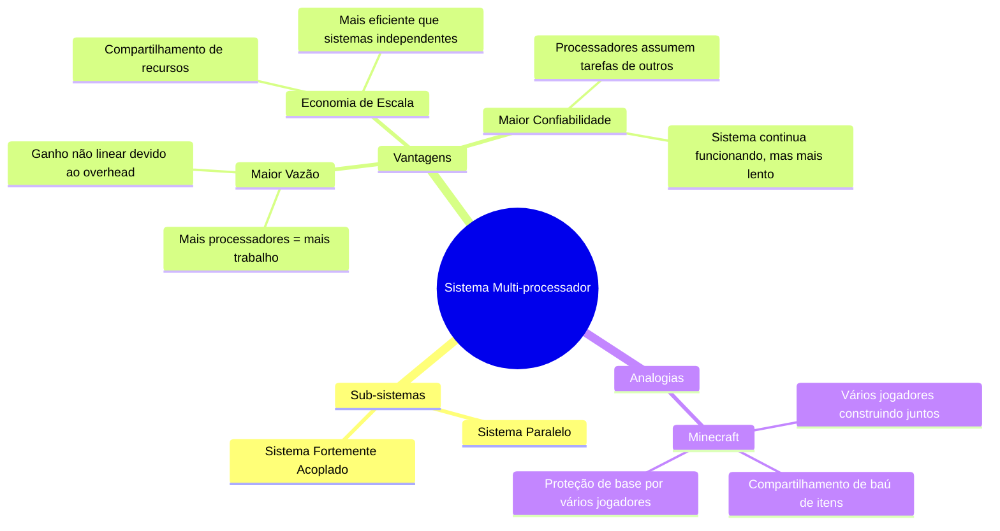
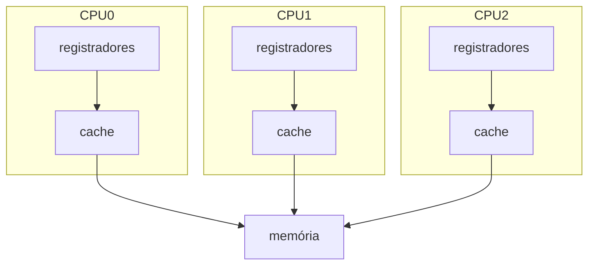
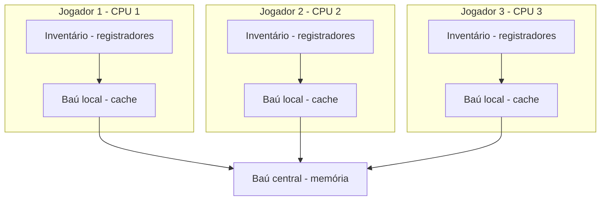
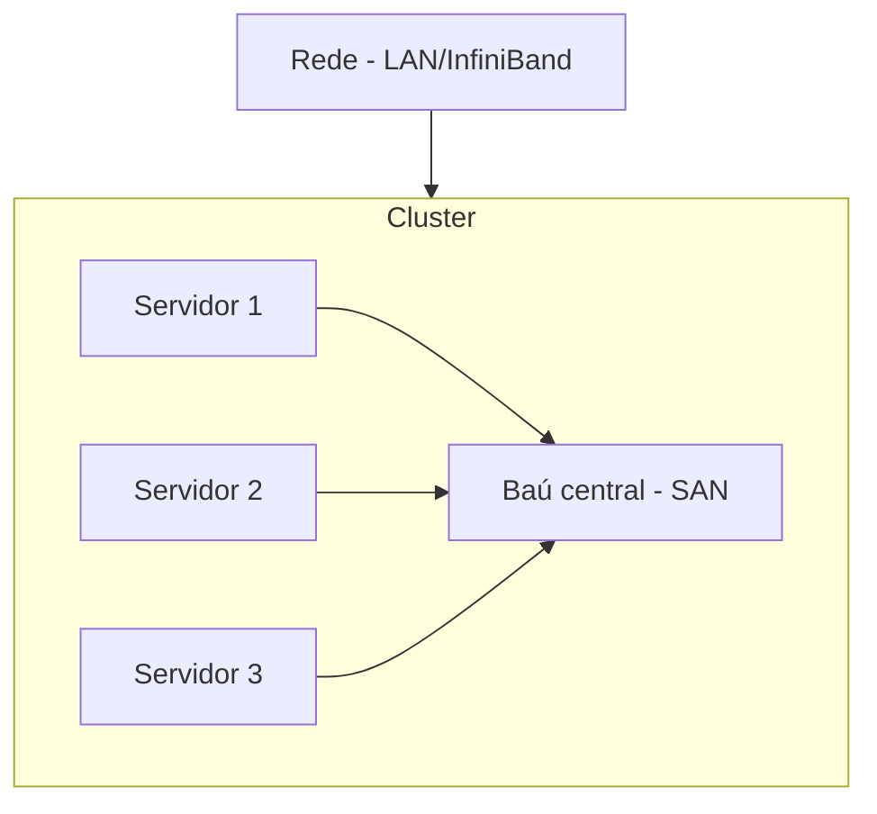

# 1.5 Arquitetura do Sistema

Agora falaremos sobre a categorização dos sistemas computadorizados, que é feita com base no número de processadores que ele possui, ou seja, estamos nos referindo a computadores de uso geral.

## 1.5.1 Sistema Monoprocessador

Esses sistemas, como o nome diz, possuem um único processador e foram muito utilizados, desde PDAs até mainframes. Assim, esses sistemas contêm uma única CPU que pode realizar diversas instruções de uso geral, assim como os processos do usuário.

> A maioria dos sistemas utiliza um processador de uso específico, como, por exemplo, para processamento gráfico, com os controladores gráficos, ou nos mainframes, com os processadores de E/S.  
{style="note"}

Esses processadores específicos não executam processos do usuário e somente realizam instruções limitadas e especializadas.

- Em alguns casos, o sistema operacional controla esse componente, pois o sistema envia informações sobre sua próxima tarefa e monitora seu status.

### Exemplo:
- Um processador controlador de disco recebe uma sequência de requisições da CPU principal.
- Implementa sua própria fila de disco e algoritmo de escalonamento.

> Com isso, há um alívio na carga de processamento do escalonamento de disco, que, de outra forma, seria delegado à CPU principal.  
{style="note"}

O sistema operacional não pode se comunicar diretamente com esses processadores, pois eles operam em um nível mais baixo. Um exemplo disso são os teclados, que possuem um microprocessador responsável por converter os toques nas teclas em códigos que serão enviados para a CPU principal. 

Assim, esses processadores realizam suas tarefas de forma anônima, pois não interagem diretamente com o sistema operacional.

Mesmo com o uso desses processadores específicos, o sistema ainda não é considerado multiprocessado. 

Para que um sistema seja classificado como monoprocessador, ele deve possuir uma única CPU de uso geral. Os processadores mencionados anteriormente são de uso específico.

### Diagrama

 
 

## 1.5.2 Sistema multi-processador
Esse tipo de sistema em que temos mais de um processador, de uso geral, dentro de um mesmo sistema computadorizado tem ganhado cada vez mais espaço por diversas razões o lugar dos sistema mono processador.

Os sistemas multiprocessados, ou também conhecidos como: **sistemas paralelos** (parallel system) ou **sistema fortemente acoplado** (tightly coupled system) fazem um compartilhamento perfeito de periféricos, relógio do computador, barramento do computador para vários processadores de modo que a comunicação entre eles é perfeita.

Podemos escalar **três grandes vantagens** acerca desse tipo de arquitetura para sistemas:

1. **Maior vazão:**
   - Como ter vários jogadores trabalhando juntos em uma construção no Minecraft.
   - Mais processadores = mais trabalho realizado em menos tempo.
   - Porém, o ganho não é linear devido ao overhead de coordenação.

2. **Economia de escala:**
   - Semelhante a compartilhar um baú de itens entre vários jogadores no Minecraft.
   - Sistemas multiprocessados compartilham recursos (periféricos, armazenamento, energia).
   - Mais eficiente que ter vários sistemas independentes.

3. **Maior confiabilidade:**
   - Como ter vários jogadores protegendo uma base no Minecraft.
   - Se um processador falha, os outros podem assumir suas tarefas.
   - O sistema continua funcionando, apenas mais lento, em vez de travar completamente.

Estas vantagens tornam os sistemas multiprocessados cada vez mais populares, assim como servidores de Minecraft com vários jogadores oferecem uma experiência mais robusta e dinâmica.

Imagine construir um mundo no Minecraft. A **confiabilidade** do sistema é como a estabilidade do mundo: se algo der errado (bloco sumir, mob bugar), ele continua funcionando, mesmo que limitado. Isso é **degradação controlada** — como minerar com uma ferramenta pior se a melhor quebrar.

Sistemas **tolerantes a falhas** vão além: mesmo com falhas, funcionam sem interrupções. No Minecraft, seria um backup automático que restaura blocos destruídos por creepers sem você sair do jogo.

O **HP NonStop** é como um servidor com duplicação: dois jogadores (CPUs) constroem a mesma coisa ao mesmo tempo. Se um errar, o sistema corrige e transfere a tarefa para outro par, garantindo continuidade, mas com custo maior.

Já os **sistemas multiprocessados** são como vários jogadores trabalhando juntos:

1. **Assimétrico**: Um jogador mestre comanda os outros. Se ele sair, tudo pode parar.  
2. **Simétrico (SMP)**: Todos são iguais, compartilham recursos (baú/memória) e trabalham juntos sem perder desempenho. Sistemas como **Solaris**, Windows e Linux usam isso.

- Com Minecraft:

## 1.5.3 Sistemas em Clusters

### Resumo com analogias ao Minecraft:

Um **sistema em cluster** é como um grupo de servidores de Minecraft trabalhando juntos. Cada servidor (nó) é independente, mas eles estão conectados por uma rede (LAN ou conexão rápida) e compartilham armazenamento (como um baú central). O objetivo é garantir **alta disponibilidade** e **alto desempenho**.

- **Alta disponibilidade**: Se um servidor falhar (explodir como um creeper), outro assume seu lugar, mantendo o mundo (serviço) funcionando com pouca interrupção.  
  - **Modo assimétrico**: Um servidor fica de olho (hot-standby) enquanto o outro roda o jogo. Se o ativo falhar, o standby assume.  
  - **Modo simétrico**: Vários servidores rodam o jogo e se monitoram, usando todo o hardware de forma eficiente.

- **Alto desempenho**: Vários servidores podem trabalhar juntos para resolver tarefas complexas, como gerar chunks ou processar comandos em paralelo. Isso exige que o jogo (aplicação) seja dividido em partes que rodam simultaneamente em diferentes servidores.

- **Clusters paralelos**: Vários servidores acessam os mesmos dados (como um banco de dados compartilhado). Para evitar conflitos, um sistema de "trava" (DLM) garante que apenas um servidor modifique os dados por vez.

- **SANs (Storage-Area Networks)**: É como um baú gigante conectado a todos os servidores. Se um servidor cair, outro pode pegar os itens (dados) e continuar o jogo.

### Resumo visual:

