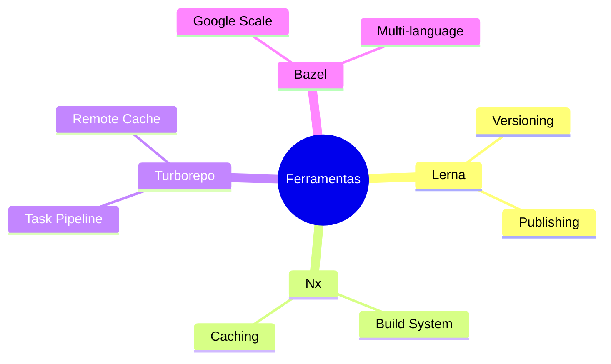
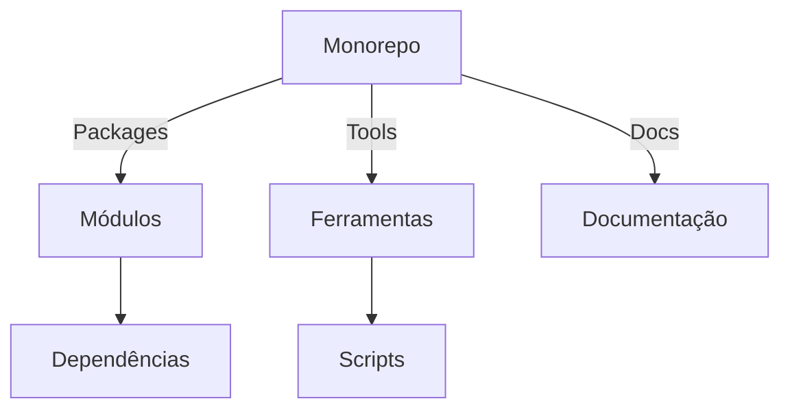
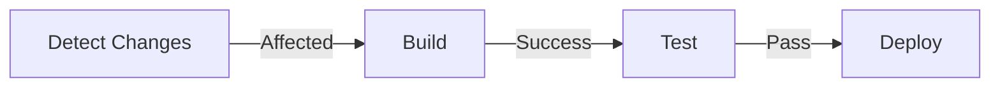
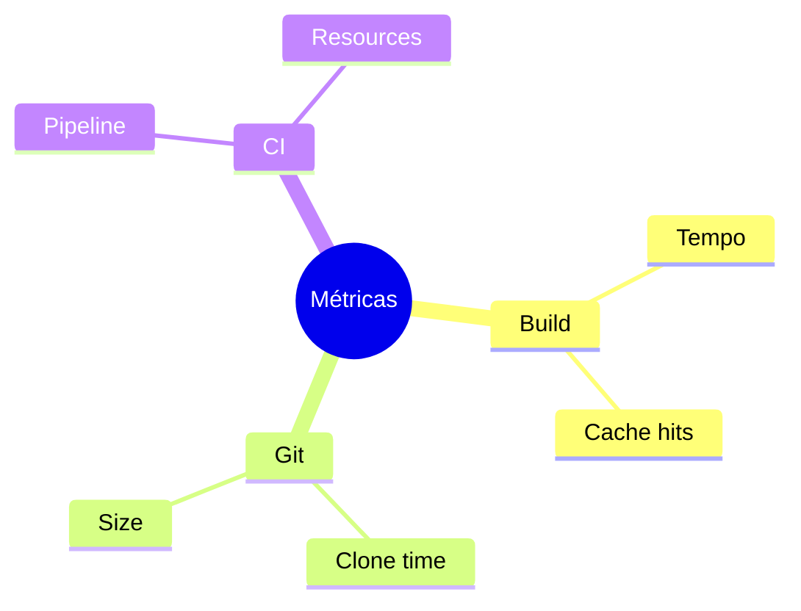
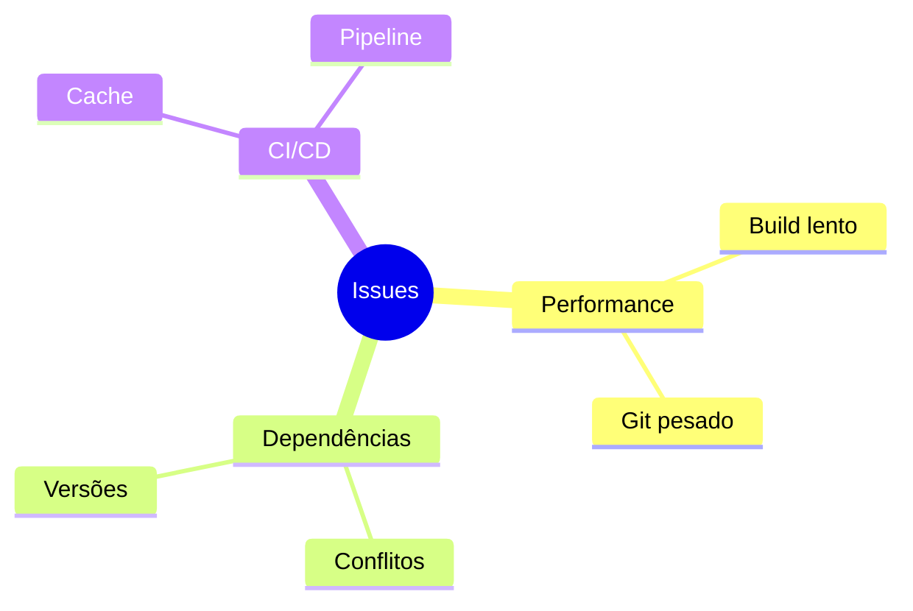

# Gerenciamento de Monorepo

## O que é um Monorepo?

Um monorepo é um repositório único que contém múltiplos projetos relacionados, com possíveis diferentes linguagens de programação, ferramentas e releases independentes.

## Estrutura Básica

```ascii
monorepo/
├── packages/
│   ├── frontend/
│   ├── backend/
│   └── shared/
├── tools/
├── docs/
└── scripts/
```

## Ferramentas Populares

### Gerenciadores de Workspace


## Vantagens e Desvantagens

### Prós
- Código compartilhado
- Refatoração atômica
- Consistência de versões
- Colaboração simplificada

### Contras
- Build mais complexo
- CI/CD mais lento
- Git mais pesado
- Curva de aprendizado

## Melhores Práticas

### 1. Organização


### 2. Performance
```bash
# Shallow clone
git clone --depth 1 

# Sparse checkout
git sparse-checkout set packages/frontend

# Partial clone
git clone --filter=blob:none
```

## CI/CD para Monorepos

### Pipeline Básico


### Configuração
```yaml
build:
  script:
    - nx affected:build
    - nx affected:test
    - nx affected:lint
```

## Escalabilidade

### Estratégias
1. Cache distribuído
2. Build incremental
3. Testes paralelos
4. Deploy seletivo

### Monitoramento


## Troubleshooting

### Problemas Comuns


## Próximos Passos

### Tópicos Relacionados
- [Git LFS](git-lfs.md)
- [Performance Issues](performance-issues.md)
- [CI/CD Integration](ci-cd-integration.md)

> **Dica Pro**: Use ferramentas como `git maintenance` e `git gc` regularmente para manter o repositório otimizado.