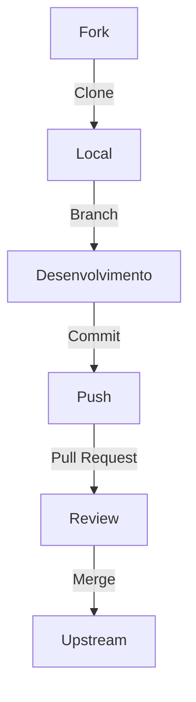
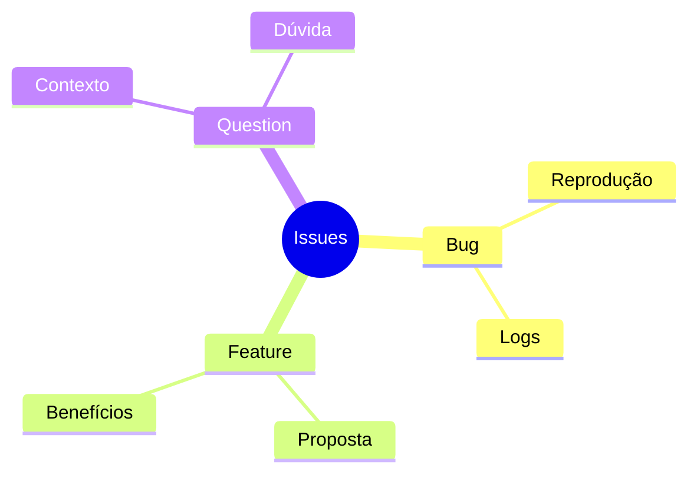
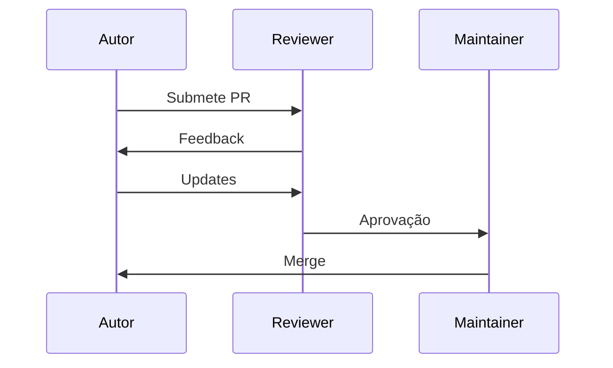
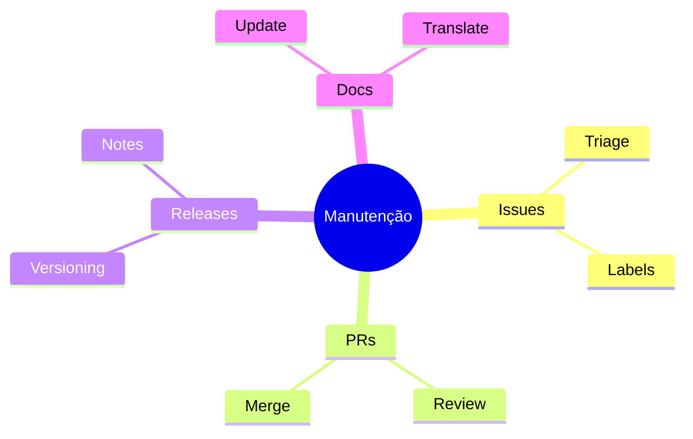
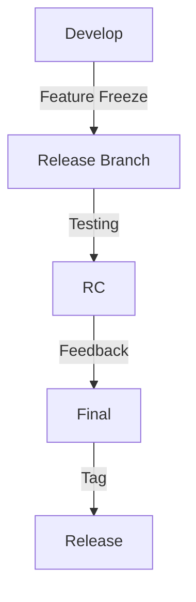
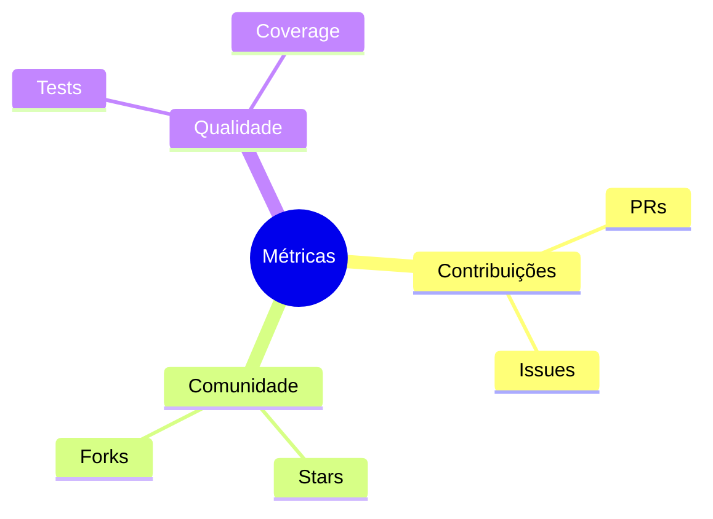

# Workflow Open Source

## Visão Geral

O workflow open source é um modelo colaborativo que permite contribuições de múltiplos desenvolvedores, mantendo qualidade e organização.

## Estrutura do Projeto

### Arquivos Essenciais
```ascii
projeto/
├── README.md
├── CONTRIBUTING.md
├── CODE_OF_CONDUCT.md
├── LICENSE
└── .github/
    ├── ISSUE_TEMPLATE/
    └── PULL_REQUEST_TEMPLATE.md
```

## Processo de Contribuição

### Fluxo Básico


## Guidelines

### 1. Commits
```bash
# Formato
<tipo>(<escopo>): <descrição>

# Exemplos
feat(auth): adiciona autenticação OAuth
fix(api): corrige erro na validação
docs(readme): atualiza instruções de instalação
```

### 2. Issues


## Code Review

### Processo


## Manutenção

### Tarefas Regulares


## Automação

### GitHub Actions
```yaml
name: CI
on: [push, pull_request]
jobs:
  test:
    runs-on: ubuntu-latest
    steps:
      - uses: actions/checkout@v2
      - name: Run tests
        run: |
          npm install
          npm test
```

## Comunicação

### Canais
```ascii
+------------------------+
|     COMUNICAÇÃO       |
|                       |
| • Issues             |
| • Discussions       |
| • Discord           |
| • Mailing List      |
| • Blog              |
+------------------------+
```

## Releases

### Processo


## Métricas

### KPIs


## Próximos Passos

### Tópicos Relacionados
- [Git Workflow](git-workflow.md)
- [Code Review Practices](code-review-practices.md)
- [Documentation Practices](documentation-practices.md)

> **Dica Pro**: Mantenha um changelog detalhado e use semantic versioning para facilitar o acompanhamento das mudanças.