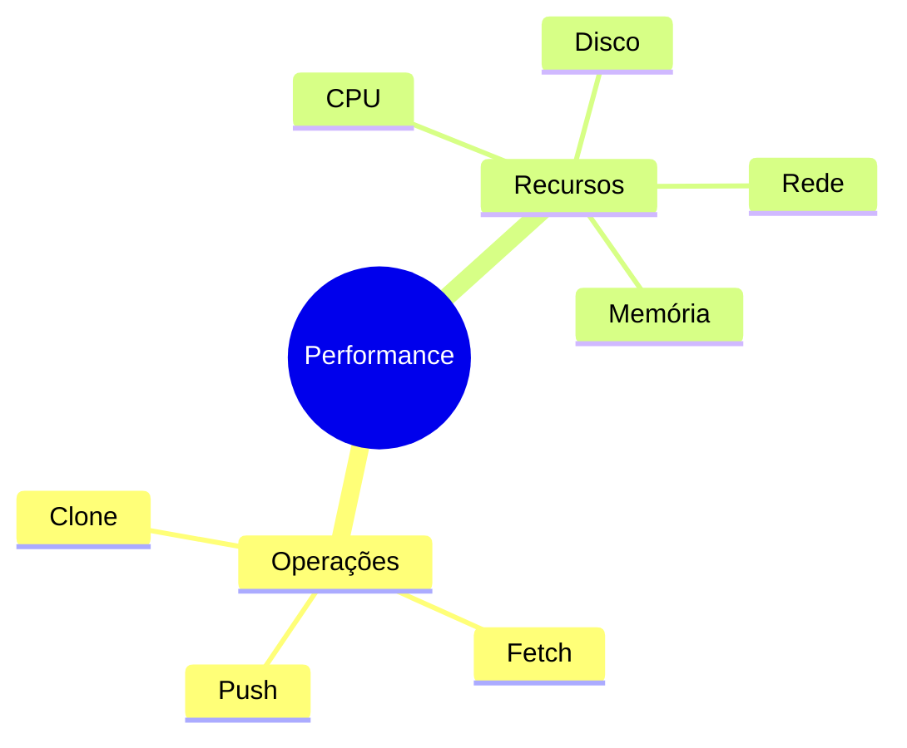
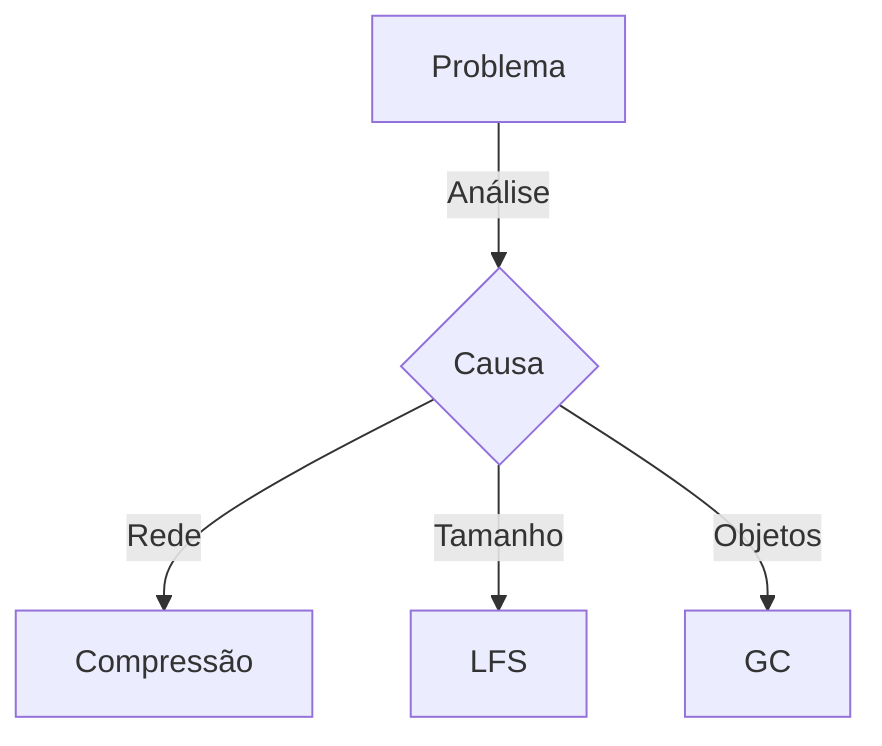

# Problemas de Performance no Git

## Diagnóstico

### Métricas Importantes


### Ferramentas de Análise
```bash
# Trace de performance
GIT_TRACE_PERFORMANCE=1 git status

# Estatísticas de objetos
git count-objects -v

# Análise de packfiles
git verify-pack -v .git/objects/pack/*.idx
```

## Otimizações

### Configurações
```bash
# Melhorar performance local
git config core.preloadindex true
git config core.fsmonitor true
git config core.untrackedCache true

# Otimizar rede
git config core.compression 9
git config pack.windowMemory "100m"
```

### Manutenção
```ascii
+------------------------+
|    MANUTENÇÃO         |
|                       |
| • git gc             |
| • git prune          |
| • git repack         |
| • git fsck           |
| • git maintenance    |
+------------------------+
```

## Problemas Específicos

### Clone Lento
```bash
# Clone raso
git clone --depth 1 URL

# Clone específico
git clone --filter=blob:none URL

# Clone parcial
git clone --sparse URL
```

### Push/Pull Lento


## Monitoramento

### Métricas Chave
1. Tempo de operação
2. Uso de recursos
3. Tamanho do repo
4. Objetos soltos
5. Eficiência de pack

### Comandos de Monitoramento
```bash
# Tamanho do repo
du -sh .git/

# Objetos grandes
git rev-list --objects --all | \
git cat-file --batch-check | \
sort -k3nr | head

# Status de refs
git for-each-ref --sort=-committerdate
```

## Próximos Passos

### Tópicos Relacionados
- [Large Repositories](large-repositories.md)
- [Recovery Procedures](recovery-procedures.md)
- [Common Issues](common-issues.md)

> **Dica Pro**: Implemente monitoramento contínuo para detectar problemas de performance antes que se tornem críticos.