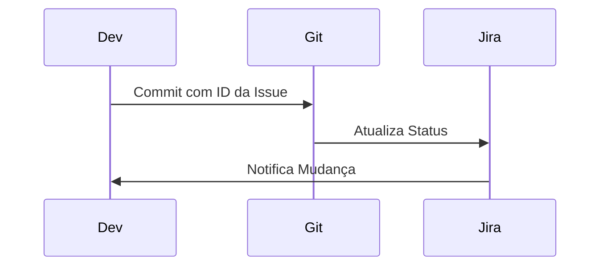
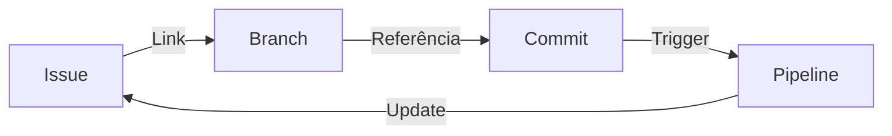
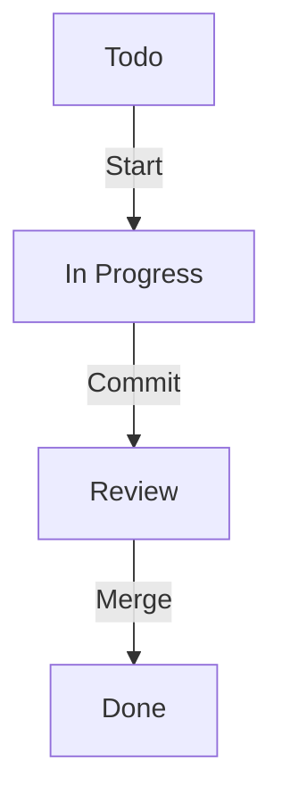

# Integração com Gestão de Projetos

A integração entre controle de versão e ferramentas de gestão de projetos melhora a rastreabilidade e o gerenciamento do trabalho.

## Ferramentas Populares

### 1. Jira + Git

### 2. Azure DevOps
- Work Items
- Boards
- Repos
- Pipelines

### 3. Trello + GitHub
- Card Links
- Automações
- Power-Ups

## Funcionalidades Principais

### 1. Rastreabilidade

### 2. Automações
- Status automático
- Assignees
- Labels
- Milestones

## Melhores Práticas

### 1. Nomenclatura
- Branches com ID da issue
- Commits com referências
- PRs linkados

### 2. Workflows
