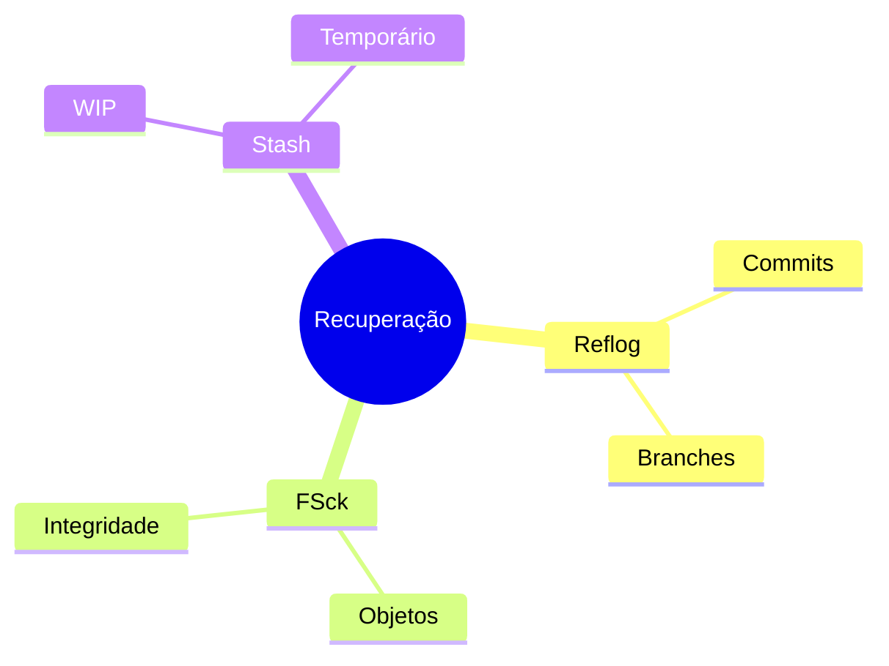
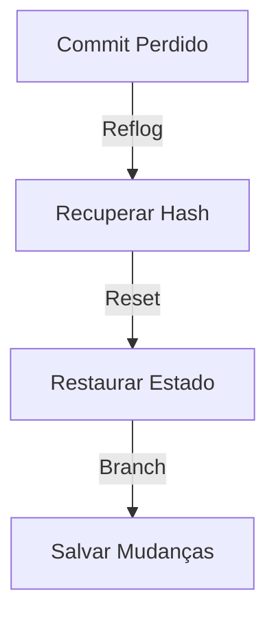

# Procedimentos de Recuperação

## Recuperação de Dados

### Ferramentas


### Comandos Básicos
```bash
# Ver reflog
git reflog

# Verificar objetos
git fsck --full

# Recuperar stash
git stash list
git stash apply
```

## Corrupção de Repositório

### Diagnóstico
```ascii
+------------------------+
|    DIAGNÓSTICO        |
|                       |
| • Objetos perdidos   |
| • Refs quebradas     |
| • Index corrompido   |
| • Pack corrompido    |
| • HEAD inválido      |
+------------------------+
```

### Reparação
```bash
# Verificar e reparar
git fsck --full

# Reparar refs
git gc --prune=now

# Recriar index
rm .git/index
git reset
```

## Recuperação de Commits

### Técnicas


### Procedimentos
```bash
# Encontrar commit
git reflog show --all

# Criar branch
git branch recovery-branch HASH

# Reset para commit
git reset --hard HASH
```

## Backup e Prevenção

### Estratégias
1. Backup regular
2. Mirrors remotos
3. Bundle backups
4. Documentação
5. Testes de recuperação

### Comandos de Backup
```bash
# Criar bundle
git bundle create repo.bundle --all

# Mirror completo
git clone --mirror URL

# Backup refs
git for-each-ref > refs_backup.txt
```

## Plano de Recuperação

### Passos


## Próximos Passos

### Tópicos Relacionados
- [Common Issues](common-issues.md)
- [Performance Issues](performance-issues.md)
- [Large Repositories](large-repositories.md)

> **Dica Pro**: Mantenha um plano de recuperação documentado e testado regularmente para minimizar tempo de recuperação em emergências.