# Gerenciamento de Releases

Como diria o Stifler: "Uma release é como uma festa - precisa de planejamento, organização e saber a hora certa de lançar!"

## Fundamentos de Release Management

### 1. Ciclo de Release
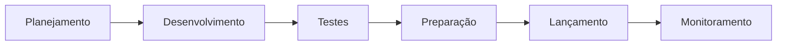

### 2. Tipos de Release

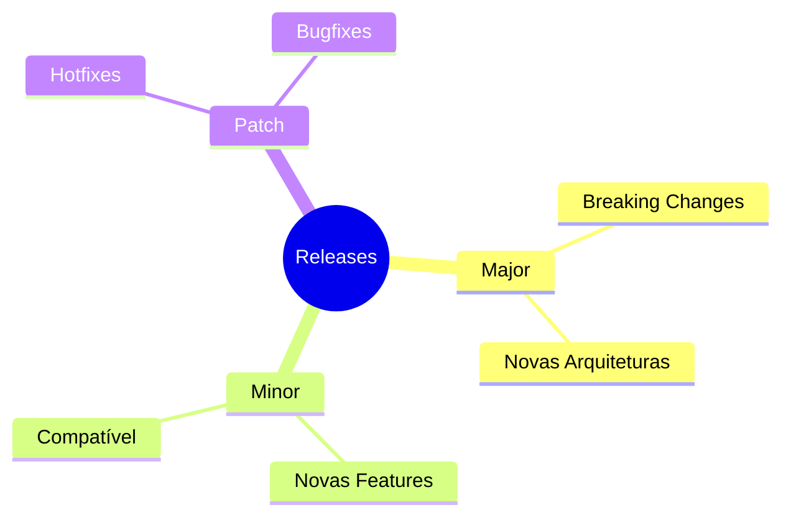

## Versionamento Semântico

### 1. Estrutura
```ascii
MAJOR.MINOR.PATCH
  |     |     |
  |     |     `-- Correções de bugs
  |     `-------- Novas funcionalidades
  `-------------- Breaking changes
```

### 2. Exemplos Práticos
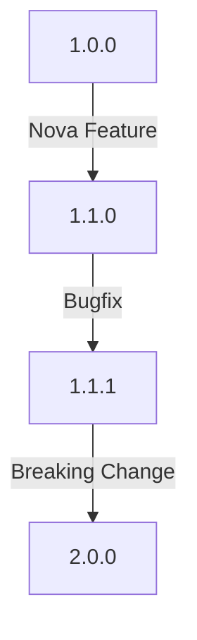

## Processo de Release

### 1. Preparação
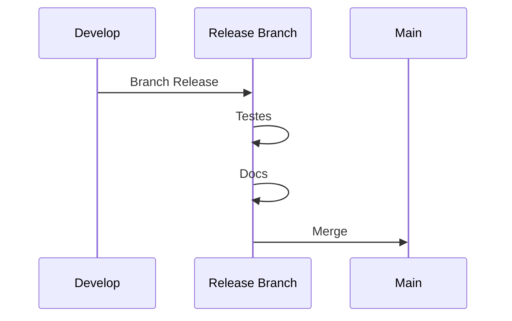

### 2. Checklist de Release
```ascii
📋 Release Checklist

1. [ ] Code Freeze
2. [ ] Versão Atualizada
3. [ ] Testes Completos
4. [ ] Documentação
5. [ ] Release Notes
6. [ ] Deploy Staging
7. [ ] Smoke Tests
8. [ ] Deploy Prod
9. [ ] Monitoramento
10.[ ] Comunicação
```

## Estratégias de Release

### 1. Release Tradicional
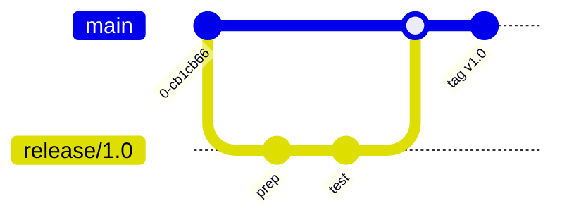

### 2. Continuous Delivery
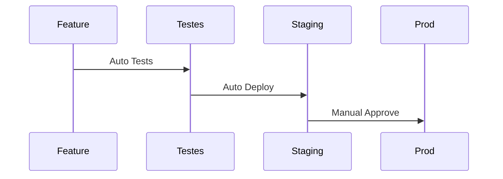

## Ambientes de Deploy

### 1. Pipeline de Ambientes
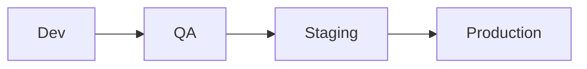

### 2. Configuração por Ambiente
```ascii
environments/
├── dev/
│   └── config.yml
├── qa/
│   └── config.yml
├── staging/
│   └── config.yml
└── prod/
    └── config.yml
```

## Documentação de Release

### 1. Release Notes
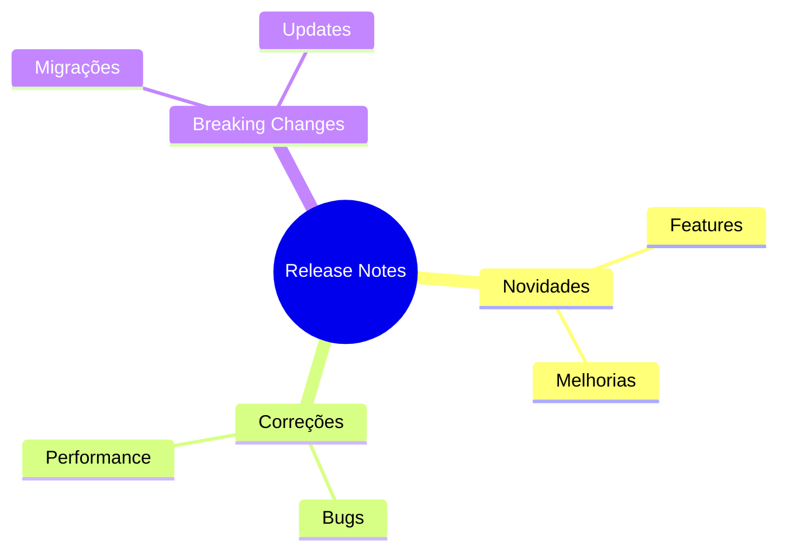

### 2. Changelog
```ascii
# Changelog

## [2.0.0] - 2024-02-20
### Added
- Nova interface
- API v2

### Changed
- Refatoração do core

### Fixed
- Bug #123
- Performance issue
```

## Comunicação

### 1. Stakeholders
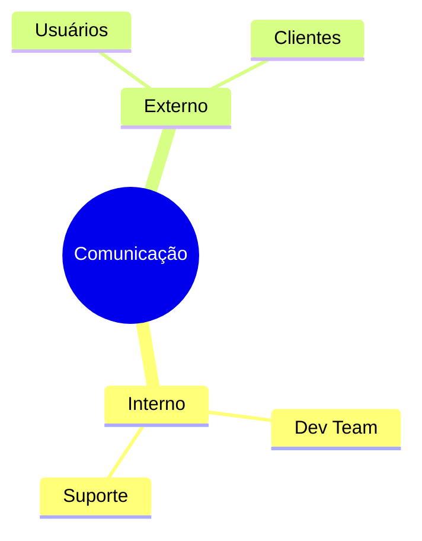

### 2. Canais de Comunicação
```ascii
📢 Canais

- Email Newsletter
- Blog Técnico
- Redes Sociais
- Documentação
- Release Notes
```

## Monitoramento Pós-Release

### 1. Métricas Importantes
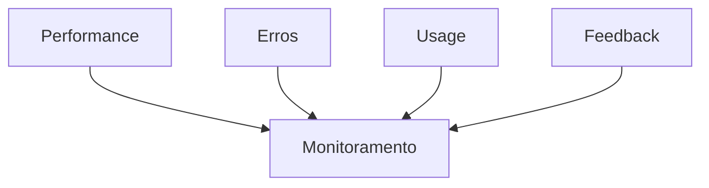

### 2. Plano de Rollback
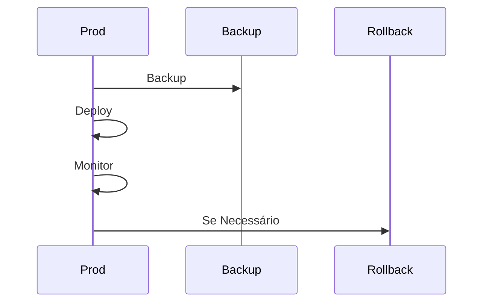

## Automação

### 1. CI/CD Pipeline
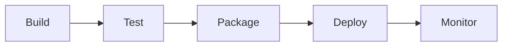

### 2. Scripts de Release
```bash
# Exemplo de script de release
./release.sh \
  --version="1.2.0" \
  --env="prod" \
  --backup \
  --notify
```

## Melhores Práticas

### 1. Planejamento
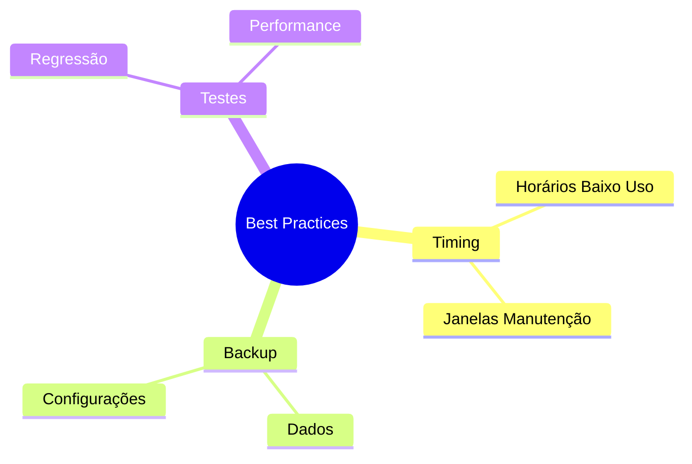

### 2. Checklist de Segurança
```ascii
🔒 Security Checklist

1. [ ] Backups atualizados
2. [ ] Secrets rotacionadas
3. [ ] Permissões verificadas
4. [ ] Logs habilitados
5. [ ] Monitoramento ativo
```

## Conclusão

Como em American Pie, o timing é tudo! Uma release bem executada é como uma festa perfeita - todos se divertem e nada dá errado (ou pelo menos sabemos como lidar quando dá).

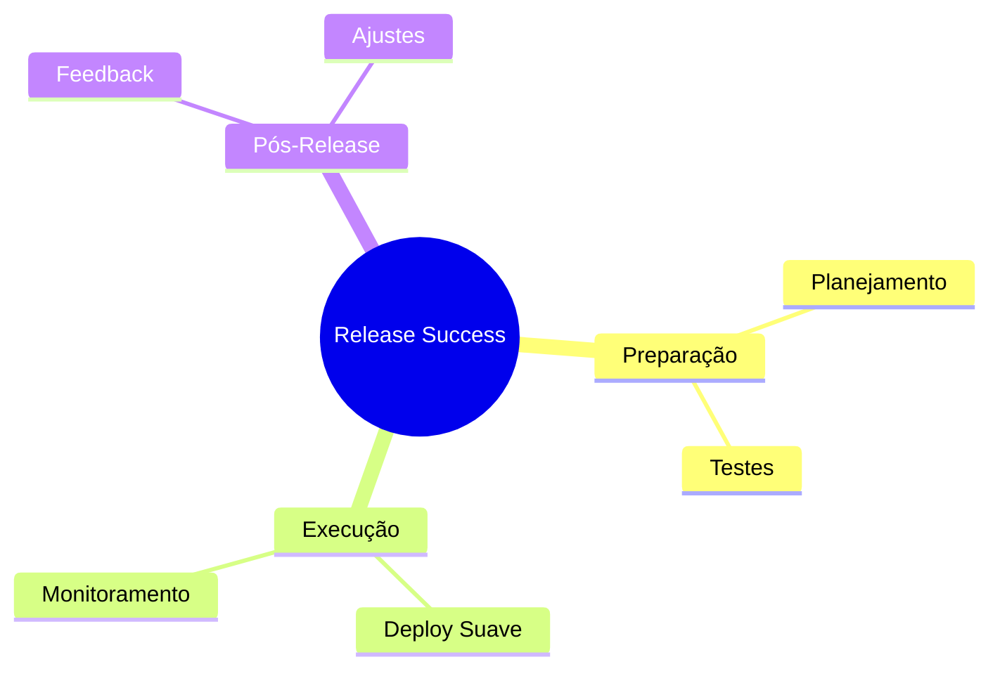