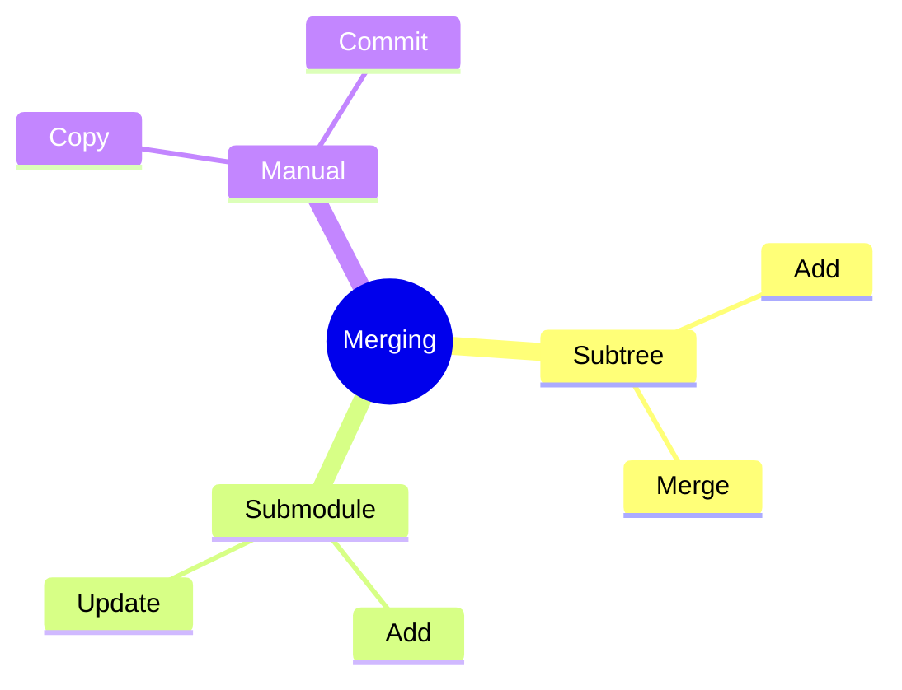
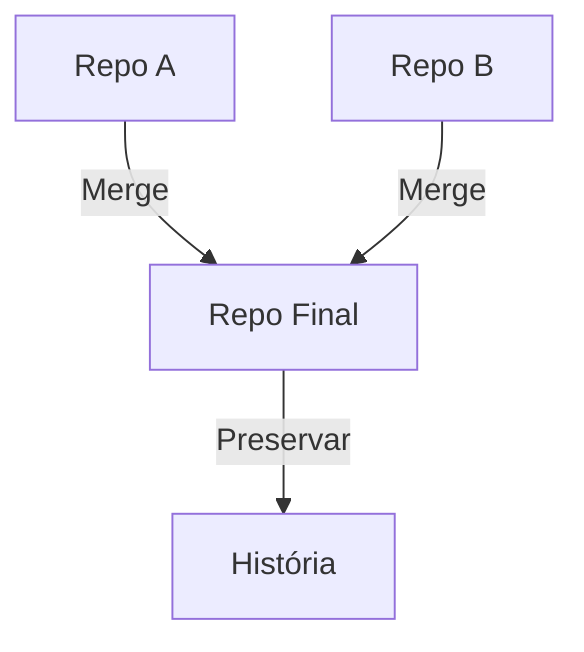
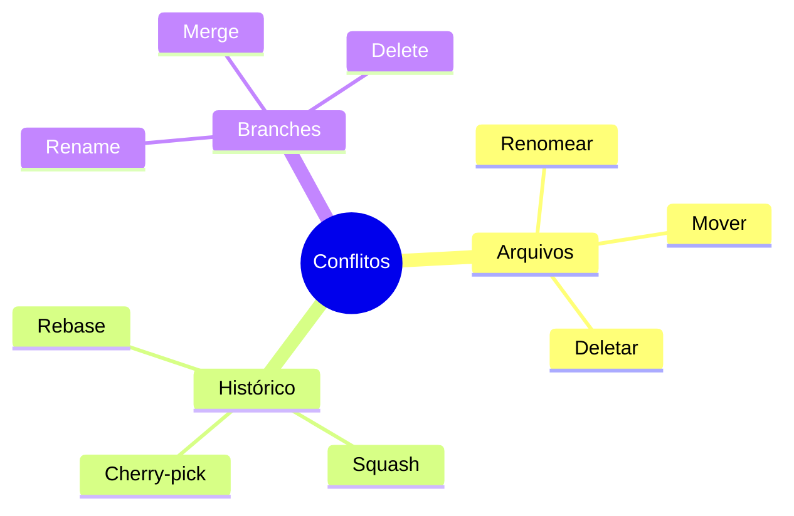
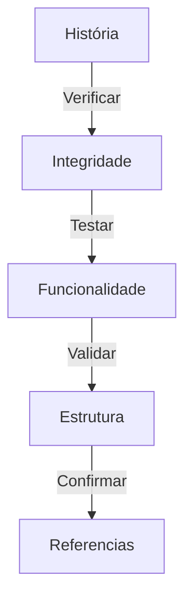

# Mesclando Repositórios Git

## Estratégias de Mesclagem

### Abordagens


## Usando git subtree

### Processo Básico
```bash
# Adicionar repositório como subtree
git subtree add --prefix=subdir \
    git@github.com:org/repo.git main --squash

# Atualizar subtree
git subtree pull --prefix=subdir \
    git@github.com:org/repo.git main --squash
```

## Preservando História

### Técnicas


## Scripts de Mesclagem

### Mesclagem com Histórico
```bash
#!/bin/bash
# Script para mesclar repositórios

REPO_A="git@github.com:org/repo-a.git"
REPO_B="git@github.com:org/repo-b.git"
FINAL_REPO="merged-repo"

# Preparar repositório final
git init $FINAL_REPO
cd $FINAL_REPO

# Adicionar e mesclar repos
git remote add -f repo-a $REPO_A
git remote add -f repo-b $REPO_B

git merge repo-a/main --allow-unrelated-histories
git merge repo-b/main --allow-unrelated-histories
```

### Reorganização de Arquivos
```bash
#!/bin/bash
# Reorganizar estrutura após merge

# Mover arquivos
mkdir -p new/structure
git mv old/path/* new/structure/

# Commit das mudanças
git commit -m "refactor: reorganize repository structure"

# Limpar e otimizar
git gc --aggressive --prune=now
```

## Resolução de Conflitos

### Estratégias


## Validação

### Checklist


## Melhores Práticas

### Recomendações
```ascii
+------------------------+
|  MESCLAGEM REPOSITÓRIO|
|                       |
| 1. Backup repos       |
| 2. Planejar estrutura |
| 3. Testar localmente  |
| 4. Resolver conflitos |
| 5. Validar resultado  |
+------------------------+
```

## Automação

### CI/CD
```bash
#!/bin/bash
# Script de CI para validação

# Verificar estrutura
test -d "expected/path" || exit 1

# Testar funcionalidade
./run_tests.sh

# Validar referências
git fsck --full

# Verificar hooks
test -x .git/hooks/pre-commit
```