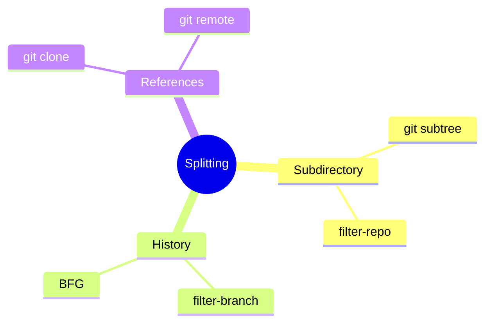
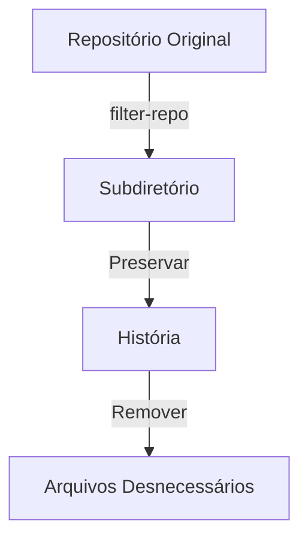
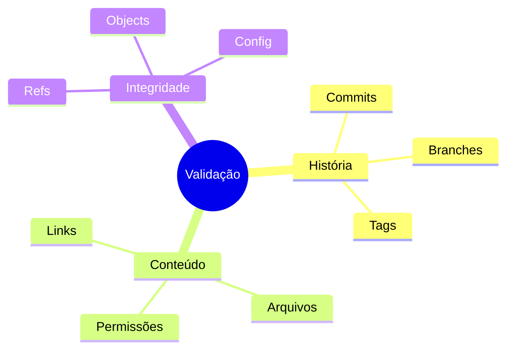

# Dividindo Repositórios Git

## Estratégias de Divisão

### Abordagens


## Usando git-filter-repo

### Processo Básico
```bash
# Instalar git-filter-repo
pip install git-filter-repo

# Extrair subdiretório
git filter-repo --path subdir/ --path-rename subdir/:

# Limpar e otimizar
git gc --aggressive --prune=now
```

## Preservando História

### Técnicas


## Scripts de Divisão

### Extração de Subdiretório
```bash
#!/bin/bash
# Script para dividir repositório

REPO_URL="git@github.com:org/monorepo.git"
SUBDIR="projects/webapp"
NEW_REPO="webapp"

# Clonar repositório
git clone $REPO_URL
cd $(basename $REPO_URL .git)

# Extrair subdiretório
git filter-repo --path $SUBDIR/ \
    --path-rename $SUBDIR/:

# Configurar novo repositório
git remote add origin git@github.com:org/$NEW_REPO.git
git push -u origin main
```

### Limpeza de Referências
```bash
#!/bin/bash
# Limpar referências antigas

# Remover remotes antigos
git remote remove origin

# Limpar refs
git for-each-ref --format="%(refname)" refs/original/ | \
xargs -n 1 git update-ref -d

# Executar GC
git gc --aggressive --prune=now
```

## Validação

### Checklist


## Melhores Práticas

### Recomendações
```ascii
+------------------------+
|  DIVISÃO REPOSITÓRIO  |
|                       |
| 1. Backup inicial     |
| 2. Teste em clone     |
| 3. Validar história   |
| 4. Verificar deps     |
| 5. Atualizar CI/CD    |
+------------------------+
```