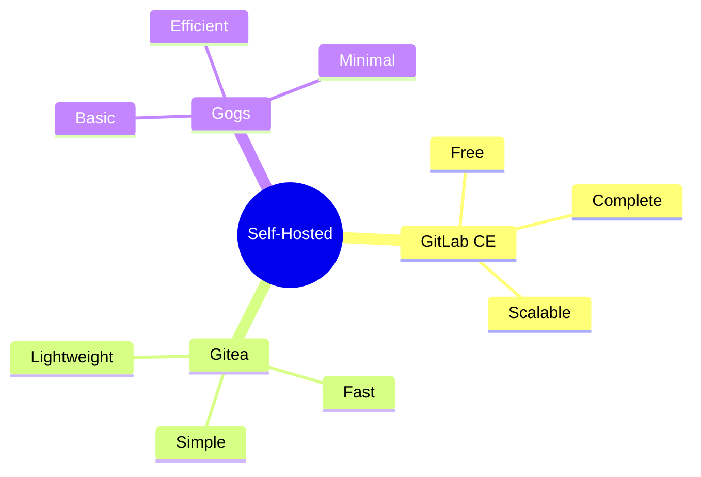

# Self-Hosted Git 

```ascii
+------------------------+
|    Self-Hosted        |
|                       |
| Installation         |
| Configuration       |
| Maintenance         |
|                       |
| Security            |
+------------------------+
```

## Soluções Populares

### Opções


## Instalação

### Setup Básico
```bash
# GitLab CE
curl -sS https://packages.gitlab.com/install/repositories/gitlab/gitlab-ce/script.deb.sh | sudo bash
sudo apt install gitlab-ce

# Gitea
docker run -d --name=gitea -p 3000:3000 gitea/gitea:latest
```

## Manutenção

### Backup
```ascii
+------------------------+
|    BACKUP TYPES       |
|                       |
| • Repositórios       |
| • Configurações      |
| • Banco de dados     |
| • Uploads            |
+------------------------+
```

## Próximos Passos

### Tópicos Relacionados
- [Git Hosting](git-hosting.md)
- [Git Security](git-security.md)
- [Git Authentication](git-authentication.md)

> **Dica Pro**: Mantenha um ambiente de teste para validar atualizações antes de aplicar em produção.