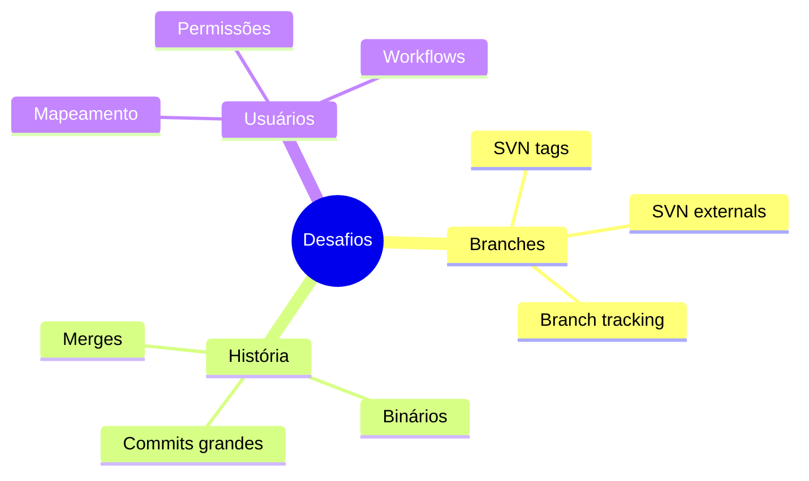
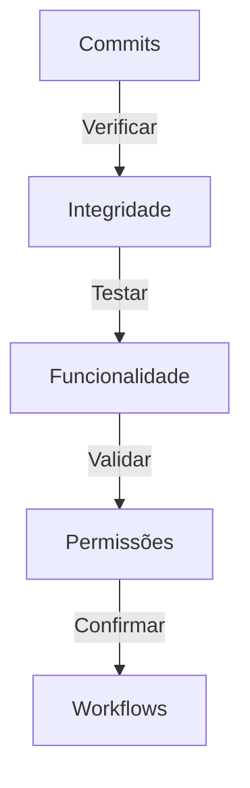
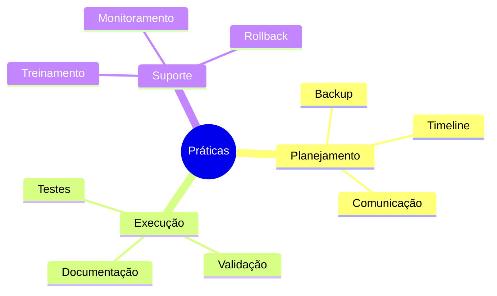

# Migrando de SVN para Git

## Processo de Migração

### Preparação
```bash
# Instalar git-svn
apt-get install git-svn

# Listar autores SVN
svn log -q | awk -F '|' '/^r/ {sub("^ ", "", $2); sub(" $", "", $2); print $2" = "$2" <"$2">"}' | sort -u > authors.txt
```

### Migração Básica
```bash
# Clonar repositório SVN
git svn clone --stdlayout --authors-file=authors.txt \
    http://svn.example.com/repo/ git_repo

# Otimizar repositório
cd git_repo
git gc --aggressive
```

## Desafios Comuns

### Problemas e Soluções


## Validação

### Checklist


## Scripts Úteis

### Mapeamento de Usuários
```bash
#!/bin/bash
# Gerar mapeamento de usuários
svn log -q | \
awk -F '|' '/^r/ {sub("^ ", "", $2); sub(" $", "", $2); print $2}' | \
sort -u > svn_users.txt

# Criar arquivo de autores
while read user; do
    echo "$user = $user <$user@example.com>"
done < svn_users.txt > authors.txt
```

### Migração com Branches
```bash
#!/bin/bash
# Migrar com branches e tags
git svn clone \
    --stdlayout \
    --authors-file=authors.txt \
    --no-metadata \
    --prefix="svn/" \
    http://svn.example.com/repo/ \
    git_repo
```

## Pós-Migração

### Configuração Git
```bash
# Configurar remotes
git remote add origin git@github.com:org/repo.git
git push -u origin --all
git push origin --tags

# Limpar referências SVN
git config --remove-section svn-remote.svn
rm -rf .git/svn
```

## Melhores Práticas

### Recomendações
