# Colaboração em Equipe

## Comunicação

### Canais

```mermaid
mindmap
    root((Comunicação))
        Assíncrona
            Issues
            PRs
            Docs
        Síncrona
            Daily
            Planning
            Review
```


## Processos

### Workflow


## Ferramentas

### Stack Essencial
```ascii
Colaboração
├── Git
├── GitHub/GitLab
└── CI/CD

Comunicação
├── Slack/Teams
├── Jira/Trello
└── Confluence/Wiki

Desenvolvimento
├── IDE
├── Linters
└── Testing
```

## Boas Práticas

### Code Review
- Revisões regulares
- Feedback construtivo
- Compartilhamento de conhecimento
- Documentação de decisões

### Pair Programming


## Gestão de Conflitos

### Resolução
1. Identificar conflito
2. Discutir alternativas
3. Decidir solução
4. Documentar decisão

### Git Conflicts
```bash
# Resolver conflitos
git checkout feature
git rebase main
git mergetool
```

## Métricas

### KPIs
```ascii
📊 Métricas Chave
├── Tempo de Review
├── Taxa de Bugs
├── Cobertura de Testes
└── Velocidade de Deploy
```