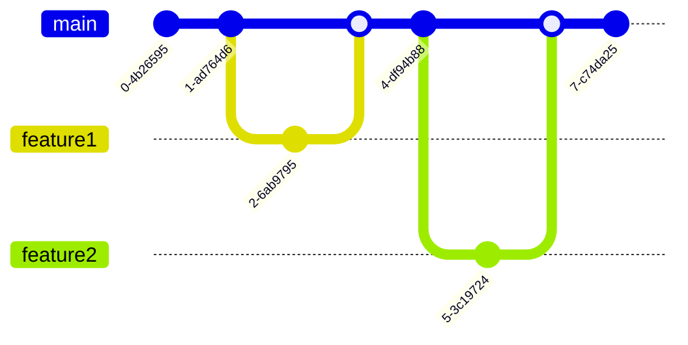

# Trunk-Based Development

Imagine uma festa onde todo mundo dança na mesma pista. É assim que funciona o Trunk-Based Development (TBD)! 

## Anatomia do TBD



## Como Funciona?

Todo mundo trabalha direto na branch principal (trunk/main):


## Regras do Jogo

### 1. Commits Pequenos e Frequentes


### 2. Testes Antes de Tudo


### 3. Feature Flags
- Código novo entra escondido
- Ativa quando estiver pronto
- Como uma surpresa na festa!

## Ciclo de Vida do Código


## Fluxo de Trabalho Típico


## Por Que Usar?

### Vantagens
- Integração contínua real
- Menos conflitos
- Deploy mais rápido
- Todo mundo no mesmo ritmo

### Desafios
- Precisa de muita disciplina
- Testes automatizados são obrigatórios
- Feature flags para código incompleto

## Na Prática

### Fluxo Básico
```ascii
1. Código novo
2. Testes locais
3. Code review
4. Merge na main
5. Deploy
```

### Dicas de Sobrevivência
- Commits pequenos
- Testes, testes e mais testes
- Feature flags são seus amigos
- Code review rápido

## Conclusão

TBD é rápido, moderno e eficiente. Como uma festa bem organizada, todo mundo se diverte junto, mas seguindo algumas regras básicas para manter tudo funcionando!