# Melhores Práticas em Controle de Versão

O controle de versão é fundamental para o desenvolvimento de software moderno. Aqui estão as práticas essenciais para manter seu código organizado e sua equipe produtiva.

## Por que Seguir Boas Práticas?
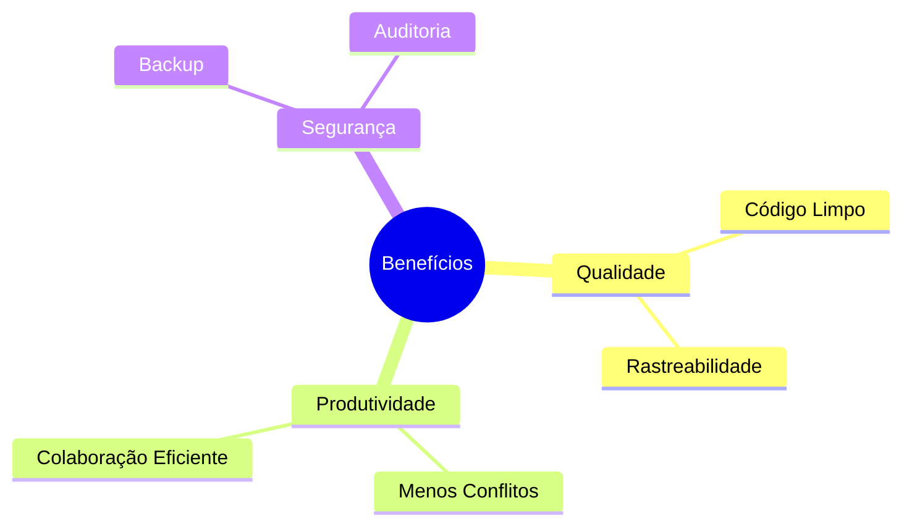

## Princípios Fundamentais

### 1. Consistência
- Mantenha padrões de código
- Siga convenções de commit
- Use nomenclatura uniforme

### 2. Atomicidade
- Commits pequenos e focados
- Uma feature por branch
- Mudanças relacionadas juntas

### 3. Rastreabilidade
- Commits descritivos
- Referência a issues
- Documentação atualizada

## Organização de Repositório

### Estrutura de Diretórios
```
projeto/
├── src/
├── tests/
├── docs/
├── .gitignore
└── README.md
```

### Arquivos Essenciais
- README.md
- .gitignore
- CONTRIBUTING.md
- LICENSE

## Commits

### Anatomia de um Bom Commit
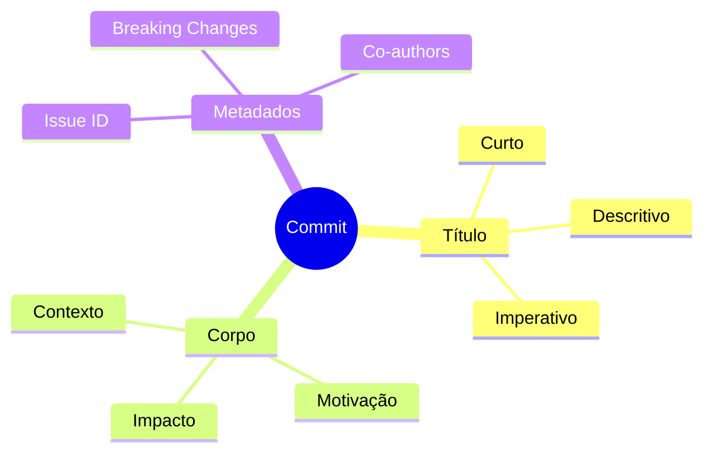

### Padrão de Mensagens
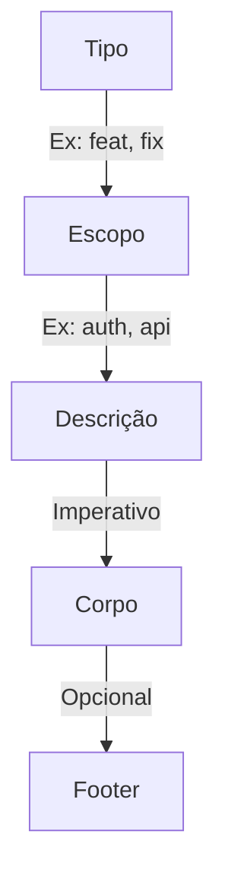

### Convenção de Commits
```ascii
<tipo>(<escopo>): <descrição>

[corpo]

[footer]

Exemplos:
✅ feat(auth): adiciona autenticação via Google
✅ fix(api): corrige timeout em requisições longas
✅ docs(readme): atualiza instruções de instalação
✅ style(login): ajusta layout responsivo
✅ refactor(core): migra para TypeScript
✅ test(unit): adiciona testes para módulo de pagamento
```

### Tipos de Commit
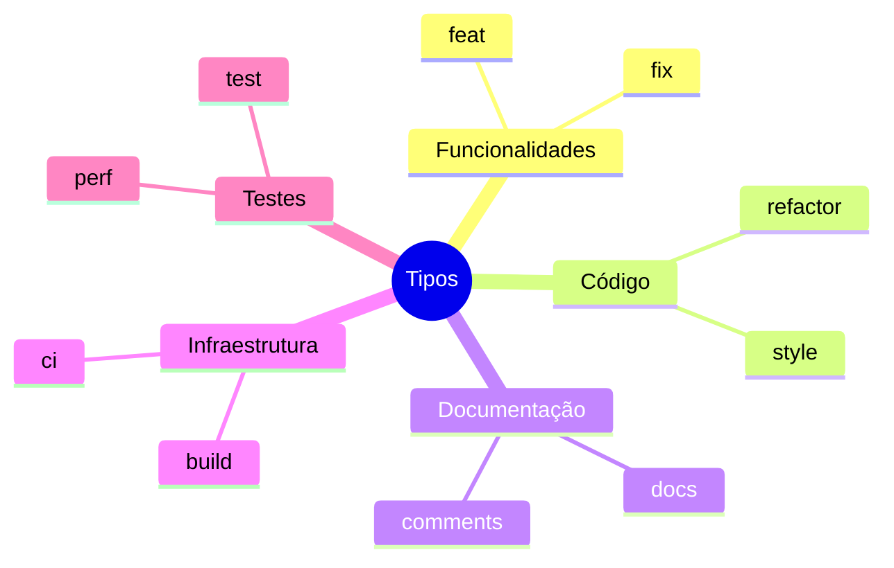

### Fluxo de Trabalho
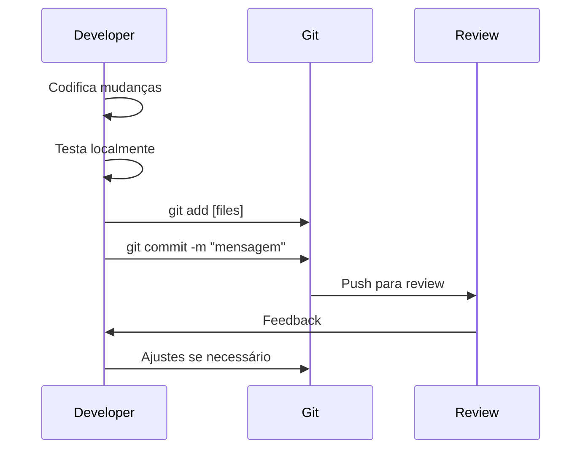

### Commits Atômicos
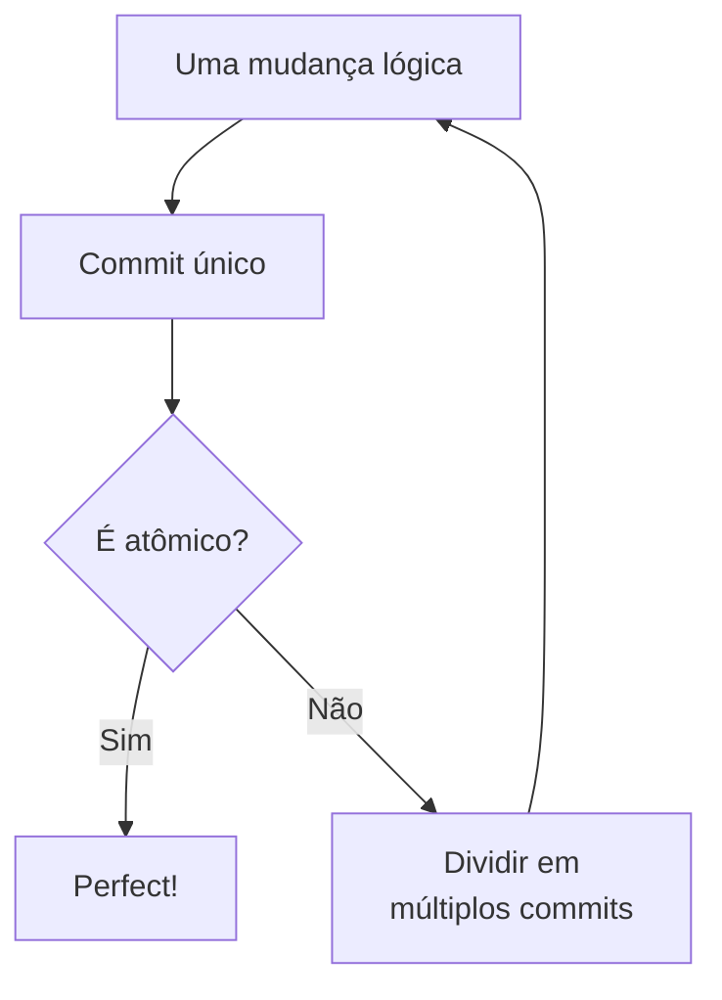

### O que Evitar
```ascii
❌ Commits Ruins:
└── "correções"
└── "wip"
└── "updates"
└── "fix bugs"
└── "commit final"
└── "alterações diversas"

✅ Commits Bons:
└── "feat(user): adiciona validação de email"
└── "fix(auth): corrige refresh token expirado"
└── "refactor(api): simplifica tratamento de erros"
└── "docs(swagger): atualiza documentação da API"
```

### Dicas para Commits Efetivos
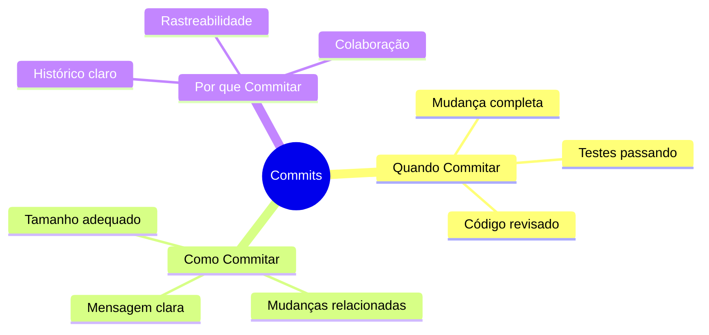

### Ferramentas Úteis
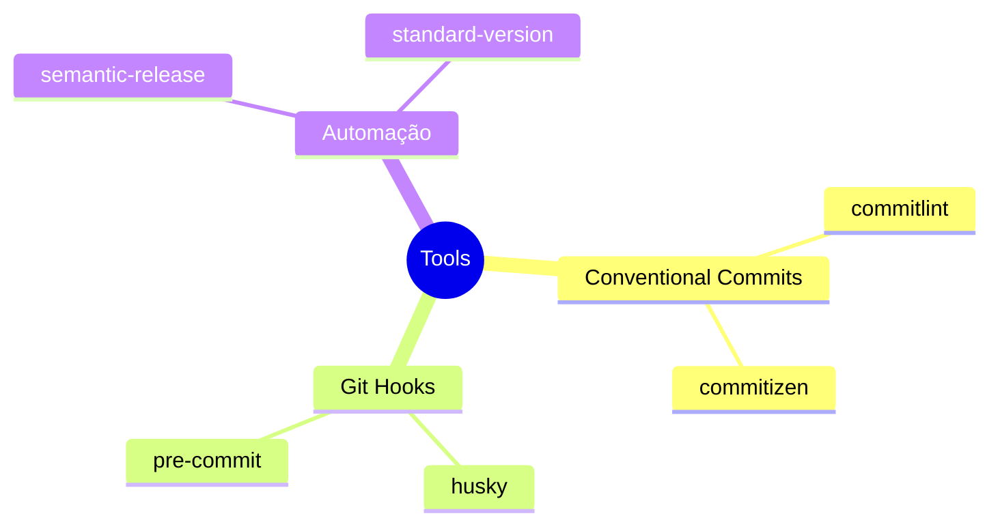

### Revisão de Commits
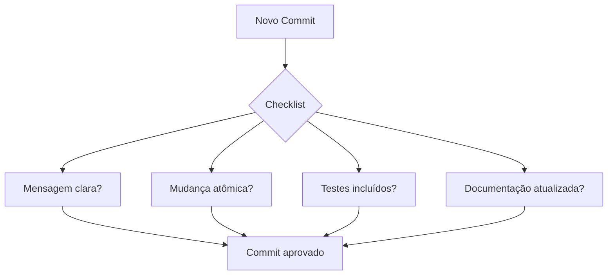

### Boas Práticas de Reescrita
```ascii
🔄 Reescrita de Commits

Local (antes do push):
├── git commit --amend
├── git rebase -i
└── git reset

Remoto (com cuidado):
├── Squash merges
├── Rebase time
└── Force push (-f)
```

## Gerenciamento de Branches

### Fluxo de Desenvolvimento
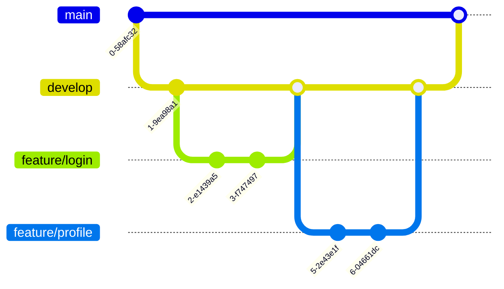

### Estrutura de Branches
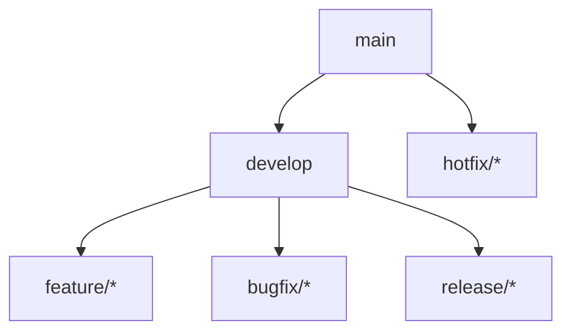

### Ciclo de Vida de uma Branch
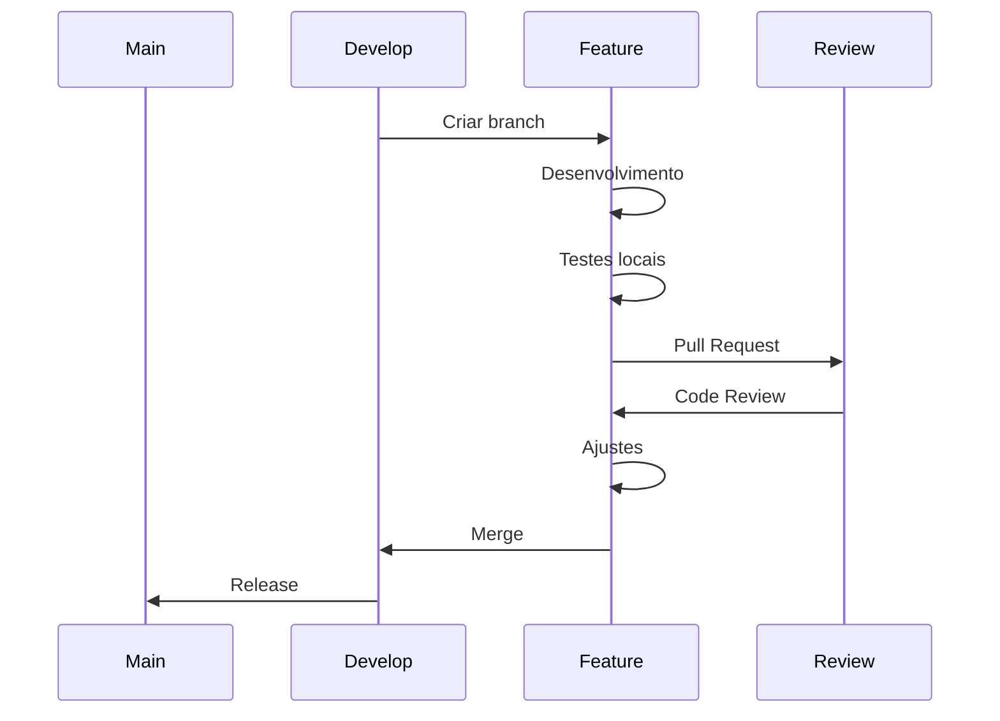

### Convenções de Nomenclatura
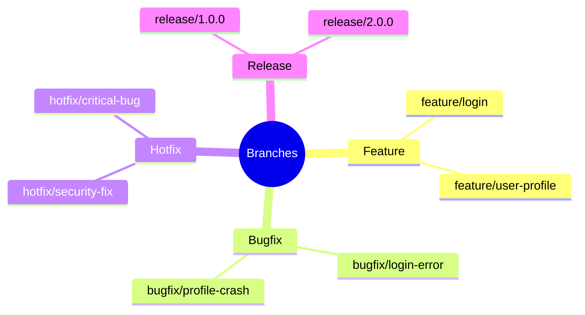

## Code Review

### Checklist
- [ ] Código segue padrões
- [ ] Testes adicionados/atualizados
- [ ] Documentação atualizada
- [ ] Performance considerada
- [ ] Segurança verificada

### Feedback Construtivo
- Foco no código, não no desenvolvedor
- Sugestões específicas
- Explicações claras
- Reconhecimento de boas práticas